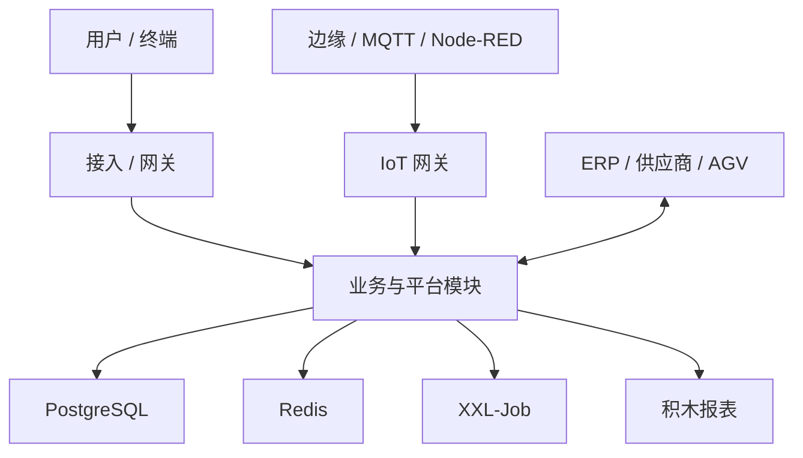

# 技术架构

> 适用基线：测试环境目标 / `dev` 分支 / 2026-07-15。
> 阅读对象：实施架构师、开发与运维；业务培训优先看[模块边界](04-模块边界与系统上下文.md)与各业务模块概述。

## 架构概述

MOM 以**多业务模块 + 统一系统/基础设施能力**组织：管理端与多终端接入，业务服务按域拆分，主数据与权限集中治理，库存/质量/执行等权威落在对应业务模块。技术栈细节见[技术栈](07-技术栈.md)。

本页描述**逻辑分层与模块协作**，不替代各环境真实部署图。

## 架构分层

| 分层 | 职责 | 文档入口 |
| --- | --- | --- |
| 接入层 | Web 管理端、SCP 门户、WMS/MES/EAM PDA 等；经网关/反向代理进入 | [多端与终端架构](03-多端与终端架构.md) |
| 应用层 | System / Infra / DBC / WMS / MES / QMS / EAM / ANDON / SCP / AGV / Report 等模块服务；仓外 IoT 网关 | [模块边界](04-模块边界与系统上下文.md) |
| 数据层 | PostgreSQL 业务库、Redis 缓存；报表与调度有独立组件 | [技术栈](07-技术栈.md) |
| 平台能力 | 认证授权、文件、消息、导入导出、接口调用信息与重试、定时任务、积木报表 | [基础设施](../03-基础设施/index.md) |
| 边缘与设备 | 数采配置与 MQTT/边缘上报；AGV 回调 | [数采](../13-数采管理/index.md)、API 中 AGV 索引 |

## 关键权威边界

| 事实类型 | 权威模块 |
| --- | --- |
| 主数据身份与工厂建模 | DBC（SCP 侧可能并存，同步未一律证实） |
| 库存事务与余额 | WMS |
| 生产执行与报工追溯 | MES |
| 检验结论 | QMS |
| 维修/巡检工单 | EAM |
| 异常呼叫到岗 | ANDON |
| 供应商协同单据 | SCP |
| 用户、角色、租户会话 | System |

更细的跨系统方向见[跨系统集成场景](../14-API参考/03-跨系统集成场景.md)。

## 关键技术决策（已收敛到文档的）

| 决策 | 结论 | 出处 |
| --- | --- | --- |
| 正式文档不写 DDL/源码路径 | 技术证据下沉 `project-docs` | 仓库约定 |
| 标签打印当前入口 vs 平台归属 | 当前多在 WMS；目标属平台能力 | [标签、条码与打印](../03-基础设施/01-标签、条码与打印.md) |
| PS 排程 | 本仓无实现，文档薄弱口径 | [PS](../11-PS-排程管理/index.md) |
| 申请—任务—记录 | 跨 WMS/QMS 等复用公共模型 | [申请任务记录模型](../02-业务模型/01-申请任务记录模型.md) |

未形成 ADR 编号库；后续评审结论可追加本表，不臆造历史 ADR 编号。

## 服务依赖拓扑

模块级协作示意见上图与[集成场景](../14-API参考/03-跨系统集成场景.md)。**运行时服务拆分实例名、端口与注册中心**以部署环境为准，见[部署架构](../03-基础设施/10-部署架构.md)待确认项。

## 限制与待确认

- 是否全部模块同进程/同网关：环境相关，不以开发仓目录等同部署单元。
- Finance 等旁路模块的产品化边界：有菜单/源码线索，站点未单开批次。
- 服务网格、多活与灾备：待运维资料。
