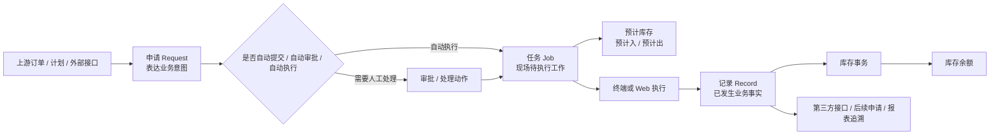

# 申请、任务与记录模型

> 状态：P0 样板阶段已开始抽取公共模型；WMS 采购收货是首轮取证样例。本文先沉淀已由 `dev` 基线源码证实的共用规则，未覆盖业务仍需逐项核验。

## 1. 本页负责回答

1. 为什么系统中会反复出现“申请、任务、记录”三类对象。
2. 三者分别承载什么业务责任，不能互相替代的原因是什么。
3. 三者如何通过单据号、申请单号、任务单号进行追溯。
4. 通用状态、通用动作和自动策略如何影响业务流转。
5. 具体业务页应该复用哪些公共说明，哪些内容必须保留在本业务页。

## 2. 抽取时机与复用原则

这类共用知识不等到全站批量占位时再抽取，而是在 P0 样板闭环阶段完成首版抽取。

| 阶段 | 是否抽取公共模型 | 原因 |
| --- | --- | --- |
| P0 单业务初扫 | 暂不急于抽取 | 先确认至少一个业务的真实代码链路，避免把猜测写成公共规则。 |
| P0 样板闭环 | **必须抽取** | 当采购收货等样板页已经证实申请、任务、记录的共性后，应立即沉淀到本页。 |
| 批量占位前 | 必须复核 | 批量铺开前，以本页作为页面模板和状态说明来源。 |
| 批量业务填充中 | 持续回写 | 后续业务若发现例外，只在业务页说明差异，并回写本页“适用与例外”。 |

具体业务页只写本业务特有内容，例如来源单据、字段差异、库存影响、接口挂接、异常分支、终端入口。申请、任务、记录的通用定义、通用状态和通用动作统一链接到本页。

## 3. 分层责任

| 对象 | 业务目的 | 典型创建方式 | 使用者关注点 | 文档写法 |
| --- | --- | --- | --- | --- |
| 订单（Order） | 承接外部或上游业务意图。 | ERP/SCP/客户/供应商接口，或人工维护。 | 业务来源、数量、交期、对象。 | 作为来源说明，不直接写成现场执行结果。 |
| 计划（Plan） | 对订单或需求进行计划性拆分。 | 计划运算、人工编制、第三方导入。 | 计划数量、计划日期、可执行性。 | 是否实际使用需按模块核验。 |
| 申请（Request） | 提出需要系统处理的业务请求。 | 人工新增、导入、接口、自动生成。 | 谁提出、为什么处理、是否需要审批、是否可关闭。 | 说明来源、审批、处理前置条件和明细约束。 |
| 任务（Job） | 把申请转成可执行的现场工作。 | 申请处理、自动执行、系统拆分。 | 谁执行、在哪里执行、允许修改什么、是否产生预计库存。 | 说明状态、承接/执行/关闭/异常和终端操作。 |
| 记录（Record） | 固化已经发生的业务事实。 | 任务执行、受控直记、撤销冲抵。 | 实际发生了什么、影响了哪些库存/接口/后续单据。 | 说明库存事务、接口回写、撤销和追溯。 |

## 4. 通用链路

通用理解：

- 申请解决“要不要做、为什么做、由谁批准”的问题。
- 任务解决“谁去做、去哪里做、按什么限制做”的问题。
- 记录解决“实际做了什么、对库存和接口造成了什么影响”的问题。
- 预计库存通常挂在任务阶段，实际库存变化通常挂在记录阶段。

## 5. 通用关联字段

| 关系 | 常见字段 | 说明 |
| --- | --- | --- |
| 申请自身编号 | `number` | 申请主表单据号；通常也是申请明细的业务单号。 |
| 任务追溯申请 | `request_number` | 任务主表保存来源申请单号。 |
| 记录追溯申请 | `request_number` | 记录主表保存来源申请单号，便于从最终结果回查业务意图。 |
| 记录追溯任务 | `job_number` | 记录主表保存来源任务单号，便于回查现场执行过程。 |
| 明细归属主表 | `master_id` | 明细表通常通过主表 ID 归属主表。 |
| 下游库存挂接 | `job_number`、`record_number` | 预计库存通常挂任务号；库存事务通常挂记录号。 |

字段名称必须以当前 DDL、DO、VO 和前端实际请求为准。旧文档中自行翻译出来的 `request_no`、`task_id`、`receipt_no` 等名称不能作为当前字段依据。

## 6. 通用状态与动作

### 6.1 申请状态

| 状态码 | 状态名称 | 典型含义 |
| --- | --- | --- |
| `1` | 新增 | 申请已创建，尚未提交或处理。 |
| `2` | 审批中 | 已提交，等待审批。 |
| `3` | 审批通过 | 审批已通过，可进入处理。 |
| `4` | 审批驳回 | 审批未通过，可按业务规则重新添加或关闭。 |
| `5` | 关闭 | 申请被关闭。 |
| `6` | 处理中 | 申请已进入任务生成或执行链路。 |
| `7` | 部分完成 | 部分明细或部分数量已完成。 |
| `8` | 已完成 | 申请已完成。 |

### 6.2 申请动作

| 动作 | 通用前置 | 通用结果 | 说明 |
| --- | --- | --- | --- |
| 提交 | 新增 | 审批中、审批通过或处理中 | 结果受自动通过、自动执行配置影响。 |
| 同意 | 审批中 | 审批通过或处理中 | 若自动执行开启，可能直接生成任务。 |
| 驳回 | 审批中 | 审批驳回 | 业务页需说明驳回后是否允许重提。 |
| 处理 | 审批通过或部分完成 | 处理中 | 通常触发任务生成。 |
| 关闭 | 新增、审批中、审批通过、审批驳回、处理中、部分完成 | 关闭 | 若已有进行中任务，通常应阻止关闭或先处理任务。 |
| 重新添加 | 关闭或审批驳回 | 新增 | 是否在前端开放，需要业务页单独核验。 |

### 6.3 任务状态与动作

| 状态码 | 状态名称 | 典型动作 |
| --- | --- | --- |
| `1` | 待处理 | 可承接、关闭。 |
| `2` | 进行中 | 可执行、放弃；部分业务允许拒收、撤销等异常动作。 |
| `3` | 完成 | 已执行完成，通常已生成记录。 |
| `4` | 关闭 | 未执行而关闭。 |
| `5` | 拒收 | 执行异常结果之一。 |
| `6` | 撤销 | 任务撤销结果之一。 |

| 动作 | 通用前置 | 通用结果 | 说明 |
| --- | --- | --- | --- |
| 承接 | 待处理 | 进行中 | 记录承接人和承接时间。 |
| 放弃 | 进行中 | 待处理 | 清空承接信息，任务可重新被承接。 |
| 关闭 | 待处理 | 关闭 | 业务页需说明预计库存如何处理。 |
| 执行 | 进行中 | 完成 | 通常生成记录。 |

### 6.4 记录状态与动作

| 状态码 | 状态名称 | 典型含义 |
| --- | --- | --- |
| `1` | 正常 | 有效业务事实。 |
| `2` | 已撤销 | 原记录已被撤销。 |
| `3` | 撤销冲抵 | 系统为撤销生成的冲抵记录。 |

记录不是普通可编辑数据。记录撤销通常需要校验库存现状，并生成反向库存事务或冲抵记录；具体影响必须在业务页说明。

## 7. 自动策略

| 策略 | 作用位置 | 影响 |
| --- | --- | --- |
| 自动提交 | 申请创建或导入后 | 申请可能不停留在新增状态，直接进入审批中。 |
| 自动通过 | 提交或创建链路 | 申请可能跳过人工审批，直接进入审批通过。 |
| 自动执行 | 提交、审批或创建链路 | 申请可能直接进入处理中并生成任务。 |
| 直接生成记录 | 个别业务配置 | 可能绕过人工任务执行，直接形成记录；必须逐业务确认。 |

这些策略通常来自业务类型、单据配置或服务默认值。业务页必须说明本业务实际读取的配置代码、默认值来源和是否允许用户修改。

## 8. 适用与例外

| 模块/业务 | 当前判断 | 证据状态 |
| --- | --- | --- |
| WMS 采购收货 | 适用申请、任务、记录三层。任务生成预计入，记录生成库存事务。 | 已在 P0 样板中取证。 |
| WMS 采购退货、采购上架、发料、生产收料等 | 预计大概率适用，但状态和库存影响不同。 | 待按业务页继续取证。 |
| MES、QMS、EAM、ANDON | 可能复用“申请/任务/记录”的思想，但对象命名和状态未必一致。 | 待模块级取证。 |
| SCP | 更偏协同、订单、计划、发货与结算，可能只部分复用。 | 待模块级取证。 |

## 9. 业务页输出规则

具体业务页不重复解释“申请、任务、记录为什么存在”，只补充以下内容：

1. 本业务是否完整采用申请、任务、记录三层。
2. 哪些来源会生成申请，哪些情况下跳过申请或跳过任务。
3. 本业务的状态按钮是否与通用状态机一致。
4. 任务阶段是否生成预计入、预计出或其它中间对象。
5. 记录阶段是否生成库存事务、接口消息、后续申请或报表数据。
6. 终端操作与 Web 操作的差异。
7. 当前实现与通用模型不一致的地方，必须登记为待确认或产品差距。

## 10. 待继续核验

| 编号 | 待补内容 | 主要证据 | 完成标准 |
| --- | --- | --- | --- |
| MODEL-ATR-01 | 适用业务清单 | WMS、MES、QMS、EAM、ANDON、SCP 菜单与源码 | 每个业务说明复用、变体或不适用原因。 |
| MODEL-ATR-02 | 自动策略来源 | 业务类型配置、单据设置、服务代码、测试环境 | 标明自动提交、自动通过、自动执行、直接生成记录的真实触发条件。 |
| MODEL-ATR-03 | 关闭、撤销、拒收的差异 | 各业务服务代码和测试环境 | 标明哪些是通用状态机，哪些是业务扩展动作。 |
| MODEL-ATR-04 | 权限边界 | 前端按钮权限、后端权限注解、菜单权限 | 形成可复用的动作权限说明模板。 |
