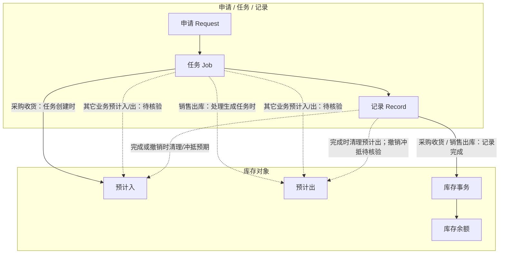
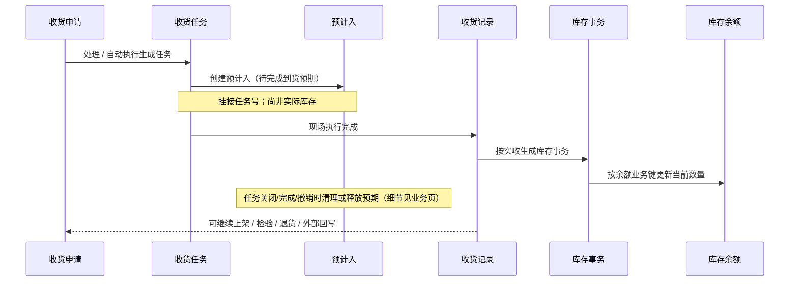

# 库存数据挂接模型

> 状态：WMS 采购收货—库存链路已完成首轮取证；其余业务待核验。
> 目标：统一说明预计入、预计出、库存事务、库存余额如何由业务单据创建、消耗、追溯和冲销。

## 1. 当前已知事实

采购收货任务创建预计入，采购收货记录创建库存事务，库存事务服务更新库存余额。库存余额业务唯一粒度已确定为批次、托盘、包装、物料、库存状态、库位。详见[库存管理](../05-WMS-库房管理/09-库存管理/index.md)与[库存管理精度与唯一粒度](08-库存管理精度与唯一粒度.md)。

销售出库主链已证实：处理申请生成任务时建立预计出，发货记录形成出库事务并更新余额，同时清理对应预计出。发料等其它出库业务对预计出的创建时点仍待逐项核验。

## 2. 对象关系与过账时序（已证实主链）

### 2.1 库存对象挂接关系

实线表示采购收货已证实路径；虚线表示销售出库已证实的对称出库路径，或其它业务尚待核验的挂接。

### 2.2 采购收货过账时序（样板）

追溯顺序与过账相反：余额 → 最近事务 → 业务记录 → 任务 / 来源申请。不要把预计入当作已入账数量，也不要用手工改余额代替源业务。

## 3. 参考设计：数据责任

| 数据对象 | 参考责任 | 与单据的挂接方式 |
| --- | --- | --- |
| 预计入/预计出 | 表示已计划但未实际发生的供需占用 | 通常由待执行任务创建，在完成、取消或变更时相应消耗或释放。 |
| 库存事务 | 记录一次可追溯的库存变化 | 应关联业务记录、事务类型、数量方向及来源单据。 |
| 库存余额 | 表示当前可用/冻结等库存状态下的汇总事实 | 只能由库存事务等受控业务动作改变，不能以查询或人工汇总代替。 |
| 移动日志 | 记录物理移动或状态变化轨迹 | 用于追溯，是否独立实现待当前基线核验。 |

## 4. 待填写任务

| 编号 | 待补内容 | 主要证据 | 完成标准 |
| --- | --- | --- | --- |
| MODEL-INV-01 | 预计入/预计出的创建、变更、消耗、删除时点 | WMS 服务、表结构、测试环境 | 每类预计数据可追溯到任务或来源单据。 |
| MODEL-INV-02 | 库存事务类型、业务记录号和冲销关系 | 事务类型配置、事务服务、DDL | 可由事务回查业务记录及库存变更原因。 |
| MODEL-INV-03 | 库存余额业务粒度、冻结和负库存规则 | 余额服务、库位策略、产品确认 | 明确业务键与数据库约束/缺口。 |
| MODEL-INV-04 | 各业务对库存模型的影响矩阵 | WMS/MES/QMS/EAM 业务链 | 每个业务明确“预计、事务、余额”三项影响。 |

## 5. 输出规则

页面不得把“库存余额查询”误写为库存变化来源；库存变化必须经事务追溯。数据库约束不足、并发控制和无法确认的粒度须进入产品差距总账。
