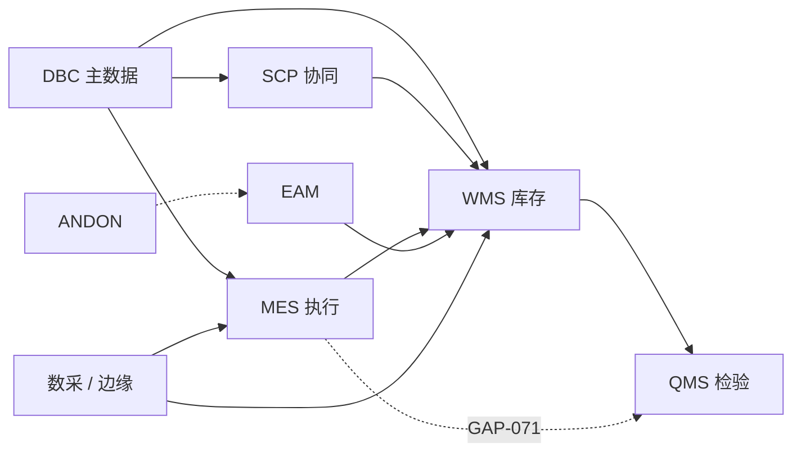

# 业务模型

> 适用基线：测试环境目标 / `dev` 分支 / 2026-07-15。
> 本页给领域地图；细则见同目录模型页与各业务模块概述。

## 领域模型概述

MOM 围绕制造运营协同与执行建模：主数据与工厂建模在前，供应链与仓储保障物料到位，计划与线边执行产出过程事实，质量与设备/异常闭环保障过程可控，平台能力支撑权限、集成与输出。

排程（PS）在产品导航中保留意图层；**当前仓内无排程实现**，执行层以 MES 计划管理为准。

## 核心领域

| 领域 | 职责摘要 | 文档入口 |
| --- | --- | --- |
| 主数据域 | 物料、BOM、供应商/客户、工厂建模、策略与工艺主数据 | [DBC](../04-DBC-主数据管理/index.md) |
| 仓储域 | 收发存、库内、盘点、库存事务与余额 | [WMS](../05-WMS-库房管理/index.md) |
| 生产域 | 工艺、计划/工单、报工、追溯、线边终端 | [MES](../06-MES-生产管理/index.md) |
| 质量域 | 检验配置、来料/生产/客户退回检验、质量评审 | [QMS](../07-QMS-质量管理/index.md) |
| 设备域 | 报修维修、巡检保养、备件/工装；台账多在 DBC | [EAM](../08-EAM-设备管理/index.md) |
| 异常域 | 安灯呼叫、响应到岗 | [ANDON](../09-ANDON-异常管理/index.md) |
| 供应链域 | 采购订单、预测/计划、发货协同、跟踪、结算 | [SCP](../10-SCP-供应链平台/index.md) |
| 排程域（规划） | 约束排产意图 | [PS](../11-PS-排程管理/index.md)（薄弱） |
| 数采域 | 采集点/参数、日志、MQTT；边缘编排薄弱 | [数采](../13-数采管理/index.md) |
| 系统与平台 | 租户认证、组织、RBAC、公共能力 | [租户与认证](../12-系统管理/01-租户与认证/index.md)、[基础设施](../03-基础设施/index.md) |

## 跨域公共模型

| 模型 | 用途 |
| --- | --- |
| [申请、任务与记录](01-申请任务记录模型.md) | WMS/QMS 等单据三段式 |
| [库存数据挂接](02-库存数据挂接模型.md) | 预计入出、事务、余额 |
| [第三方接口与单据挂接](03-第三方接口与单据挂接.md) | 外部单与内部单关系 |
| [页面数据字典规范](04-页面数据字典规范.md) | 字段与字典写法 |
| [单据类型与配置](05-单据类型、业务类型与单据配置.md) | 业务类型/单据开关 |
| [策略与规则引擎](06-策略与规则引擎模型.md) | 规则配置边界 |
| [主数据治理](07-主数据治理模型.md) | 主数据权威与引用 |
| [库存精度与唯一粒度](08-库存管理精度与唯一粒度.md) | 余额粒度 |
| [跨模块追溯与闭环](09-跨模块追溯与业务闭环.md) | 追溯与闭环 |

## 领域间协作关系

端到端叙事见[核心业务流程](11-核心业务流程.md)；接口方向见[跨系统集成场景](../14-API参考/03-跨系统集成场景.md)。

## 限制与待确认

- 图为培训用协作关系，不等于全部已证实的同步接口。
- 未证实项（如 NG→QMS、SCP↔DBC 同步）以问题总账编号为准，不在本页写成固定自动流。
