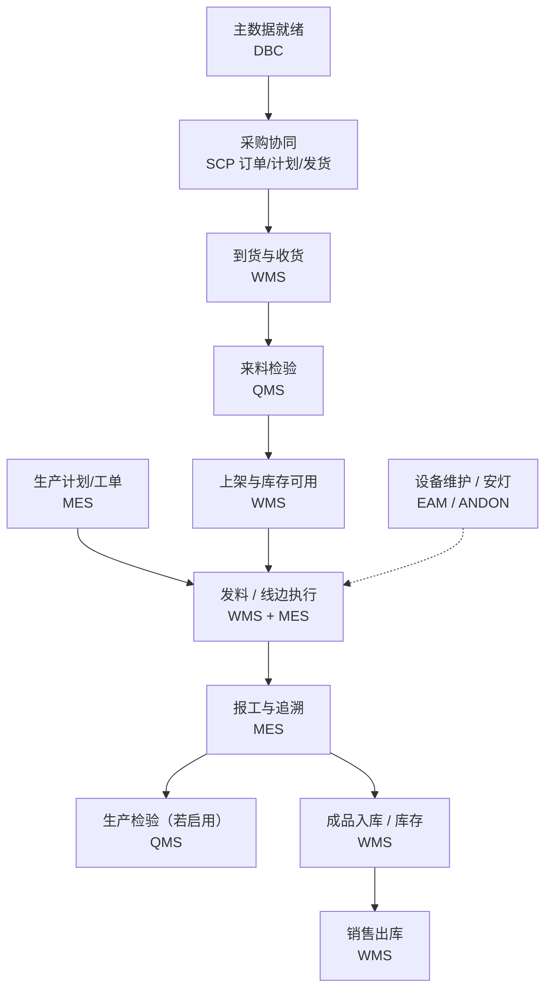

# 核心业务流程

> 适用基线：测试环境目标 / `dev` 分支 / 2026-07-15。
> 用业务语言串起「从需求/订单到交付」的主路径；细节与状态机以各模块页为准。

## 本页解决什么问题

模块文档再全，也需要一张「教学主路径」把供应、收货、检验、生产、出库串起来。本页回答：**一笔典型制造运营从哪走到哪、关键子流程该进哪组文档**；不替代各业务页的状态机与配置细节。

读完应能判断：当前问题落在主路径哪一段、该打开哪组模块文档；以及哪些分支（寄售、返修、盘点等）会偏离上图。共享对象与追溯见[跨模块追溯与业务闭环](09-跨模块追溯与业务闭环.md)、[领域模型](10-领域模型.md)。

## 如何使用本页

| 你的目的 | 建议做法 |
| --- | --- |
| 建立端到端主线印象 | 先跟「端到端主路径」图与说明 |
| 写业务页 / 培训时定位 | 用「关键子流程」表跳到对应模块入口 |
| 排障时选段 | 按现象落段（到不了货 / 检不过 / 发不出料 / 出不了库）再下钻 |
| 对 KPI / 看板 | 读「流程 KPI」：勿把旧规划书指标当系统内置标准 |

## 端到端主路径

说明：

- **排程 PS** 不插入上图实线；无实现时由 MES 计划承接可执行工单。
- **报工 NG → QMS** 未证实自动建单（`GAP-071`），图中生产检验为可选协同。
- 数采/边缘为执行与物流的辅助输入，不替代业务单据权威。

## 关键子流程（入口）

| 子流程 | 要回答的问题 | 文档入口 |
| --- | --- | --- |
| 订单履约（供应） | 订单如何发布、发货、跟踪到收货 | [SCP 采购订单](../10-SCP-供应链平台/02-采购订单/index.md) → [发货协同](../10-SCP-供应链平台/05-发货协同/index.md) → [WMS 采购收货](../05-WMS-库房管理/03-采购收货/index.md) |
| 生产执行 | 订单如何变成工单并报工 | [MES 计划管理](../06-MES-生产管理/03-计划管理/index.md) → [终端操作](../06-MES-生产管理/06-终端操作/index.md) |
| 质量检验 | 何时建检、结论如何影响放行 | [来料检验](../07-QMS-质量管理/02-来料检验/index.md) 等 |
| 库存闭环 | 预计入出、事务、余额如何挂接 | [库存挂接模型](02-库存数据挂接模型.md)、[库存管理](../05-WMS-库房管理/09-库存管理/index.md) |
| 异常处理 | 呼叫如何到岗，是否转维修 | [ANDON](../09-ANDON-异常管理/index.md)、[EAM 设备管理](../08-EAM-设备管理/02-设备管理/index.md) |
| 设备维修 | 报修到维修闭环 | [EAM](../08-EAM-设备管理/index.md) |
| 出货履约 | 发货与出库 | [销售出库](../05-WMS-库房管理/10-销售出库/index.md) |

## 流程 KPI

本仓库**未取证**统一 KPI 字典或看板指标权威表。实施时：

- 业务过程 KPI 以现场报表/积木报表模板口径为准（见[报表](../03-基础设施/02-报表、看板与数据输出.md)）；
- 不要把旧规划书指标直接写成系统内置标准。

待确认：是否存在跨模块统一 KPI 主数据；确认前仅按报表/项目定制理解。

## 自检或验证点

1. 能否把现场问题落到上图某一段，并找到对应子流程入口？
2. 培训时是否误把教学主路径说成唯一现场路径（寄售/返修/盘点等分支）？
3. `GAP-071` 等未证实自动流是否仍按可选/待确认表述？

## 限制与待确认

- 上图是教学主路径，现场可因寄售、返修、盘点、调拨等分支偏离。
- 自动触发与接口补偿以各页「限制与待确认」及总账为准。
