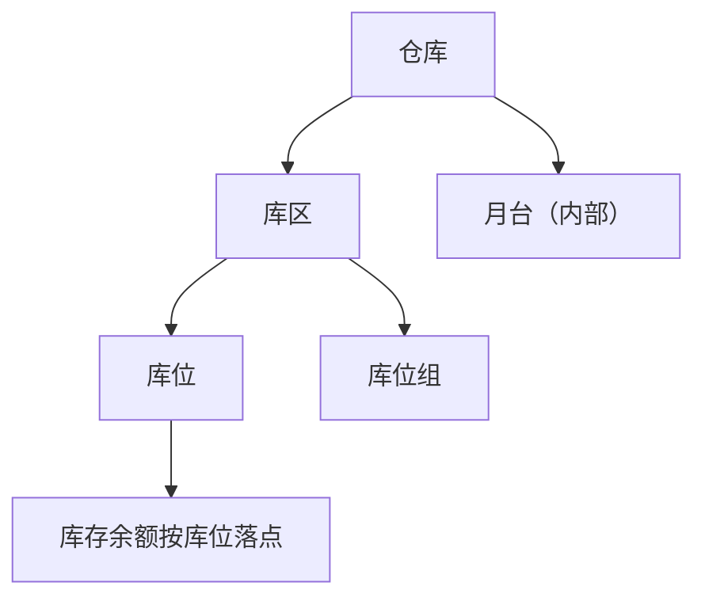

# 库位与仓储级联惯例

> 适用基线：测试环境目标 / `dev` 分支 / 2026-07-22。
> 用途：仓库 → 库区 → 库位（及库位组/月台）级联通例。业务页写差异 + 链接。
> 相关：工厂建模中的仓库/库区/库位/库位组/月台页面；[通用选择器过滤惯例](12-通用选择器过滤惯例.md)。

## 1. 层级关系（业务语言）

- **仓库**：仓储范围与组织归属的顶层地点。
- **库区**：仓库内的分区（用途、作业类型等）。
- **库位**：可执行存放/拣选的最细地点；库存余额业务键包含库位。
- **库位组**：库位的分组管理对象，不替代库位作为余额落点。
- **月台**：收发货对接地点；与客户月台为不同对象。

## 2. 级联行为通例（P4）

| 上游字段变化 | 受影响下游 | 系统行为（通例） | 业务原因 |
| --- | --- | --- | --- |
| 变更仓库 | 库区、库位、（可能）库位组/月台 | **清空**下游已选值，再按新仓库过滤 | 禁止跨仓库地点残留 |
| 变更库区 | 库位 | **清空**库位后按新库区过滤 | 库位从属于库区 |
| 库位所属仓库/库区在主数据中被改挂 | 已有库存与在途任务 | **禁止或高风险**；应先清库存/关任务（各页细则） | 地点身份变更影响追溯 |
| 停用仓库/库区/库位 | 业务选择器 | 期望从可选范围移除；**过滤时点** ❓ 待各业务确认 | 避免新业务落到停用地点 |

各业务任务若配置“禁止改库位”，则现场级联选择被锁定，以任务配置为准（见采购收货等页）。

## 3. 选择器范围通例（P2）

| 选择字段 | 可选范围 | 依赖 | 选不到时通常原因 |
| --- | --- | --- | --- |
| 仓库 | 可用仓库；❓ 数据权限裁剪 | 组织/权限（`GAP-014`） | 停用、权限外 |
| 库区 | 属于已选仓库的可用库区 | 仓库 | 未选仓库、库区停用、挂错仓库 |
| 库位 | 属于已选仓库（及库区）的可用库位 | 仓库、库区；扫码时还需标签匹配 | 不在当前库区、停用、扫码不匹配 |
| 库位组 | 属仓库/库区范围内的组 | 仓库、库区 | 组未维护或库区不符 |
| 内部月台 | 属仓库且类型符合的可用月台 | 仓库；默认库位归属校验见月台页 | 仓库不符、默认库位无效 |

## 4. 业务页差异示例

| 场景 | 相对通例的差异 | 详见 |
| --- | --- | --- |
| 采购收货现场 | 库位常由任务配置决定可否改；PDA 扫描校验 | 采购收货维护参考 |
| 物料库区配置 | 当前页面主表聚焦物料+仓库+管理精度+包装，**历史库区/库位默认策略未接入**（`GAP-032`） | 物料库区配置 |
| 生产线物料关系 | Web 原料/完工库位字段可能未开放，勿按历史草稿培训（`GAP-035`） | 生产线物料关系 |

## 5. 相关差距

- `GAP-048`～`GAP-052`：仓/区/位/组/月台唯一性、编辑锁定与删除保护未完全闭合。
- `GAP-050`：库位通用保存路径与专用规则分离；ERP/QAD 字段口径易混。
