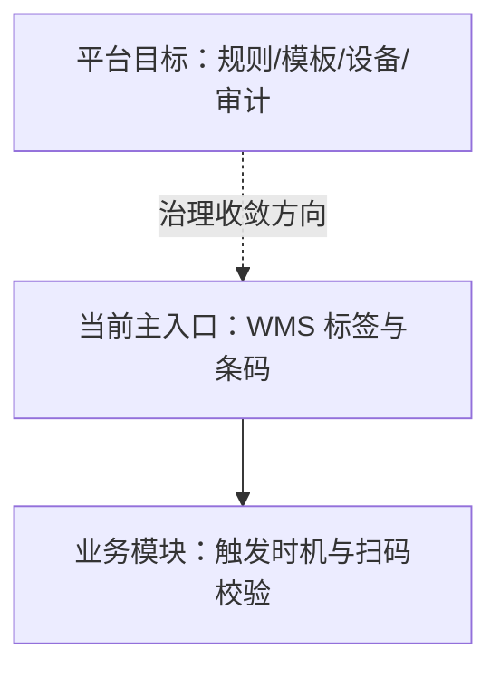

# 标签、条码与打印

> 适用基线：测试环境目标 / `dev` 分支 / 2026-07-15。
> 阅读对象：测试、实施、运维（主）。

## 本页解决什么问题

标签、条码与打印给包装、器具、库位、库存对象等提供可识别、可打印、可追溯的标识，并支持补打与查询。读完本页，应能判断：**配置入口当前在哪、平台长期怎么治理、业务页只负责什么**；不把本页当成某一张收货单的扫码细则说明书。

当前最完整的仓储侧配置与操作说明见：[WMS 标签与条码](../05-WMS-库房管理/01-基础数据/06-标签与条码.md) 及其[维护与查询参考](../05-WMS-库房管理/01-基础数据/09-标签与条码-维护与查询参考.md)。

**何时用本页 / 不归本页**

| 何时进来 | 不归本页 |
| --- | --- |
| 判断「标签该在基础设施还是 WMS 配」 | 现场配规则/模板/补打操作 → [WMS 标签与条码](../05-WMS-库房管理/01-基础数据/06-标签与条码.md) |
| 跨模块入口差异、平台收敛目标 | 某业务何时强制扫码、失败如何卡单 → 对应业务页（收货、上架、出库等） |
| 打印连不上时先分清「配置 vs 设备通道」 | 物料/包装主数据本身错误 → DBC；打印机驱动与现场 IT → 运维专项 |

## 如何使用本组文档

| 你的目的 | 建议阅读 |
| --- | --- |
| 想在仓储现场配规则/模板/补打 | [WMS 标签与条码](../05-WMS-库房管理/01-基础数据/06-标签与条码.md) |
| 想理解为何文档把能力归到基础设施 | 本页 |
| 想查某业务何时要求扫码/打印 | 对应业务页 |
| 想查 MES/SCP 侧打印触发 | 各模块概述中的终端与输出边界；细则随模块续作 |

## 当前入口 vs 目标归属

| 维度 | 当前可确认事实 | 目标口径 |
| --- | --- | --- |
| 规则 / 类型 / 模板 / 标签信息 | 主要在 WMS 基础数据维护与使用。 | 作为可复用平台能力统一治理。 |
| 打印服务 | WMS 提供打印机列表、模板打印等接口能力。 | 设备适配、队列与审计向平台收敛。 |
| 业务触发 | 收货、上架、库位、包装等业务动作触发生成/打印/扫码。 | 业务只定义「何时、对何对象、带何变量请求打印」。 |
| DBC | 提供物料、包装、业务类型等被引用的主数据。 | 不把 DBC 当作标签引擎本体。 |
| MES / SCP | 存在业务侧标签/打印/模板类入口或记录（分散）。 | 保留业务触发与记录；通用模板与设备能力归平台。 |

!!! example "📷 截图占位"
    WMS 标签模板与一次业务触发打印的对照；标注「当前入口」。

## 能力分工边界

| 角色 | 负责什么 | 不负责什么 |
| --- | --- | --- |
| 平台 / 基础设施（本页） | 统一能力边界、复用原则、治理目标、跨模块入口索引。 | 不写某张收货单的扫码强制规则细节。 |
| WMS 标签配置 | 当前规则、类型、模板、标签信息、补打入口。 | 不宣称已完成平台级统一设备中心。 |
| 业务模块 | 何时生成/打印/校验标签，失败如何处理。 | 不各自复制一套互不兼容的编码规则（实施上应复用已有规则/模板）。 |
| DBC | 被标签引用的主数据正确性。 | 不替代标签规则引擎。 |

## 关键判断

| 判断点 | 应先确认什么 | 判断后的影响 |
| --- | --- | --- |
| 模板找不到 | 是否在 WMS 标签模板/类型中维护。 | 不要只在业务单据页找配置。 |
| 扫码失败 | 标签规则、类型解析、现场标签是否匹配业务对象。 | 区分「规则错」与「业务状态不允许」。 |
| 补打争议 | 标签信息中的补打记录与原因。 | 以可追溯记录为准。 |
| 其它模块打印入口 | 是业务触发还是另一套模板体系。 | 记录差异，避免强行写成已统一。 |

## 建议验证点

- 从本页出发，能落到 WMS 标签规则 → 类型 → 模板 → 标签信息，而不是在「基础设施」菜单里空等独立标签中心。
- 同一收货场景：业务页触发打印后，可用标签信息/补打记录回查；扫码失败时能区分规则问题与单据状态问题。
- 非仓储模块若另有打印入口：登记是否与 WMS 模板同源，**不**默认已平台统一。

## 查询与联查

| 想解决的问题 | 推荐定位方式 | 建议联查 |
| --- | --- | --- |
| 仓储标签怎么配 | WMS 标签规则 → 类型 → 模板 → 标签信息。 | WMS 维护参考。 |
| 收货扫码不通过 | 业务页扫描规则 + 标签内容。 | 采购收货等业务页。 |
| 平台是否已有独立菜单 | 当前以 WMS（及部分模块）入口为准。 | 本页边界表。 |
| 打印设备连不上 | 环境打印机列表/客户端打印通道 🔍 待核验（运维专项）。 | 运维与现场 IT。 |

## 常见问题与处理

| 情况 | 建议处理 |
| --- | --- |
| 以为基础设施菜单里一定有标签配置 | 当前主配置在 WMS 基础数据；本页是归属与边界说明。 |
| 各模块各自新建互不相干的模板 | 优先复用已有规则/类型/模板，差异登记到问题总账。 |
| 把标签问题当成库存数据错误 | 先核对标签状态与扫码对象，再查库存余额。 |

## 当前限制与待确认事项

- 独立 Infra 标签中心菜单/服务是否已存在：🔍 待核验 **当前未证实为可替代 WMS 入口的完整平台模块**；
- MES/SCP 等入口与 WMS 模板是否共享同一套主数据：❓ 待确认 需逐模块对照；
- WEB/PDA/线边端打印失败补偿与设备适配清单：📝 待补充；
- 作废标签不可再作为有效业务标识等细则，以 WMS 页与测试验证为准。

## 待补充的图示与示例

| 类型 | 后续需要补充的内容 | 目的 |
| --- | --- | --- |
| 入口地图 | WMS / MES / SCP 当前入口一览。 | 支持治理决策。 |
| 对照表 | 当前入口字段 vs 目标平台能力项。 | 支持迁移规划。 |
| 示例 | 一笔收货标签从配置到扫码。 | 支持培训（可复用 WMS 示例）。 |
