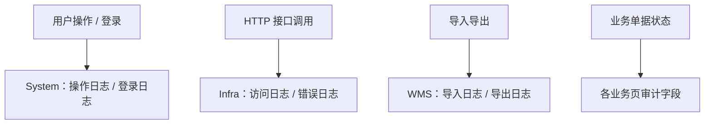

# 日志、审计与运行监控

> 适用基线：测试环境目标 / `dev` 分支 / 2026-07-15。
> 阅读对象：系统管理员、运维与安全协同人员，以及需要按日志定位“谁做了什么、接口为何失败”的支持人员。

## 业务目的与适用范围

日志与审计用于事后定位操作、登录、接口调用与错误；运行监控关注服务健康与异常积压。本页说明**当前已证实的查询入口与分层**；业务单据级状态变迁审计仍以各业务页为准。

## 如何使用本组文档

| 你的目的 | 建议阅读 |
| --- | --- |
| 想查谁登录/谁点了什么 | 本页“操作与登录日志”。 |
| 想查接口访问或报错 | 本页“API 访问/错误日志”。 |
| 想查导入导出过程 | [导入、导出与批量操作](04-导入、导出与批量操作.md)。 |
| 想查业务状态为何变更 | 对应业务页与业务审计字段。 |

## 使用前准备

| 需要确认什么 | 为什么重要 |
| --- | --- |
| 查询账号是否有日志菜单权限 | 日志入口受 RBAC 控制。 |
| 时间范围与关键字 | 日志量大，需缩小条件。 |
| 是业务问题还是接口问题 | 决定先查操作日志还是 API 错误日志。 |
| 是否跨租户 | 在正确租户上下文中查询。 |

!!! example "📷 截图占位"
    操作日志列表与一条 API 错误日志详情；脱敏。

## 当前已证实的日志分层

| 类型 | 当前入口（菜单级） | 能回答的问题 |
| --- | --- | --- |
| 登录日志 | 系统管理 → 登录日志 | 谁在何时登录/退出及结果线索。 |
| 操作日志 | 系统管理 → 操作日志 | 管理端关键操作记录（以实际落库字段为准）。 |
| API 访问日志 | 基础设施 → 访问日志 | 接口被谁、何时调用及概要。 |
| API 错误日志 | 基础设施 → 错误日志 | 接口异常；支持处理状态更新。 |
| 导入/导出日志 | WMS 导入导出日志 | 某次批量导入/导出进度与错误文件。 |
| 异步方法记录 | 基础设施侧异步成功/失败记录菜单 | 异步/MQ 类失败排查线索（细则待专项）。 |

## 与业务审计的边界

| 层级 | 说明 |
| --- | --- |
| 平台日志 | 登录、操作、API、导入导出过程。 |
| 业务审计 | 单据状态、数量、库存事务、审批意见等业务语义。 |
| 关联方式 | 优先用业务编号、时间窗、操作者对齐；不假定全站统一追踪号已覆盖所有链路。 |

培训时应说：先定问题类型，再进对应日志，最后回业务单据核对结果。

## 查询与联查

| 想解决的问题 | 推荐定位方式 | 建议联查 |
| --- | --- | --- |
| 账号被盗用嫌疑 | 登录日志异常时间/地点线索。 | 用户状态、角色变更。 |
| 误操作追溯 | 操作日志 + 业务单据变更时间。 | 业务详情。 |
| 接口 500/超时 | API 错误日志处理与摘要。 | 对应业务接口说明。 |
| 导入失败 | 导入日志错误文件。 | 业务导入页。 |
| 权限被拒 | 操作/访问日志 + RBAC。 | [RBAC 权限模型](../12-系统管理/03-用户与权限/01-RBAC权限模型.md)。 |

## 常见问题与处理

| 情况 | 建议处理 |
| --- | --- |
| 业务说“系统没记录” | 确认查的是哪一类日志；业务状态可能只在单据上。 |
| 错误日志未处理堆积 | 按处理状态分流，避免只看最新一条。 |
| 把监控大盘当成已有 | 当前以日志查询入口为主；独立 APM/告警平台待环境确认。 |
| 导出日志本身需权限 | 按角色授权，勿用超管代替日常审计账号。 |

## 当前限制与待确认事项

- 操作日志字段粒度与是否覆盖全部写接口，待抽样矩阵；
- 统一链路追踪（traceId）跨模块覆盖率未证实；
- 运行监控大盘、告警订阅、资源指标的独立平台页待环境核验；
- 日志保留周期与脱敏策略待运维规范确认。

## 图示、截图与示例任务

| 类型 | 后续需要补充的内容 | 目的 |
| --- | --- | --- |
| 分层图 | System / Infra / WMS / 业务。 | 培训选型。 |
| 排错剧本 | 登录失败、接口失败、导入失败各一例。 | 支持值班。 |
| 权限表 | 日志菜单权限标识。 | 授权配置。 |
