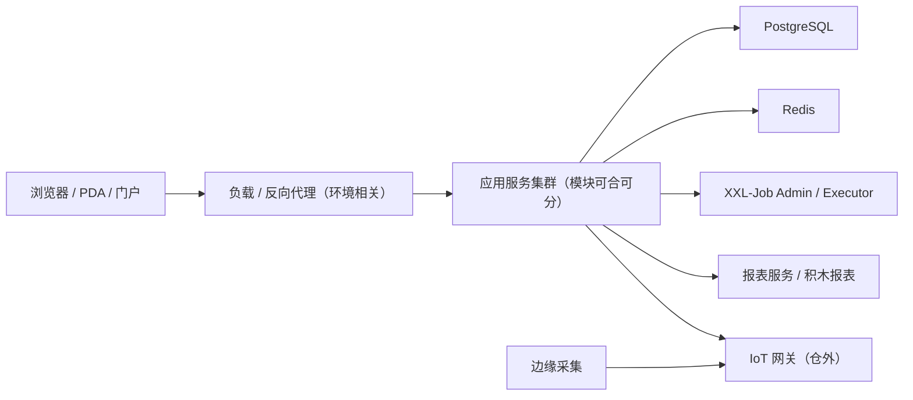

# 部署架构

> 适用基线：测试环境目标 / `dev` 分支 / 2026-07-15。
> 阅读对象：测试、实施、运维（主）。
> 本页写**部署认知边界与本仓可核对的部署单元线索**；具体集群拓扑、IP、账号以运维资料为准，不写入产品文档。

## 本页解决什么问题

读完本页，应能回答：目标环境大概有哪些运行单元、发布时要核对哪些横切依赖（报表地址、调度执行器、多租户），以及**哪些细节禁止写进产品文档**。

**何时用本页 / 不归本页**

| 何时进来 | 不归本页 |
| --- | --- |
| 理解逻辑拓扑与模块/前端/调度等部署单元线索 | 具体 IP、账号、连接串、证书私钥 → 运维私有资料 |
| 联调前确认报表服务、XXL-Job、SCP 是否纳入清单 | 安全认证/授权细则 → [安全体系](11-安全体系.md)；日常排障入口 → [监控运维](12-监控运维.md) |
| 区分「源码工程边界」与「生产是否同机/同库」 | 把开发仓目录直接等同生产拓扑 |

## 如何使用

| 你的目的 | 建议怎么做 |
| --- | --- |
| 看逻辑拓扑与环境分层 | 本页下方两节 |
| 列发布检查项 | 「发布与配置注意」 |
| 查接口前缀与发现 | [API 调用约定](../14-API参考/01-调用约定与文档发现.md) |

## 部署拓扑（逻辑）

真实是否同机、是否 K8s、几个副本：**待运维确认**，不以开发仓目录直接等同生产拓扑。

## 环境说明

| 环境 | 用途 | 本仓可写结论 |
| --- | --- | --- |
| 开发 / local | 日常联调 | 配置文件中存在 local 类 profile 线索 |
| 测试 | 功能与集成验证 | 文档基线指向测试环境；配置中存在 test 类 profile |
| 预发布 | 上线前验证 | **待运维确认是否独立环境** |
| 生产 | 正式运行 | 配置中存在 prod 类 profile；细节不进本文 |

各环境连接串、密钥、内网地址**禁止**粘贴进 `docs/`。

## 部署清单（本仓模块线索）

下列表示**源码/工程边界**，实施部署时可合并或拆分进程：

| 单元线索 | 说明 |
| --- | --- |
| 业务模块包 | System、Infra、DBC、WMS、MES、QMS、EAM、ANDON、AGV、Report、Finance 等 |
| SCP | 可独立部署与独立门户（`scp` / `scp-ui`） |
| XXL-Job | Admin + Core，与业务「任务单」不同 |
| 前端 | 管理端 `ui`、PDA、SCP 门户、EAM 终端等分开构建 |
| IoT 网关 | `iotgw` 依赖仓外，需单独纳入发布清单 |

接口发现与网关前缀见[API 调用约定](../14-API参考/01-调用约定与文档发现.md)。

## 发布与配置注意

| 主题 | 建议 |
| --- | --- |
| 多租户 | 发布后用目标租户验证登录与数据隔离 |
| 报表基地址 | 积木报表依赖正确服务地址与令牌 |
| 定时任务 | 确认执行器在线，避免双环境抢同一调度 |
| 集成账号 | 最小权限；失败可查接口调用信息 |

## 建议验证点

- 发布清单包含：应用（或合并进程）、前端包、报表服务、XXL-Job、必要的 IoT/SCP 单元。
- 目标租户可登录；报表预览与调度执行器在线各冒烟一次。
- 产品文档与培训材料中**无**连接串、密钥、内网 IP。

## 限制与待确认

- 容器平台、CI/CD 流水线、镜像仓库、证书与域名：待运维文档回填。
- 高可用、备份恢复 RPO/RTO：待运维。
- SCP 与主站是否同库同网关：环境相关，联调时登记。
