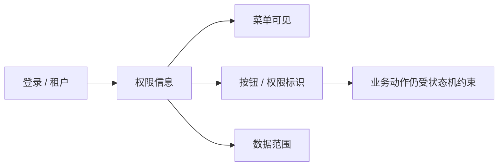

# 安全体系

> 适用基线：测试环境目标 / `dev` 分支 / 2026-07-15。
> 安全培训以「认证 → 授权 → 数据范围 → 审计」为主链；细则链到系统管理与日志页，避免本页重复展开全部字段。

## 认证与授权

| 能力 | 当前结论 | 文档入口 |
| --- | --- | --- |
| 租户与登录会话 | 多租户上下文下登录，拉取权限信息 | [租户与认证](../12-系统管理/01-租户与认证/index.md) |
| RBAC | 用户 → 角色 → 菜单/权限标识 | [RBAC 权限模型](../12-系统管理/03-用户与权限/01-RBAC权限模型.md) |
| 数据范围 | 角色部门/本人等五档；业务表挂接未全表清单 | [数据权限与决策权限](../12-系统管理/03-用户与权限/02-数据权限与决策权限.md)（`GAP-070`） |
| 岗位与库位 | 岗位库位等影响仓储可见/可操作范围 | [岗位、任务分配与审批主体](../12-系统管理/03-用户与权限/03-岗位、任务分配与审批主体.md) |
| 接口鉴权 | 前端 `hasPermi` ≠ 后端强制；逐页实测见 `GAP-014` | RBAC 页 + 问题总账 |

SSO、短信登录等是否启用：**环境配置相关**，以测试/生产实际开关为准。

## 数据安全

| 主题 | 当前可写 | 待确认 |
| --- | --- | --- |
| 传输 | 生产应使用 HTTPS；具体证书由运维管理 | 证书策略、双向 TLS |
| 存储加密 | 本仓未形成全库 TDE 定论 | 磁盘/列加密是否启用 |
| 脱敏 | 文档截图要求脱敏；系统内字段级脱敏策略尚未全量核实 | 报表/导出脱敏规则 |
| 密钥 | 配置与凭据不得进入产品文档与 Git | 密钥轮换流程 |

多组织/工厂隔离见[多组织、多工厂与数据隔离](../01-总体框架/02-多组织、多工厂与数据隔离.md)。

## 审计日志

| 类型 | 入口 |
| --- | --- |
| 操作 / 登录等 System 日志 | [日志、审计与运行监控](07-日志、审计与运行监控.md) |
| API 访问 / 错误 | 同上 Infra 分层 |
| 业务状态变更 | 以各业务页字段与记录为准，不单靠平台操作日志还原全部业务语义 |
| 接口调用失败与重试 | [数据交换与集成可靠性](09-数据交换与集成可靠性.md) |

## 集成与回调安全

| 风险点 | 建议 |
| --- | --- |
| 外部回调（如 AGV/IoT） | 确认鉴权、来源限制与幂等；路径见 API 索引 |
| 集成账号 | 独立账号、最小菜单与数据范围 |
| 导出与文件 | 控制导出权限与文件下载范围 |

## 限制与待确认

- 等保/渗透结论不在本仓。
- 后端注解被注释的接口不能仅凭前端按钮宣称“已鉴权”（`GAP-014`/`GAP-021` 等）。
- 安全基线清单（密码策略、会话超时）以 System 参数/认证页与环境实测为准。
