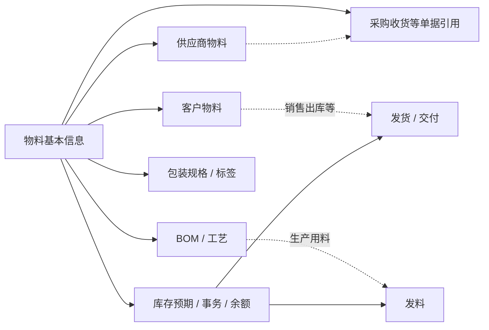

# 物料基本信息

> 适用基线：测试环境目标 / `dev` 分支 / 2026-07-15。
> 阅读对象：测试、实施、运维与主数据维护人员（主）；采购、仓储、生产等业务人员（顺带）。

## 业务目的与适用范围

读完本页，你能掌握：物料需要维护哪些关键信息、这些信息（尤其是用途开关与可用性）如何决定它能否被采购、生产、委外等业务选中，以及停用或改码前需要先确认什么。

物料基本信息是系统识别和使用实物、半成品、成品及其它物料的统一入口。采购收货、库存作业、生产用料、销售交付等业务都会引用同一份物料信息；因此，在开始业务前先维护正确、可用的物料，是避免后续单据选择错误、计量不一致和追溯困难的基础。

本页说明如何维护一项物料、物料在业务中如何被使用，以及如何查询它的上下游信息。它不替代 BOM、供应商物料、客户物料或库存页面的具体维护说明。

## 如何使用本组文档

| 你的目的 | 建议阅读 |
| --- | --- |
| 测试：设计维护、启停、用途差异与跨模块选不到料的场景 | 本页全文（尤其「配置如何起作用」「建议验证点」）；需要字段取值矩阵时再打开维护参考 |
| 实施：落地编码口径、字典与用途开关，并评估停用影响 | 本页「使用前准备 → 一项物料如何进入业务 → 配置如何起作用 → 做完后会影响什么」 |
| 运维：日常答疑「为什么选不到这个物料」「停用后还能不能用」、排查改码/停用引发的下游异常 | 本页「配置如何起作用」「建议验证点」「常见问题与处理」；具体操作步骤见维护参考 |
| 正在新增、批量导入、停用物料，或需要按条件查询和联查 | [物料基本信息-维护与查询参考](02-物料基本信息-维护与查询参考.md)。该页含字段业务语义总表、取值影响矩阵与具体操作。 |

## 使用前准备

新增物料前，应先准备好以下业务信息：

| 需要准备什么 | 用途 |
| --- | --- |
| 物料号与名称 | 用于唯一识别和日常沟通。物料号由维护人员录入，不能与已有物料重复。 |
| 物料类型与计量单位 | 用于分类、计量和后续业务选择。当前由系统字典提供可选值。 |
| 物料用途 | 明确该物料是否可采购、可制造、可委外加工，以及是否为回收件、虚物料等。 |
| 管控属性 | 例如 ABC 类、有效天数、是否可用、质量等级等；是否需要维护取决于物料类型和企业管理要求。 |

!!! example "📷 截图占位"
    物料新增页面。标出物料号、名称、物料类型、基本单位、用途开关和状态；截图需使用脱敏测试数据。

## 一项物料如何进入业务

物料创建后，不等于所有业务都可以立即使用。还可能需要维护供应商物料、客户物料、包装规格、BOM 或库存相关配置；具体以所在业务场景的前置要求为准。

上图只表达“物料会被谁引用”，不承诺每个引用点都有详情页一键跳转；当前详情已提供供应商物料、客户物料页签，其余联查见下文。

!!! example "📝 示例数据占位"
    以“螺栓 M8×20”为例，展示物料号、单位、物料类型、可采购/可制造属性，以及它在采购收货和库存查询中的使用方式。

## 维护时的关键判断

下表只列影响维护和业务使用的关键信息；完整语义与取值矩阵见[维护与查询参考](02-物料基本信息-维护与查询参考.md)。下游业务选择物料时的「仅可用主数据 / 用途开关」通例见[通用选择器过滤惯例](../../02-业务模型/12-通用选择器过滤惯例.md)；本页只保留停用过滤时点等差异与 `❓`。

### 关键字段业务角色

| 字段/配置点 | 在系统中的作用 | 关键行为要点（取值/范围/联动/门禁） | 维护或操作时要警惕什么 |
| --- | --- | --- | --- |
| 物料号 | 物料的主要业务识别号 | 新增必填、不可与已有物料重复；日常 Web 编辑锁定不可改 | 已被 BOM/库存/采购引用后勿绕过页面改码（`GAP-013`） |
| 名称与描述 | 列表、单据、查询展示与规格区分 | 名称必填；描述可选补充 | 名称过短会导致现场无法区分近似物料 |
| 物料类型 | 分类口径，并影响可选管控属性 | 由物料类型字典选择；字典备注可能约束有效天数上限 | 类型选错会导致管控项与后续筛选口径不一致 |
| 基本单位 / 替代单位 | 业务数量的计量基础与换算出口 | 基本单位必填；替代单位用于需换算场景；选项来自计量单位字典 | 单位变更影响已有单据与库存计量理解；导入层对替代单位必填口径不一致（`GAP-018`） |
| 可采购 / 可制造 / 可委外加工 | 标明物料可通过哪些途径获得 | 开关取值影响采购、生产、委外等业务对该物料的适用判断；❓ 各业务选择器是否按开关过滤待确认 | 误关「可采购」可能导致采购侧无法正确匹配或建单后无法闭环 |
| 回收件 / 虚物料 | 特殊业务属性 | `回收件`是正式语义（勿当「标准件」）；虚物料用于不入库的逻辑构成 | 页面若显示「标准件」按回收件理解并登记（`GAP-007`） |
| 是否可用与状态 | 控制是否处于可维护、可使用的管理状态 | 启用/停用有页面入口；停用后选择器过滤时点 ❓ 待确认 | 停用前评估在途采购、库存、生产引用 |
| ABC 类、有效天数、质量等级 | 分类、保质与质量管控 | 有效天数仅非负整数；上限可能由物料类型配置决定 | 有保质要求时先确认类型配置再填天数 |

### 关键判断摘要

| 需要判断什么 | 业务含义与维护规则 |
| --- | --- |
| 物料号 | 见上表 P6；新增检查重复，编辑锁定。 |
| 物料类型与单位 | 见上表；不确定时先确认主数据字典口径。 |
| 用途开关 | 见上表 P1；应与实际取得/使用方式一致。 |
| 可用性 | 停用优先于删除；删除保护 ❓ 待确认。 |

## 配置如何起作用

物料没有像[业务类型](../05-策略设置/03-业务类型.md)、[单据设置](../05-策略设置/04-单据设置.md)那样的独立策略配置页；物料对下游业务的约束，主要来自本页维护的两类配置点，以及下游选择器遵循的通用规则：

| 配置点 | 起作用的方式 | 与下游选择器通例的关系 |
| --- | --- | --- |
| 用途开关（可采购 / 可制造 / 可委外加工） | 标明该物料理论上能否走对应获取或使用路径；开关在本页维护，是否被对应业务选择器实际过滤由各下游页面决定 | 对应[通用选择器过滤惯例](../../02-业务模型/12-通用选择器过滤惯例.md)「物料用于采购场景」等通例；❓ 各业务选择器是否严格按开关过滤仍待逐页验证 |
| 是否可用 / 状态 | 停用后物料原则上不应再被新单据选中，但仍可能保留在已有单据和历史记录中 | 对应[通用选择器过滤惯例](../../02-业务模型/12-通用选择器过滤惯例.md) §2「仅可用主数据」通例；停用后各选择器的实际过滤时点 ❓ 待确认 |
| 物料类型（字典） | 决定可维护/展示哪些管控属性（如有效天数上限），属于分类口径 | 不属于启停类过滤，一般不改变「能否被选中」，只影响管控属性与导入校验 |

对实施而言：给物料配置用途开关和可用性，本质上是在决定它会出现在哪些业务的选择器里；具体到某一业务页的可选范围、依赖条件和选不到的常见原因，以该业务页自身的选择器范围表或[通用选择器过滤惯例](../../02-业务模型/12-通用选择器过滤惯例.md)为准，本页不重复罗列各下游页面的选择器细则。

对运维而言：现场反馈「某物料在采购/生产里选不到」时，先按上表定位是用途开关关闭、物料被停用，还是选择器本身的过滤时点问题（`❓`）；「物料号变了/对不上」优先怀疑绕过页面改码（见常见问题与处理）。

## 建议验证点

- 关闭「可采购 / 可制造 / 可委外加工」后，对应业务的选料/建单选择器是否确实无法选中该物料。
- 「是否可用」改为停用后，采购、生产用料、库存出库等选择器是否立即生效，还是存在缓存或时点差异。
- 回收件物料在页面或导入模板显示为「标准件」时，是否影响批量导入判断或标签打印（`GAP-007`）。
- 替代单位、是否脱离 ERP 等字段的导入模板必填口径与实际保存校验是否一致（`GAP-018`）。
- 物料号在 Web 页面锁定后，接口/服务侧是否仍可能改码（`GAP-013`）。
- 停用或尝试删除已被采购、库存、BOM 引用的物料时，系统是否给出明确提示或阻断。

## 新增与修改

### 新增物料

1. 在物料列表选择“新增”。
2. 填写物料号、名称，选择物料类型和基本单位。
3. 根据物料实际用途设置采购、制造、委外及特殊属性。
4. 补充状态、可用性及企业需要的分类或有效期信息后保存。
5. 如该物料将用于采购、客户交付、生产或包装，继续维护相应的关联信息。

当前页面会检查物料号、名称等关键输入；物料号在页面中最长允许 30 个字符，名称最长允许 50 个字符。实际可选项和某些有效期限制受字典配置影响。

### 修改、启停与删除

| 操作 | 使用建议 | 当前边界 |
| --- | --- | --- |
| 修改 | 可调整名称、分类、用途和管控属性时，应同步评估对后续选择与业务规则的影响。 | 日常页面中物料号被锁定，其他字段的最终可编辑范围以页面和权限配置为准。 |
| 启用/停用 | 停用前先确认是否仍有采购、库存、生产或销售业务需要引用该物料。 | 当前页面提供启用/禁用入口；停用后各业务选择器的实际过滤时点仍需测试确认。 |
| 删除 | 仅用于错误创建且尚未被业务使用的物料。 | 被下游业务引用后的删除保护尚待测试确认，日常不建议以删除代替停用。 |

!!! example "📷 截图占位"
    编辑页面中物料号不可修改的状态，以及启用/禁用操作入口。

## 批量维护

物料导入适合一次性初始化或按统一规则批量维护。开始导入前，先确定本次是“只新增”“更新已有数据”还是“处理已有数据”，并让业务负责人确认物料类型、单位和用途的统一口径；不要把导入当作绕过日常变更评估的方式。

模板列、三种处理方式、错误文件和逐项校验说明见[物料基本信息-维护与查询参考](02-物料基本信息-维护与查询参考.md)中的“导入参考”。

!!! example "📝 示例数据占位"
    提供一行正确导入样例和一行错误样例，重点说明物料类型、计量单位、回收件、有效天数和重复物料号。

!!! example "📷 截图占位"
    导入页面、模板下载入口和错误文件下载结果。

## 查询、详情与联查

### 列表查询

当前列表优先展示物料号、名称、物料描述、物料类型、基本单位、状态及创建/更新时间等信息。常用查询条件包括物料号、名称、物料类型、基本单位、状态和是否可用。

建议先用“物料号或名称 + 状态”定位，再根据类型或单位缩小范围；不要依赖创建时间等审计字段作为日常业务识别条件。

### 详情分组与快速跳转

| 详情分组 | 应帮助使用者判断什么 |
| --- | --- |
| 基本信息 | 这是哪一种物料，是否处于可用状态。 |
| 用途与管控 | 是否可采购、制造、委外，是否为回收件/虚物料，以及有效期和分类要求。 |
| 关联业务 | 供应商物料、客户物料、BOM/工艺、库存、采购收货等上下游关系。 |
| 标签与打印 | 是否已创建标签、是否可以打印，以及使用了什么模板。 |
| 系统信息 | 创建、更新和备注等追溯信息。 |

当前详情已提供供应商物料和客户物料页签。BOM/工艺、库存余额、库存事务和采购收货等联查，应在后续页面完善后按“当前物料号”自动过滤。

!!! example "📷 截图占位"
    物料详情页及供应商物料、客户物料页签；标出从物料视角可追溯的关联信息。

## 标签与打印

当前物料列表提供创建标签和打印标签入口。创建标签后才可进入打印流程；标签模板、条码内容、打印机选择和打印记录属于后续平台能力说明的范围。

!!! example "📷 截图占位"
    创建标签与打印标签入口；后续补充标签样例和模板选择过程。

## 做完后会影响什么

| 方向 | 影响 |
| --- | --- |
| 下游单据 | 采购收货、库存作业、生产用料、销售交付等引用同一物料号与基本单位。 |
| 关系主数据 | 可继续维护供应商物料、客户物料、[BOM](02-BOM.md)、[包装规格](04-包装规格.md) / 物料包装、物料库区配置。 |
| 停用 / 用途变更 | 可能使后续业务选不到该物料，或使在途单与现场理解不一致；变更前先按「配置如何起作用」定位引用范围。 |
| 查询与排障入口 | 列表筛选 + 详情分组；供应商 / 客户物料页签已可用，其余联查见[维护与查询参考](02-物料基本信息-维护与查询参考.md)（部分为后续完善）。 |

## 常见问题与处理

| 情况 | 建议处理 |
| --- | --- |
| 新增时提示物料号重复 | 先查询现有物料是否已存在；不要通过修改大小写或附加临时字符制造重复主数据。 |
| 不确定应选择哪种单位或类型 | 暂停新增，先向主数据负责人确认字典口径和后续业务用途。 |
| 已有业务需要更换物料号 | 不要直接通过接口改码；应先评估 BOM、库存、采购和生产等下游影响，并走变更方案。 |
| 导入后出现错误文件 | 按错误文件逐行修正；确认导入模式后再重新提交，避免覆盖已有物料。 |
| 页面显示“标准件” | 本系统该字段的正确业务含义是“回收件”。若页面或模板仍显示“标准件”，应登记为前端/模板问题后再使用。 |

## 当前限制与待确认事项

- `GAP-013`：Web 将物料号设为不可编辑，但接口/服务仍可能接收改码；培训与日常操作一律按「物料号不可修改」执行，禁止绕过页面改码。
- `GAP-007`：回收件在部分前端与导入模板中被错误标注为「标准件」；正式文档与培训统一采用「回收件」。MES 追溯等页若出现同样标签，同样按回收件理解。
- `GAP-018`：导入模板读取层与保存层对部分字段（如替代单位、是否脱离 ERP）的必填口径可能不一致；批量导入前须用小样验证，并以错误文件为准，勿假设「模板必填 = 保存必填」。
- 停用、删除后对所有下游选择器和已引用业务的影响尚需测试环境验证；在结论明确前，应采用审慎的停用和变更流程。

## 待补充的图示与示例
| 类型 | 后续需要补充的内容 | 目的 | 状态 |
| --- | --- | --- | --- |
| 关系图 | 物料与供应商物料、客户物料、BOM、库存、采购收货的关系。 | 帮助新人理解“物料不是孤立资料”。 | 已挂引用关系示意 |
| 新增/编辑截图 | 表单必填区域、物料号锁定、用途开关。 | 支持主数据维护培训。 | 见待截图执行清单 |
| 导入样例 | 正确行、错误行和错误回执。 | 支持批量维护与测试。 | 待补充示例数据 |
| 详情截图 | 分组和关联页签。 | 支持查询与追溯。 | 见待截图执行清单 |
