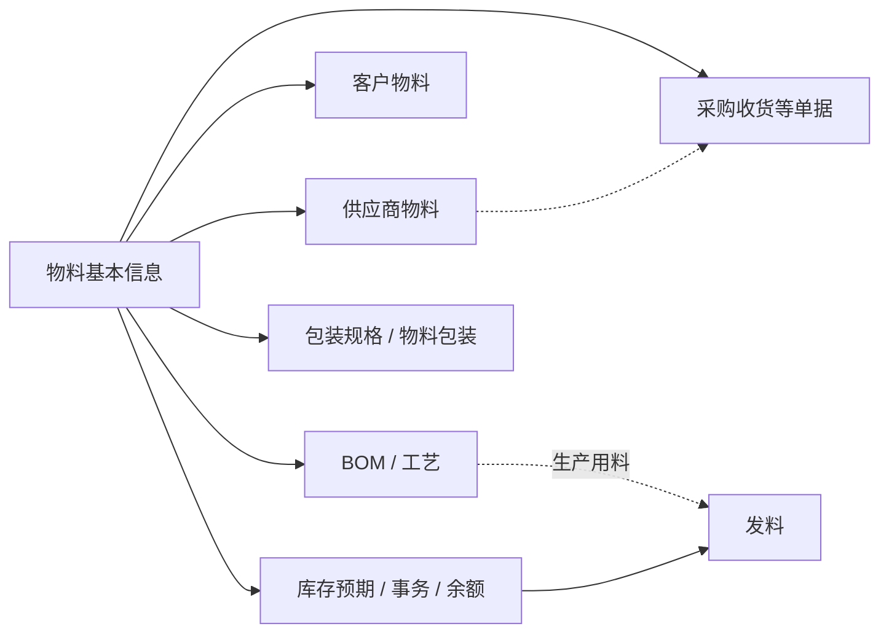

# 物料基本信息

> 适用基线：测试环境目标 / `dev` 分支 / 2026-07-15。
> 阅读对象：测试、实施与主数据维护人员（采购 / 仓储 / 生产可按「如何使用本组文档」浅读主线）。

物料基本信息是系统识别和使用实物、半成品、成品及其它物料的统一入口。读完本页应能说清：维护范围与边界、一条物料如何从建档到被业务引用、本页配置（用途开关 / 类型单位 / 启停）如何改变下游可选范围，以及用哪些点做验证。

## 如何使用本组文档

| 你的目的 | 建议阅读 |
| --- | --- |
| 测试：设计维护、启停、用途差异与跨模块选不到料的场景 | 本页全文（尤其「配置如何起作用」「建议验证点」）→ 需要字段取值矩阵时再打开维护参考 |
| 实施：落地编码口径、字典与用途开关，并评估停用影响 | 本页「准备 → 典型链路 → 配置如何起作用 → 做完影响什么」；导入与录入限制见维护参考 |
| 日常新增 / 导入 / 联查操作步骤 | [物料基本信息-维护与查询参考](02-物料基本信息-维护与查询参考.md) |
| 理解选择器「可用 / 用途」通例 | [通用选择器过滤惯例](../../02-业务模型/12-通用选择器过滤惯例.md)；本页只写物料差异 |

本页不替代 [BOM](02-BOM.md)、供应商物料、客户物料、[包装规格](04-包装规格.md) 或库存页面的具体维护说明。

## 一笔典型业务：从建档到被引用

主数据维护型页面的「一笔业务」= **维护链路** + **下游使用链路**。

### 维护链路（触发 → 处理 → 结果）

1. **触发**：新物料要进入采购 / 库存 / 生产，或既有物料用途、单位、可用性需要变更。
2. **处理**：确认物料号与名称口径 → 选物料类型与基本单位 → 按实际取得方式打开用途开关 → 补管控属性 → 保存并启用。
3. **结果**：物料可在列表与详情中查询；是否立刻出现在采购收货、发料等选择器中，还取决于「是否可用」及各业务是否按用途过滤（见配置节）。
4. **关键分支**：
    - 只需纠正名称 / 管控、不改码 → 日常编辑。
    - 物料不再使用 → **停用优先于删除**；删除仅用于尚未被业务引用的错误创建。
    - 批量初始化 → 走导入（三种模式与校验见维护参考），正式批量前先小样。

### 使用链路（被谁引用）

!!! example "写实示例（给定配置 → 期望行为）"
    物料号 `BOLT-M8-20`，名称「螺栓 M8×20」，物料类型=紧固件，基本单位=件，**可采购=是**、**可制造=否**、**是否可用=是**。  
    **期望：** 可维护供应商物料并在采购侧建单/收货选料路径上可用；不作为自制件进入制造路径。若随后将「是否可用」改为否，停用后各业务选择器是否立刻不可选仍须按验证点实测（`❓`）。

物料创建成功 ≠ 所有业务立即可用：采购匹配常还要供应商物料，生产用料常还要 BOM/工艺，包装与库区另见对应页。

## 使用前准备

| 需要准备什么 | 用途 |
| --- | --- |
| 物料号与名称 | 唯一识别与日常沟通；物料号由维护人员录入，不可与已有物料重复 |
| 物料类型与计量单位 | 分类、计量与后续业务选择；选项来自系统字典 |
| 物料用途 | 是否可采购、可制造、可委外加工，以及回收件、虚物料等 |
| 管控属性 | ABC 类、有效天数、是否可用、质量等级等；是否必填取决于物料类型与企业管理要求 |

!!! example "📷 截图占位"
    物料新增页：标出物料号、名称、物料类型、基本单位、用途开关与状态；使用脱敏测试数据。

## 业务逻辑要点

| 要点 | 说明 |
| --- | --- |
| 主对象 | 一条物料主档：识别信息 + 分类计量 + 用途开关 + 管控 / 可用性 |
| 状态与动作 | 页面提供启用 / 禁用；日常 **Web 编辑锁定物料号**；删除仅用于未引用的错误创建 |
| 跨模块边界 | 本页只维护「是什么物料、能否按某途径使用」；不在本页维护默认包装、默认库位、BOM 结构或库存余额 |
| 与选择器通例 | 下游选料默认期望「可用主数据」；采购场景还宜满足可采购等用途。通例见[通用选择器过滤惯例](../../02-业务模型/12-通用选择器过滤惯例.md)；**用途开关与停用在各业务选择器的过滤时点仍有 `❓`** |
| 与字典 / 类型配置 | 物料类型、计量单位、ABC、质量等级、状态等可选范围来自字典；有效天数上限可能受物料类型配置约束 |

## 关键判断或规则

| 需要判断什么 | 规则与后果 |
| --- | --- |
| 物料号 | 新增必填且不重复；编辑不可改。已被 BOM / 库存 / 采购引用后，禁止绕过页面改码（`GAP-013`） |
| 类型与单位 | 选错会导致管控项与后续筛选口径不一致，以及收发数量不可比 |
| 用途开关 | 须与实际取得 / 使用方式一致；误关「可采购」可能导致采购侧无法匹配或无法闭环 |
| 回收件 vs 页面「标准件」 | 正式业务语义是**回收件**；页面或模板若显示「标准件」仍按回收件理解（`GAP-007`） |
| 可用性 | 停用前评估在途采购、库存、生产引用；优先停用，不以删除代替停用 |

## 配置如何起作用

本页**没有**独立的业务类型 / 单据设置。对测试与实施而言，「配置」= **本页主档字段本身** + **上游字典 / 类型约束** + **下游选择器通例**。

| 你改什么 | 预期影响什么 | 实施/测试时怎么看 |
| --- | --- | --- |
| 物料类型（字典项） | 分类口径；可能约束有效天数上限等管控展示 | 换类型后看管控项是否仍匹配企业管理要求 |
| 基本单位 / 替代单位 | 后续采购、库存、生产的计量基础 | 单位变更会影响已有单据与库存计量理解；导入对替代单位必填口径可能不一致（`GAP-018`） |
| 可采购 / 可制造 / 可委外加工 | 标明可通过哪些途径获得；**期望**影响采购 / 生产 / 委外选料与匹配 | 过滤是否在选择器层生效 → 见建议验证点（`❓`） |
| 回收件 / 虚物料 | 特殊分类与通常不实物入库的逻辑件 | 虚物料误标会导致库存预期偏差；回收件勿按「标准件」培训 |
| 是否可用（启停） | 是否处于可使用的管理状态；通例期望停用后不可再被选 | 各业务过滤时点 `❓`；停用前查在途与库存 |
| 有效天数、ABC、质量等级 | 保质 / 分级 / 质量分档 | 有保质要求时先确认类型配置再填天数 |
| 上游：物料类型 / 计量单位字典未建或已停用 | 本页选不到对应项，导入也会失败 | 先修字典，再维护物料 |
| 通例：[通用选择器过滤惯例](../../02-业务模型/12-通用选择器过滤惯例.md) | 「仅可用主数据」、组织权限裁剪、采购场景宜可采购等 | 本页差异（停用 / 用途过滤时点）以实测为准，勿写成全站已证实规则 |

## 建议验证点

短列表，供开单；完整字段与导入样例见维护参考。

1. **新增唯一性**：重复物料号应被拒绝；合法物料保存后可在列表按物料号 / 名称查到。
2. **物料号锁定**：编辑页物料号不可改；培训口径一律禁止绕过页面改码（`GAP-013`）。
3. **用途差异**：同一物料「可采购=是 / 否」各建一条对照；在采购订单或采购收货选料路径上观察是否可选（记录实际过滤时点，`❓`）。
4. **启停门禁**：启用物料可被业务引用；停用后抽查采购、库存、生产至少各一个选择器是否过滤（`❓`）。
5. **类型与有效天数**：选有天数上限的物料类型，录入超限与合法天数，确认页面 / 导入表现。
6. **回收件标签**：页面或导入模板若出现「标准件」，业务结论仍按回收件；登记前端 / 模板问题（`GAP-007`）。
7. **导入小样**：追加 / 更新 / 覆盖各跑一行成功与一行失败；核对错误文件，并留意替代单位等必填口径差异（`GAP-018`）。
8. **下游引用准备**：仅建物料主档、不建供应商物料时，确认采购匹配仍缺哪一步（边界，而非本页缺陷）。

## 关键字段业务角色

只列主线；完整语义、取值矩阵与选择器范围见[维护与查询参考](02-物料基本信息-维护与查询参考.md)。

| 字段/配置点 | 在系统中的作用 | 关键行为要点 | 维护时要警惕什么 |
| --- | --- | --- | --- |
| 物料号 | 主要业务识别号 | 新增必填、不重复；日常 Web 编辑锁定 | 已被引用后勿绕过页面改码（`GAP-013`） |
| 名称与描述 | 列表、单据、查询展示 | 名称必填；描述可选 | 名称过短无法区分近似物料 |
| 物料类型 | 分类，并影响可选管控 | 选自物料类型字典；可能约束有效天数上限 | 类型选错 → 管控与筛选口径不一致 |
| 基本单位 / 替代单位 | 计量基础与换算出口 | 基本单位必填；替代单位用于需换算场景 | 单位变更影响已有计量理解；导入口径不一致（`GAP-018`） |
| 可采购 / 可制造 / 可委外 | 标明获得途径 | 取值影响适用判断；选择器是否过滤 `❓` | 误关可采购可能导致无法采购闭环 |
| 回收件 / 虚物料 | 特殊业务属性 | 回收件为正式语义；虚物料通常不入库 | 「标准件」显示按回收件理解（`GAP-007`） |
| 是否可用与状态 | 可维护、可使用管理状态 | 有启用 / 禁用入口；停用过滤时点 `❓` | 停用前评估在途与库存 |
| ABC / 有效天数 / 质量等级 | 分级、保质、质量分档 | 有效天数仅非负整数；上限可能来自类型配置 | 有保质要求时先确认类型配置 |

## 做完影响什么

| 方向 | 影响 |
| --- | --- |
| 下游单据 | 采购收货、库存作业、生产用料、销售交付等引用同一物料号与单位 |
| 关系主数据 | 可继续维护[供应商物料](../02-供应商管理/02-供应商物料.md)、客户物料、[BOM](02-BOM.md)、[包装规格](04-包装规格.md) / 物料包装、物料库区配置 |
| 停用 / 用途变更 | 可能使后续选不到料，或使在途单与现场理解不一致；变更前先定位引用 |
| 查询入口 | 列表筛选 + 详情；供应商 / 客户物料页签已可用。BOM、库存、采购收货等按物料号联查见维护参考（部分为后续完善） |

## 异常与查询入口

日常异常处理与列表 / 详情操作见[维护与查询参考](02-物料基本信息-维护与查询参考.md)。主线常见情况：

| 情况 | 建议处理 |
| --- | --- |
| 新增提示物料号重复 | 先查是否已存在；不要靠改大小写或临时字符制造双码 |
| 不确定单位或类型 | 暂停新增，先确认字典口径与后续业务用途 |
| 业务要求更换物料号 | 不绕过页面改码；评估 BOM / 库存 / 采购 / 生产影响后走变更方案 |
| 导入出现错误文件 | 按错误文件逐行修正；确认导入模式后再提交 |
| 页面显示「标准件」 | 按「回收件」理解并登记前端 / 模板问题 |

## 当前限制与待确认事项

主线已按「可依赖事实」书写；下列项不改变上述培训与实施口径，验证时单独跟踪：

- `GAP-013`：Web 物料号不可编辑，但接口 / 服务仍可能接收改码 → 日常一律按不可修改执行。
- `GAP-007`：部分前端与导入模板将回收件标成「标准件」→ 文档与培训统一用「回收件」。
- `GAP-018`：导入读取层与保存层对部分字段（如替代单位、是否脱离 ERP）必填口径可能不一致 → 正式批量前小样验证，以错误文件为准。
- `❓` 停用后各业务选择器的过滤时点；删除已被引用物料时的保护与提示；用途开关是否在选择器层过滤；有效天数上限的企业配置口径；标签 / 打印模板范围。

## 待补充的图示与示例

| 类型 | 后续需要补充的内容 | 目的 | 状态 |
| --- | --- | --- | --- |
| 关系图 | 物料与供应商物料、客户物料、BOM、库存、采购收货 | 理解「物料不是孤立资料」 | 上文已挂引用示意 |
| 新增 / 编辑截图 | 必填区、物料号锁定、用途开关 | 主数据维护培训 | 见待截图执行清单 |
| 导入样例 | 正确行、错误行与错误回执 | 批量维护与测试 | 待补示例数据 |
| 详情截图 | 分组与关联页签 | 查询与追溯 | 见待截图执行清单 |
