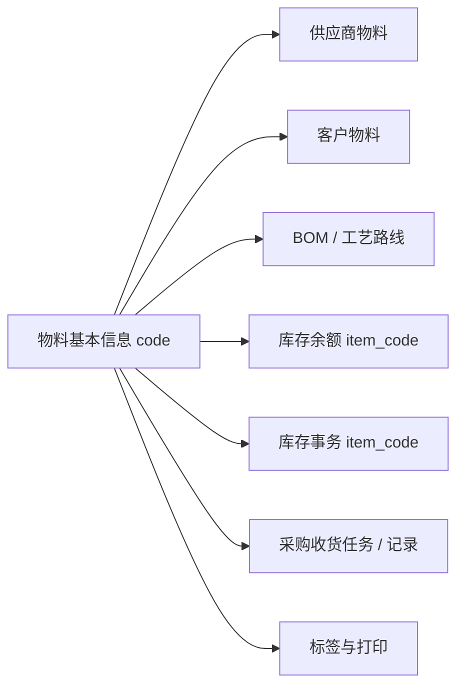

# 物料基本信息

## 概述

物料基本信息是 MOM 系统中最重要的主数据之一，所有业务单据（采购、入库、出库、盘点、生产、销售）的计价和用料都以物料为基础。

## 当前页面事实卡（代码、DDL 已证实）

> 适用基线：测试环境对应的 `dev` 分支，2026-07-15。以下内容描述当前实现；后文历史草稿中未被本节证实的字段口径和业务影响，须在后续模块轮次继续核验。

### 列表与查询

| 项目 | 当前实现 |
| --- | --- |
| 默认列表字段顺序 | 物料号、名称、物料描述、物料类型、基本单位、创建者、创建时间、更新者、更新时间、状态。 |
| 当前查询字段 | 物料号、名称、物料类型、基本单位、状态、是否可用。 |
| 详情补充字段 | 替代计量单位、采购/制造/委外开关、回收件、虚物料、是否脱离 ERP、ABC 类、种类、分组、颜色、配置、结算方式、项目、质量等级、有效天数、启停时间、备注及扩展属性。 |

### 新增约束与数据来源

| 字段/字段组 | 当前校验与类型 | 数据来源或选择方式 |
| --- | --- | --- |
| 物料号 `code` | DDL 为 `varchar(64)` 且非空；页面要求非空、长度不超过 30 个字符，并执行代码格式校验。创建服务会校验物料号未存在。 | 手工录入。 |
| 名称 `name` | DDL 为 `varchar(64)`；页面要求非空、长度不超过 50 个字符；导入也要求非空。 | 手工录入。 |
| 物料类型 `type` | `varchar(64)`、非空。 | 物料类型字典 `ITEM_TYPE`。 |
| 基本单位 `uom`、替代单位 `altUom` | 均为 `varchar(64)`；基本单位非空，替代单位可空。 | 计量单位字典 `UOM`。 |
| 状态 `status`、是否可用 `available` | 状态为 `varchar(64)` 且 DDL 非空；是否可用为 `boolean` 且默认 `true`。 | 状态字典 `ITEM_STATUS`；是否可用为布尔字典。 |
| 采购、制造、委外、回收件 `isRecycled`、虚物料开关 | 均为 `varchar(64)` 且 DDL 非空。 | TRUE/FALSE 字典；`isRecycled=TRUE` 表示回收件。当前部分前端误显示为“标准件”，详见产品差距总账。 |
| ABC 类、种类、分组、颜色、配置、结算方式、质量等级 | 均为 `varchar(64)`；ABC 类非空，其余可空。 | 对应 DBC 字典。 |
| 有效天数 `validityDays` | DDL 为 `numeric(18,2)` 且默认 `0`、非空；接口对象为整数，页面限制非负整数。 | 手工录入；页面会读取物料类型字典备注中的纯数字作为可配置上限。 |
| 启用/停用时间 | `timestamp(6)`，可空。 | 日期时间控件。 |

### 编辑限制与影响

| 规则 | 当前实现 | 文档结论 |
| --- | --- | --- |
| 物料号修改 | **Web 编辑表单会禁用 `code`**，因此正常页面操作不能改物料号；但通用更新接口仍接收 `code`，服务层也保留了代码变化时同步 `itemexpand` 的分支。 | 培训与日常维护应按“物料号不可编辑”执行。接口层未拒绝改码，且未见跨 BOM、库存、业务单据的统一同步/禁止校验，属于实现边界不一致，已登记差距。 |
| 是否可用修改 | 更新服务会同步物料扩展表的可用状态。 | 已证实主表与扩展表同步；其他业务选择器是否立即过滤不可用物料，需按实际选择器逐项核验。 |
| 乐观锁 | 主表有 `concurrency_stamp`，默认值为 1。 | 支持并发控制；冲突提示与页面处理方式待测试验证。 |

### 导入规则（当前实现与建议）

| 分类 | 内容 |
| --- | --- |
| 当前导入必填列（按导入 VO） | 物料号、名称、物料类型、基本单位、状态、是否可用、替代计量单位、可采购、可制造、可委外加工、回收件、虚物料、是否脱离 ERP、ABC 类、有效天数。 |
| 当前导入可选列 | 物料描述、种类、分组、颜色、配置、结算方式、项目、质量等级、启用/停用时间、备注、扩展属性。 |
| 当前实现的校验 | 模板读取层按 `ItembasicImportExcelVo` 校验必填、字典转换；服务保存层按 `ItembasicExcelVO` 再校验。导入模式：`1` 更新（不存在则新增）、`2` 追加（已存在报错）、`3` 覆盖（不存在报错）；存在错误且未选择部分更新时整批回滚，并输出错误文件。 |
| 不建议作为人工维护列 | 创建者、创建时间、更新者、更新时间。这些审计列当前存在于 Excel VO 中，建议后续从人工导入模板移除，由系统自动填充。 |
| 待验证项 | 导入时有效天数上限和物料代码格式校验是否与页面完全一致；`altUom`、`isOutErp` 在**模板读取层**为必填、但在**保存层 VO**中不是必填，需确认这是否为有意的模板约束；历史导入模板或前端如仍显示“标准件”，应按产品差距总账修正为“回收件”。 |

### DTO/VO 与前端页面层证据（第一轮）

| 层级 | 证据 | 当前结论 |
| --- | --- | --- |
| 接口新增/编辑 | `ItembasicBaseVO.java` | 后端接口显式必填：`code`、`uom`、`enableBuy`、`enableMake`、`enableOutsourcing`、`isRecycled`、`isPhantom`、`abcClass`、`type`、`validityDays`、`available`。 |
| 页面表单校验 | `itembasic.data.ts` | 页面要求 `code` 非空且不超过 30 个字符、执行代码格式校验；`name` 非空且不超过 50 个字符；状态、基础字典字段等由页面规则控制。 |
| 编辑态字段限制 | `itembasic/index.vue` | 打开编辑表单时，页面将 `code` 的组件设置为禁用；新增时再恢复可编辑。页面实际行为与服务层“代码变化同步扩展表”的兼容逻辑不同，日常规则以页面为准。 |
| 导入双层模型 | `ItembasicImportExcelVo.java`、`ItembasicExcelVO.java`、`WinBaseController.java` | 导入模板从 `ItembasicImportExcelVo` 解析，再复制为 `ItembasicExcelVO` 交给服务保存；两个 VO 的必填约束并不完全相同，不能只看其中任意一个定义导入规则。 |
| 页面列表/查询 | `itembasic.data.ts` | 默认列表聚焦物料号、名称、物料描述、物料类型、基本单位、创建/更新信息和状态；查询聚焦物料号、名称、物料类型、基本单位、状态、是否可用。 |
| 页面扩展属性 | `itembasic.data.ts` | 页面加载 `GetExtendConfigList('basic', 'basic_itembasic')`，说明物料页还存在按表名挂接的扩展属性。 |
| 字典与动态约束 | `itembasic.data.ts` | 物料类型、单位、状态等通过字典构造；有效天数上限来自物料类型字典 `remark` 中的纯数字配置。 |
| 已确认前端错误 | `itembasic.data.ts`、`ItembasicImportExcelVo.java` | `isRecycled` 当前被显示/导出为“标准件”，但业务语义已确认是“回收件”。本文档按“回收件”处理，并将该问题标记为产品差距。 |

### 详情页分组与快速跳转规划（P0 样板）

当前前端物料代码支持进入详情页，详情页已存在基础详情、供应商物料和客户物料页签。本文档先按“培训可读 + 业务字典可查”的目标规划详情分组，后续截图和实际 Tab 顺序以测试环境复核为准。

| 分组 | 建议展示字段/内容 | 当前依据 | 待补充 |
| --- | --- | --- | --- |
| 基本信息 | 物料号、名称、描述、物料类型、基本单位、替代单位、状态、是否可用。 | 物料列表、详情 Schema 和 `ItembasicBaseVO.java`。 | 测试环境详情页截图。 |
| 管控属性 | 可采购、可制造、可委外加工、回收件、虚物料、是否脱离 ERP、ABC 类、有效天数。 | 新增/编辑 VO 与前端表单规则。 | 各开关对选择器、BOM、库存、生产的实际过滤效果。 |
| 字典与分类 | 种类、分组、颜色、配置、结算方式、项目、质量等级、产品类、扩展属性。 | 前端字典配置和扩展属性加载逻辑。 | 字典来源、字典值说明和扩展属性配置样例。 |
| 标签与打印 | 标签是否已创建、创建标签、打印标签、标签类型 `Item`。 | 物料列表行按钮和 `createItemLabel` 调用。 | 标签模板来源、打印模板、条码样例。 |
| 供应商/客户物料 | 供应商物料页签、客户物料页签。 | `ItemBasicTabsList` 中的 `SupplierItems`、`CustomerItems`。 | 页签字段、维护规则和与采购/销售的关系。 |
| 系统信息 | 创建者、创建时间、更新者、更新时间、乐观锁版本、备注。 | DDL/DO 审计字段。 | 审计字段是否在详情页展示。 |

| 快速跳转目标 | 跳转条件 | 业务用途 | 状态 |
| --- | --- | --- | --- |
| 供应商物料 | 按物料号 `code` 过滤供应商物料。 | 查看可供货供应商、供应商物料编码和采购匹配关系。 | 已有页签，待补字段。 |
| 客户物料 | 按物料号 `code` 过滤客户物料。 | 查看客户侧物料编码、规格映射和销售交付匹配关系。 | 已有页签，待补字段。 |
| BOM/工艺路线 | 按父项或子项物料过滤。 | 判断物料是否用于生产结构和工艺路线。 | 占位，待 MES/DBC 取证。 |
| 库存余额 | 按 `item_code = code` 过滤库存余额。 | 查看当前库存数量、状态、库位、批次和包装。 | 占位，待链接到库存查询页。 |
| 库存事务 | 按 `item_code = code` 过滤库存事务。 | 追溯该物料的库存变动流水。 | 占位，待链接到库存事务页。 |
| 采购收货/任务/记录 | 按物料号过滤采购收货相关明细。 | 从物料视角追溯采购入库过程。 | 占位，待采购收货明细页完善。 |
| 导入导出日志 | 按导入任务或文件名追踪。 | 排查批量导入/导出结果。 | 占位，待 Infra/System 日志页补齐。 |
| 标签打印记录 | 按物料号或标签类型 `Item` 过滤。 | 排查标签生成、打印和模板使用情况。 | 占位；标签/打印未来按 INFRA 平台能力归档。 |

### 动作按钮、状态前置条件与服务流转（第一轮）

| 动作 | 当前入口 | 前置条件/限制 | 结果影响 | 状态 |
| --- | --- | --- | --- | --- |
| 新增 | 列表顶部“新增”。 | 页面校验物料号、名称、单位、状态、可用性和业务开关等必填项；创建服务校验物料号未存在。 | 新增物料主数据，并同步扩展表。 | 已取证，待测试截图。 |
| 编辑 | 列表行“编辑”。 | Web 表单禁用物料号 `code`；其余字段仍按表单校验提交。服务层虽能处理直接接口传入的改码，但不应被理解为日常维护能力。 | 修改物料主数据和部分扩展信息。 | 已取证；接口边界差异已登记产品差距。 |
| 启用/禁用 | 列表行启用/禁用按钮。 | 入口与按钮权限已存在；具体显示条件和业务选择器过滤效果待逐项验证。 | 改变物料可用性，影响后续选择和业务引用。 | 待测试验证。 |
| 删除 | 列表行“删除”。 | 后端删除接口存在；被业务引用后的删除限制尚未完成取证。 | 删除物料主数据。 | 待测试验证，已登记问题。 |
| 导入 | 列表顶部“导入”。 | 导入 VO 要求必填列和字典转换；追加模式校验物料号重复。 | 批量新增/更新物料，错误输出错误文件。 | 已取证，模板需优化。 |
| 导出 | 列表顶部“导出”。 | 需要导出权限。 | 异步导出，并引导用户到导入导出日志查看。 | 已取证，待补日志页链接。 |
| 创建标签 | 列表行“创建标签”。 | 当前按钮在未创建标签时展示；调用标签类型 `Item`。 | 为物料生成标签数据。 | 已取证，标签归属后续按 INFRA 平台能力整理。 |
| 打印标签 | 列表行“打印标签”。 | 需要已有标签数据。 | 打开标签打印流程。 | 已取证，待补模板和截图。 |

### 物料主数据关联示意（占位样板）



### 图示、截图与示例内容占位

| 内容类型 | 建议放置位置 | 目的 | 状态 |
| --- | --- | --- | --- |
| 物料新增表单截图 | “新增约束与数据来源”之后 | 用于培训说明哪些字段必填、哪些字段来自字典/扩展属性。 | 占位，待测试环境截图。 |
| 物料导入模板示例 | “导入规则”之后 | 给出一行有效样例和一行错误样例，说明字典值、回收件、有效天数的填写方式。 | 占位，待根据最终模板生成。 |
| 物料与业务单据引用关系图 | “关联关系”之前 | 说明物料如何被 BOM、采购、库存、生产、质量等业务引用。 | 占位，待根据代码和菜单补图。 |
| 字段差异对照图 | “字段说明”之前 | 展示“旧文档伪字段名 → 当前真实字段名”的映射，降低培训误解。 | 占位，待字段校正专项生成。 |

## 字段说明（已按 P0 字段证据底表校正）

> 字段技术名以 `basic_itembasic` 和 `ItembasicDO` 为准。旧草稿中的 `materialCode`、`materialName`、`materialType`、`unit`、`isStandard` 等名称不得再作为接口、导入、测试或排查依据。

| 中文名称 | 后端 DO 属性 | 数据库表.列 | 类型/长度 | 当前文档结论 |
| --- | --- | --- | --- | --- |
| 物料号/代码 | `code` | `basic_itembasic.code` | `varchar(64)`，非空 | 真实技术名为 `code`，不是 `materialCode`。 |
| 名称 | `name` | `basic_itembasic.name` | `varchar(64)` | 当前页面校验长度与 DDL 长度不完全一致，待继续核验。 |
| 描述1 | `desc1` | `basic_itembasic.desc1` | `varchar(64)` | 可作为物料描述字段之一。 |
| 描述2 | `desc2` | `basic_itembasic.desc2` | `varchar(64)` | 可作为物料描述字段之一。 |
| 状态 | `status` | `basic_itembasic.status` | `varchar(64)`，非空 | 字典来源待核验。 |
| 基本单位 | `uom` | `basic_itembasic.uom` | `varchar(64)`，非空 | 真实技术名为 `uom`，不是 `unit`。 |
| 替代计量单位 | `altUom` | `basic_itembasic.alt_uom` | `varchar(64)` | DO 属性与数据库列为驼峰/下划线映射。 |
| 可采购 | `enableBuy` | `basic_itembasic.enable_buy` | `varchar(64)`，非空 | true/false 字典口径待核验。 |
| 可制造 | `enableMake` | `basic_itembasic.enable_make` | `varchar(64)`，非空 | true/false 字典口径待核验。 |
| 可委外加工 | `enableOutsourcing` | `basic_itembasic.enable_outsourcing` | `varchar(64)`，非空 | true/false 字典口径待核验。 |
| 回收件 | `isRecycled` | `basic_itembasic.is_recycled` | `varchar(64)`，非空 | 已确认正式语义为“回收件”；前端/旧文档显示“标准件”为错误。 |
| 虚物料 | `isPhantom` | `basic_itembasic.is_phantom` | `varchar(64)`，非空 | 旧草稿“虚零件”可作为中文别称，但技术字段为 `isPhantom`。 |
| ABC 类 | `abcClass` | `basic_itembasic.abc_class` | `varchar(64)`，非空 | 字典来源待核验。 |
| 类型 | `type` | `basic_itembasic.type` | `varchar(64)`，非空 | 真实技术名为 `type`，不是 `materialType`。 |
| 种类 | `category` | `basic_itembasic.category` | `varchar(64)` | 字典来源待核验。 |
| 分组 | `itemGroup` | `basic_itembasic.item_group` | `varchar(64)` | 真实技术名为 `itemGroup` / `item_group`，不是 `groupCode`。 |
| 颜色 | `color` | `basic_itembasic.color` | `varchar(64)` | 字典来源待核验。 |
| 配置 | `configuration` | `basic_itembasic.configuration` | `varchar(64)` | 字典来源待核验。 |
| 结算方式 | `settlementType` | `basic_itembasic.settlement_type` | `varchar(64)` | 真实技术名为 `settlementType` / `settlement_type`。 |
| 项目 | `project` | `basic_itembasic.project` | `varchar(64)` | 项目来源待核验。 |
| 质量等级 | `eqLevel` | `basic_itembasic.eq_level` | `varchar(64)` | 真实技术名为 `eqLevel` / `eq_level`。 |
| 有效天数 | `validityDays` | `basic_itembasic.validity_days` | `numeric(18,2)`，默认 0，非空 | DO 为 `Integer`，DDL 为 `numeric(18,2)`，需确认类型转换风险。 |
| 用户组代码 | `userGroupCode` | `basic_itembasic.user_group_code` | `varchar(64)` | 是否页面维护待核验。 |
| 是否可用 | `available` | `basic_itembasic.available` | `boolean`，默认 true，非空 | 系统可用性字段。 |
| 生效时间 | `activeTime` | `basic_itembasic.active_time` | `timestamp(6)` | 日期时间字段。 |
| 失效时间 | `expireTime` | `basic_itembasic.expire_time` | `timestamp(6)` | 日期时间字段。 |
| 备注 | `remark` | `basic_itembasic.remark` | `text` | 备注字段。 |
| 是否脱离 ERP | `isOutErp` | `basic_itembasic.is_out_erp` | `varchar(64)`，默认 `FALSE` | 业务影响需继续核验。 |
| 产品类 | `prodCla` | `basic_itembasic.prod_cla` | `varchar(64)` | 字典或来源待核验。 |

## 字段说明（历史草稿，已降级为问题对照）

> 下表保留用于追溯旧文档问题，不再作为当前实现依据。正式字段以“字段说明（已按 P0 字段证据底表校正）”为准。

| 字段名 | 中文名 | 类型 | 约束 | 影响业务 | 备注 |
|--------|--------|------|------|----------|------|
| materialCode | 物料号 | VARCHAR(50) | 必填 | 所有业务单据（物料的唯一标识） | 物料在系统中的唯一身份标识，所有业务单据通过此编码引用物料 |
| materialName | 名称 | VARCHAR(200) | 必填 | 所有业务单据（显示物料名称） | 物料的显示名称，用于各单据、报表、列表中的展示 |
| materialDesc | 物料描述 | VARCHAR(500) | 非必填 | 物料识别（补充说明物料特征） | 物料的详细描述，用于补充说明物料的特征、规格等 |
| materialType | 物料类型 | ENUM | 字典项 | 业务单据分类（采购/生产/销售等模块下拉筛选）、统计报表按类型分组 | 区分物料的类型，如原材料、半成品、成品、辅料等 |
| unit | 基本单位 | VARCHAR(10) | 必填 | 入库/出库/盘点计量、工单用料量计算 | 物料的计量单位，如PCS、KG、SET |
| status | 状态 | ENUM | 字典项 | 业务单据引用（禁用状态物料不可被新建单据引用）、列表筛选 | 物料的上架/下架状态 |
| isEnabled | 是否可用 | BOOLEAN | 默认是 | 业务单据引用（不可用物料在所有选择列表中不可选） | 控制物料是否参与业务流通 |
| alternativeUnit | 替代计量单位 | VARCHAR(10) | 非必填 | 入库/出库数量换算（按换算率自动转换辅助单位数量） | 与基本单位配合使用，如"套"="12PCS" |
| canPurchase | 可采购 | BOOLEAN | 默认否 | 采购模块（关闭后采购申请/订单中不可选此物料） | 标识物料是否可以通过采购获取 |
| canManufacture | 可制造 | BOOLEAN | 默认否 | MES工单（关闭后BOM父项/工单中不可选此物料） | 标识物料是否可以通过内部生产获取 |
| canOutsource | 可委外加工 | BOOLEAN | 默认否 | 委外模块（关闭后委外订单中不可选此物料） | 标识物料是否可以通过委外加工获取 |
| isStandard | 标准件 | BOOLEAN | 默认否 | BOM引用推荐（标准件在BOM配置时优先推荐）、成本核算 | 标识物料是否为标准件，非标准件通常需要单独报价 |
| isVirtual | 虚零件 | BOOLEAN | 默认否 | [库存管理](../../05-WMS-库房管理/09-库存管理/index.md)（虚零件不参与实际库存进出、不过账） | 虚零件用于产品结构中的组合表示，如"一台整机"虚体，不对应实际库存 |
| isErpManaged | 是否脱离ERP管理 | BOOLEAN | 默认否 | 标准成本计算（脱离ERP管理后标准成本由MOM维护，不从ERP同步） | 开启后MOM独立管理物料成本，与ERP解耦 |
| abcClass | ABC类 | VARCHAR(50) | 非必填 | 库存分析（按ABC分类做库存策略差异化，如A类物料高频盘点） | ABC分类用于库存价值分级管理 |
| category | 种类 | VARCHAR(50) | 非必填 | 物料筛选（按种类快速过滤）、统计分析 | 物料种类，如电子类、机械类、包材类 |
| groupCode | 分组 | VARCHAR(50) | 非必填 | 物料筛选（按分组快速过滤） | 物料分组编码，用于同类型物料的批量管理 |
| color | 颜色 | VARCHAR(50) | 非必填 | 生产齐套（颜色是可视化管理的重要属性，影响装配准确性） | 物料颜色，用于区分同型号不同颜色的物料 |
| configuration | 配置 | VARCHAR(100) | 非必填 | 生产齐套（配置影响物料的唯一性，如同一型号不同配置） | 物料规格配置，用于高定制化产品的物料匹配 |
| settlementMethod | 结算方式 | VARCHAR(50) | 非必填 | 采购结算（按结算方式生成不同的财务凭证） | 如月结30天、票到付款等 |
| project | 项目 | VARCHAR(50) | 非必填 | 成本归集（物料消耗可按项目维度归集成本） | 关联项目，用于项目型制造的成本独立核算 |
| qualityLevel | 质量等级 | VARCHAR(50) | 非必填 | 供应商交货检验（不同质量等级触发不同的[来料检验](../../07-QMS-质量管理/02-来料检验/index.md)标准） | 如AQL 0.1、AQL 0.65等，影响来料检验严格程度 |
| validDays | 有效天数 | INT | 非必填 | 库存预警（超过有效天数触发库存老化预警/禁发） | 物料从入库开始的有效天数，超过后系统提醒处理 |
| effectiveDate | 启用时间 | DATE | 非必填 | 业务单据引用（启用时间之前物料不可被单据引用） | 物料启用的时间节点，启用前的历史单据不受影响 |
| disableDate | 停用时间 | DATE | 非必填 | 业务单据引用（停用时间之后物料不可被新建单据引用） | 物料停用的时间节点，用于物料的自然淘汰管理 |
| remark | 备注 | VARCHAR(500) | 非必填 | | 物料的补充说明信息 |

## 关联关系

```
物料 ←→ BOM（父物料/子物料 多对多）
物料 ←→ 供应商物料（供应商报价 一对多）
物料 ←→ 客户物料（客户规格匹配 多对多）
物料 ←→ 物料库区配置（默认库区/库位分配）
物料 ←→ 工艺路线（制造工艺 一对多）
```

## 字段约束说明

| 约束类型 | 说明 |
|----------|------|
| 字典项 | materialType（原材料/半成品/成品/辅料/包材/工装/备件 等）、status（草稿/生效/禁用） |
| 联动影响 | isEnabled=否→物料在所有业务单据下拉列表中不可选；validDays→入库时自动计算失效日期并触发库存老化预警；effectiveDate/disableDate→按当前单据日期判断物料是否在有效期范围内 |
