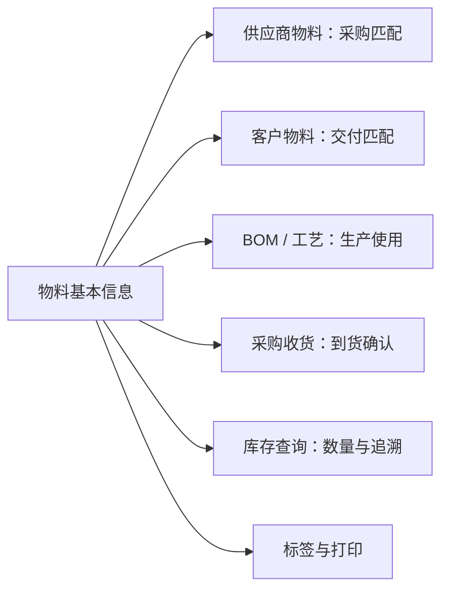

# 物料基本信息-维护与查询参考

> 适用基线：测试环境目标 / `dev` 分支 / 2026-07-15。
> 用途：配合[物料基本信息](01-物料基本信息.md)使用。本页用于日常维护、导入、查询与测试；业务背景、使用范围和培训主线以主文档为准。

## 快速定位

| 你要做什么 | 先看哪里 |
| --- | --- |
| 理解字段如何影响业务 | “字段说明” |
| 新增一项物料 | “新增与选择信息” |
| 修改、停用或删除物料 | “修改、启停与删除” |
| 批量维护物料 | “导入参考” |
| 找一项物料或查看关联关系 | “列表、详情与联查” |
| 处理标签或打印问题 | “标签与打印” |
| 想理解物料在采购、库存、生产中的作用 | 返回[物料基本信息](01-物料基本信息.md)。 |

## 字段说明
写法约定见[页面数据字典规范](../../02-业务模型/04-页面数据字典规范.md)。

### 字段说明总表
| 字段 | 业务作用 | 谁在何时维护/选择 | 业务约束摘要 | 影响哪些功能 | 变更或错选风险 |
| --- | --- | --- | --- | --- | --- |
| 物料号 | 唯一业务识别 | 主数据维护员新增时录入 | 必填、不重复、Web 编辑锁定；最长 30 字符 | 所有引用物料的单据与主数据关系 | 改码/重复导致引用断裂或双码（`GAP-013`/`GAP-006`） |
| 名称 | 业务可读识别 | 新增/修改/导入 | 必填；最长 50 字符 | 列表、单据、打印展示 | 名称含糊导致错发错用 |
| 描述 | 规格补充说明 | 按需维护 | 可选 | 查询区分 | 勿当作第二编码 |
| 物料类型 | 分类与管控入口 | 新增时选自物料类型字典 | 必填；可影响有效天数上限等配置 | 筛选、管控属性展示、导入校验 | 类型错误导致管控项不适配 |
| 基本单位 | 计量与记账基础 | 选自计量单位字典 | 必填 | 采购收货、库存、生产用量 | 单位错误导致数量不可比 |
| 替代单位 | 换算用辅助单位 | 按需选择；导入层必填口径不一致 | ❓ 换算关系维护位置与强制规则待确认（`GAP-018`） | 需双单位的收发场景 | 导入失败或现场换算混乱 |
| 可采购 | 是否走采购获取 | 新增/修改用途开关 | 取值是/否；❓ 选择器过滤时点待确认 | 采购订单、采购收货、供应商物料匹配 | 误关导致无法采购闭环 |
| 可制造 | 是否可自制 | 同上 | 同上 | 生产计划、BOM/工艺引用判断 | 误关影响自制路径 |
| 可委外加工 | 是否可委外 | 同上 | 同上 | 委外相关业务 | 误开/误关影响外协范围 |
| 回收件 | 回收件属性 | 新增/修改；正式语义为回收件 | 勿按「标准件」理解（`GAP-007`） | 标签、追溯、特殊库存处理 | 语义误解导致错误分类 |
| 虚物料 | 逻辑构成、通常不实物入库 | 新增/修改 | 与实物库存策略相关 | BOM 展开、库存预期 | 误标导致库存预期偏差 |
| ABC 类 | 物料分级 | 字典选择 | 接口层常为必填 | 分析、盘点优先级等 | 分级错误影响管控强度 |
| 有效天数 | 保质/有效期天数 | 维护员录入 | 非负整数；上限可能来自物料类型配置 | 效期管理、过期过滤 ❓ | 填错导致过早/过晚失效判断 |
| 质量等级 | 质量分档 | 按需选择 | 受字典与企业口径约束 | 质检与放行相关场景 | 等级与实物不符 |
| 状态 | 管理状态 | 维护/启停 | 字典取值；与启用禁用入口配合 | 列表筛选、可维护性 | 状态与「是否可用」混用需统一口径 |
| 是否可用 | 业务可用性 | 启用/禁用 | 默认可用；停用过滤 ❓ 待确认 | 各业务物料选择器 | 停用后仍被引用的在途单 |
| 是否脱离 ERP | 与 ERP 同步边界 | 维护/导入 | 导入与保存必填口径可能不一致（`GAP-018`） | 外部主数据同步 | 错标导致同步遗漏或冲突 |
| 创建人/时间等 | 审计 | 系统写入 | 用户勿填、导入勿改 | 追溯 | 模板含审计列时勿当业务字段 |

### 取值影响矩阵
| 取值 | 业务含义 | 影响的功能或流程 | 系统行为变化 | 错选/漏选后果 |
| --- | --- | --- | --- | --- |
| 可采购 = 是 | 允许作为采购对象 | 采购订单、采购收货、供应商物料 | ❓ 待确认：相关选择器是否按此过滤 | 需要采购却为否 → 建单或选料失败 |
| 可采购 = 否 | 不作为采购对象 | 同上 | 同上 | 误关导致在途采购无法匹配 |
| 可制造 = 是 | 允许自制 | 生产用料、BOM/工艺 | ❓ 过滤时点待确认 | 需要自制却为否 → 计划/发料受阻 |
| 可制造 = 否 | 不自制 | 同上 | 同上 | 误开可能进入错误生产路径 |
| 可委外加工 = 是/否 | 是否允许委外 | 委外相关单据与匹配 | ❓ 待确认 | 范围与实物外协策略不符 |
| 回收件 = 是 | 按回收件管理 | 标签、追溯、特殊处理 | 页面若显示「标准件」仍按回收件 | 培训/导入按标准件理解则分类错误 |
| 虚物料 = 是 | 逻辑件，通常不对应实物库存 | BOM、库存预期 | ❓ 库存事务是否跳过待确认 | 误标导致账面库存预期错误 |
| 是否可用 = 否 | 停用 | 列表与选择器 | ❓ 各业务过滤时点待确认 | 停用后仍被引用 → 现场选不到或历史单异常 |
| 物料类型 =（字典各项） | 企业分类口径 | 管控属性、有效天数上限、筛选 | 随字典备注/配置变化 | 类型与实物不符 → 管控项错配 |

### 本页范围说明

- 物料主档页内无“选单回填明细”链；关联页（供应商物料等）各自说明。
- 默认包装、默认库位等不在本页，见物料包装 / 物料库区配置。

## 物料在业务中的关联关系

这张图表达业务引用关系，而不是数据库关系。某一关联是否需要维护、是否已配置，仍应以对应业务页面为准。

## 新增与选择信息

建议按“确认编码口径 → 选择类型和单位 → 设置用途与管控 → 保存后补关联资料”的顺序维护。若采购、生产或仓储用途尚未明确，应先确认业务口径，而不是先建立一条用途不明的物料。

| 信息组 | 用户需要做什么 | 来源或限制 |
| --- | --- | --- |
| 基本识别 | 填写物料号、名称和描述。 | 物料号不可重复；名称用于业务展示。 |
| 分类与计量 | 选择物料类型、基本单位，按需选择替代单位。 | 当前选项来自系统字典；不确定时先确认主数据口径。 |
| 业务用途 | 选择是否可采购、可制造、可委外加工，以及回收件、虚物料等属性。 | 应与物料实际取得和使用方式一致。 |
| 管控属性 | 维护状态、是否可用、ABC 类、有效天数、质量等级等。 | 具体必填项受页面与物料类型配置影响。 |

### 录入限制说明

| 项目 | 当前页面限制 | 使用建议 |
| --- | --- | --- |
| 物料号 | 必填；页面最长 30 个字符；新增时检查重复。 | 使用稳定、可读的企业编码，不用临时字符规避重复。 |
| 名称 | 必填；页面最长 50 个字符。 | 应让采购、仓库、生产人员能区分物料。 |
| 有效天数 | 只允许非负整数；上限可能由物料类型配置决定。 | 有保质期管理要求时，先确认类型配置。 |

!!! example "📷 截图占位"
    新增表单中的字典选择、用途开关和必填提示。

## 修改、启停与删除

| 操作 | 可以如何处理 | 需要注意什么 |
| --- | --- | --- |
| 修改物料号 | 日常 Web 页面不支持修改。 | 已被采购、库存、BOM 或生产引用时，不应绕过页面直接改码。 |
| 修改名称、分类或用途 | 按业务变化维护，并评估下游引用。 | 采购、制造、委外等用途变化可能影响后续选择和规则。 |
| 启用/停用 | 可通过页面入口改变可用状态。 | 停用前先检查在途、库存和未完成业务；各业务选择器的实际过滤效果仍需测试确认。 |
| 删除 | 仅用于错误创建且未被引用的物料。 | 下游引用保护尚待验证，优先使用停用而不是删除。 |

变更名称、单位、用途或有效期等可能影响下游选择和业务判断时，应先定位现有引用，再决定是否修改、停用或建立替代物料。不要通过临时改码规避变更评估。

## 导入参考

### 模板应包含什么

| 分类 | 建议列 |
| --- | --- |
| 必要识别信息 | 物料号、名称、物料类型、基本单位、状态、是否可用。 |
| 业务用途与管控 | 可采购、可制造、可委外加工、回收件、虚物料、ABC 类、有效天数等。 |
| 业务补充信息 | 描述、种类、分组、颜色、配置、质量等级、备注等。 |
| 不应由用户填写 | 创建人、创建时间、更新人、更新时间等系统审计信息。 |

### 导入方式与结果

| 方式 | 适用场景 | 风险提示 |
| --- | --- | --- |
| 更新 | 已存在物料时更新信息；不存在时新增。 | 先确认哪些字段允许被批量改写。 |
| 追加 | 只新增，不接受已存在物料号。 | 适合首次初始化或严格防重复场景。 |
| 覆盖 | 只处理已存在物料。 | 使用前必须确认覆盖范围，避免误改。 |

导入失败时，按错误文件逐行修改后重新导入。模板或页面若把“回收件”显示为“标准件”，应按“回收件”理解并登记问题（`GAP-007`）。

导入模板读取校验与最终保存校验对部分字段的必填要求可能不一致（例如替代单位、是否脱离 ERP）；正式批量前必须用小样验证成功/失败范围（`GAP-018`）。

!!! example "📝 示例数据占位"
    一行正确导入数据、一行物料号重复或字典值错误的数据，以及对应错误回执。

## 列表、详情与联查

### 列表与筛选

| 推荐顺序 | 字段/条件 | 用途 |
| --- | --- | --- |
| 1 | 物料号、名称 | 快速识别目标物料。 |
| 2 | 物料类型、基本单位、状态、是否可用 | 判断是否适合当前业务使用。 |
| 3 | 描述、创建/更新时间 | 辅助区分和追溯。 |

### 详情与快速跳转

| 查看目标 | 当前入口或后续规划 | 过滤逻辑 |
| --- | --- | --- |
| 供应商物料 | 当前详情页签。 | 当前物料。 |
| 客户物料 | 当前详情页签。 | 当前物料。 |
| BOM/工艺 | 后续联查。 | 当前物料作为父项或子项。 |
| 库存余额、库存事务 | 后续联查。 | 当前物料。 |
| 采购收货 | 后续联查。 | 当前物料在收货明细中的记录。 |

!!! example "📷 截图占位"
    物料列表的常用筛选、详情分组与供应商/客户物料页签。

## 标签与打印

当前页面可以创建物料标签，并在已有标签后进入打印流程。标签模板、条码内容、打印机选择和打印记录需在后续平台能力页面补充。

!!! example "📷 截图占位"
    创建标签、标签已创建、打印标签三个状态。

## 仍待业务确认

- 停用后，各采购、生产、库存选择器何时以及如何过滤该物料；
- 删除已被引用物料时的系统保护和提示；
- 有效天数上限的业务配置口径；
- 标签模板、打印模板及其实际使用范围。
