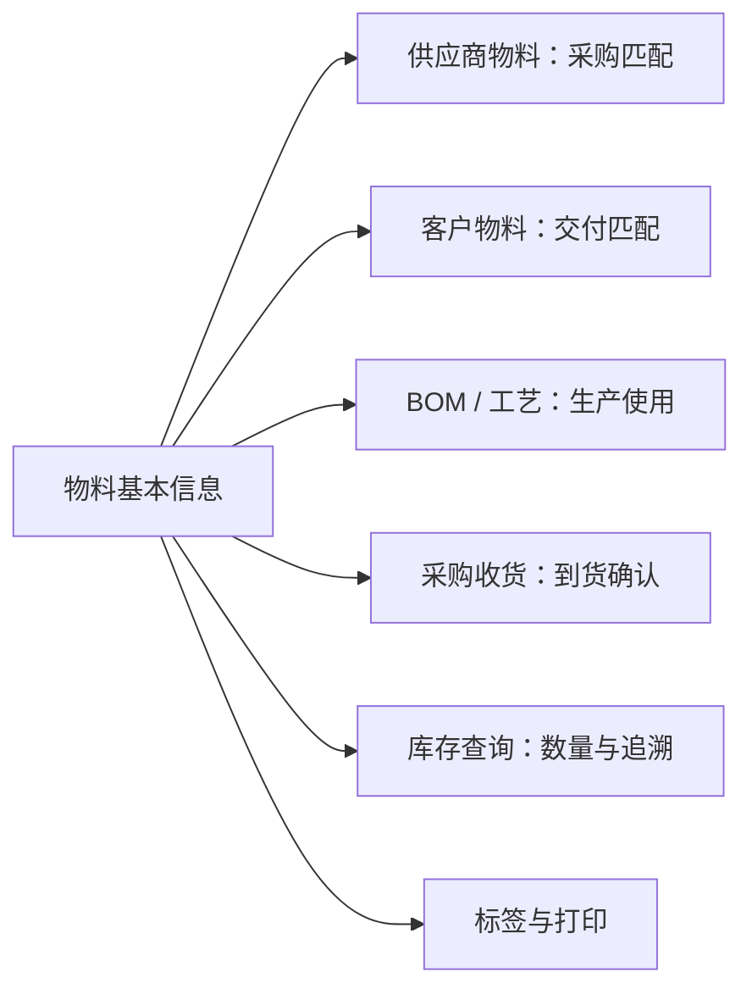

# 物料维护与查询参考

> 适用基线：测试环境目标 / `dev` 分支 / 2026-07-15。
> 用途：配合[物料基本信息](01-物料基本信息.md)使用。本页用于日常维护、导入、查询与测试；业务背景、使用范围和培训主线以主文档为准。

## 快速定位

| 你要做什么 | 先看哪里 |
| --- | --- |
| 新增一项物料 | “新增与选择信息” |
| 修改、停用或删除物料 | “修改、启停与删除” |
| 批量维护物料 | “导入参考” |
| 找一项物料或查看关联关系 | “列表、详情与联查” |
| 处理标签或打印问题 | “标签与打印” |
| 想理解物料在采购、库存、生产中的作用 | 返回[物料基本信息](01-物料基本信息.md)。 |

## 物料在业务中的关联关系

这张图表达业务引用关系，而不是数据库关系。某一关联是否需要维护、是否已配置，仍应以对应业务页面为准。

## 新增与选择信息

建议按“确认编码口径 → 选择类型和单位 → 设置用途与管控 → 保存后补关联资料”的顺序维护。若采购、生产或仓储用途尚未明确，应先确认业务口径，而不是先建立一条用途不明的物料。

| 信息组 | 用户需要做什么 | 来源或限制 |
| --- | --- | --- |
| 基本识别 | 填写物料号、名称和描述。 | 物料号不可重复；名称用于业务展示。 |
| 分类与计量 | 选择物料类型、基本单位，按需选择替代单位。 | 当前选项来自系统字典；不确定时先确认主数据口径。 |
| 业务用途 | 选择是否可采购、可制造、可委外加工，以及回收件、虚物料等属性。 | 应与物料实际取得和使用方式一致。 |
| 管控属性 | 维护状态、是否可用、ABC 类、有效天数、质量等级等。 | 具体必填项受页面与物料类型配置影响。 |

### 录入限制说明

| 项目 | 当前页面限制 | 使用建议 |
| --- | --- | --- |
| 物料号 | 必填；页面最长 30 个字符；新增时检查重复。 | 使用稳定、可读的企业编码，不用临时字符规避重复。 |
| 名称 | 必填；页面最长 50 个字符。 | 应让采购、仓库、生产人员能区分物料。 |
| 有效天数 | 只允许非负整数；上限可能由物料类型配置决定。 | 有保质期管理要求时，先确认类型配置。 |

【截图占位：新增表单中的字典选择、用途开关和必填提示。】

## 修改、启停与删除

| 操作 | 可以如何处理 | 需要注意什么 |
| --- | --- | --- |
| 修改物料号 | 日常 Web 页面不支持修改。 | 已被采购、库存、BOM 或生产引用时，不应绕过页面直接改码。 |
| 修改名称、分类或用途 | 按业务变化维护，并评估下游引用。 | 采购、制造、委外等用途变化可能影响后续选择和规则。 |
| 启用/停用 | 可通过页面入口改变可用状态。 | 停用前先检查在途、库存和未完成业务；各业务选择器的实际过滤效果仍需测试确认。 |
| 删除 | 仅用于错误创建且未被引用的物料。 | 下游引用保护尚待验证，优先使用停用而不是删除。 |

变更名称、单位、用途或有效期等可能影响下游选择和业务判断时，应先定位现有引用，再决定是否修改、停用或建立替代物料。不要通过临时改码规避变更评估。

## 导入参考

### 模板应包含什么

| 分类 | 建议列 |
| --- | --- |
| 必要识别信息 | 物料号、名称、物料类型、基本单位、状态、是否可用。 |
| 业务用途与管控 | 可采购、可制造、可委外加工、回收件、虚物料、ABC 类、有效天数等。 |
| 业务补充信息 | 描述、种类、分组、颜色、配置、质量等级、备注等。 |
| 不应由用户填写 | 创建人、创建时间、更新人、更新时间等系统审计信息。 |

### 导入方式与结果

| 方式 | 适用场景 | 风险提示 |
| --- | --- | --- |
| 更新 | 已存在物料时更新信息；不存在时新增。 | 先确认哪些字段允许被批量改写。 |
| 追加 | 只新增，不接受已存在物料号。 | 适合首次初始化或严格防重复场景。 |
| 覆盖 | 只处理已存在物料。 | 使用前必须确认覆盖范围，避免误改。 |

导入失败时，按错误文件逐行修改后重新导入。模板或页面若把“回收件”显示为“标准件”，应按“回收件”理解并登记问题。

【示例数据占位：一行正确导入数据、一行物料号重复或字典值错误的数据，以及对应错误回执。】

## 列表、详情与联查

### 列表与筛选

| 推荐顺序 | 字段/条件 | 用途 |
| --- | --- | --- |
| 1 | 物料号、名称 | 快速识别目标物料。 |
| 2 | 物料类型、基本单位、状态、是否可用 | 判断是否适合当前业务使用。 |
| 3 | 描述、创建/更新时间 | 辅助区分和追溯。 |

### 详情与快速跳转

| 查看目标 | 当前入口或后续规划 | 过滤逻辑 |
| --- | --- | --- |
| 供应商物料 | 当前详情页签。 | 当前物料。 |
| 客户物料 | 当前详情页签。 | 当前物料。 |
| BOM/工艺 | 后续联查。 | 当前物料作为父项或子项。 |
| 库存余额、库存事务 | 后续联查。 | 当前物料。 |
| 采购收货 | 后续联查。 | 当前物料在收货明细中的记录。 |

【截图占位：物料列表的常用筛选、详情分组与供应商/客户物料页签。】

## 标签与打印

当前页面可以创建物料标签，并在已有标签后进入打印流程。标签模板、条码内容、打印机选择和打印记录需在后续平台能力页面补充。

【截图占位：创建标签、标签已创建、打印标签三个状态。】

## 仍待业务确认

- 停用后，各采购、生产、库存选择器何时以及如何过滤该物料；
- 删除已被引用物料时的系统保护和提示；
- 有效天数上限的业务配置口径；
- 标签模板、打印模板及其实际使用范围。
