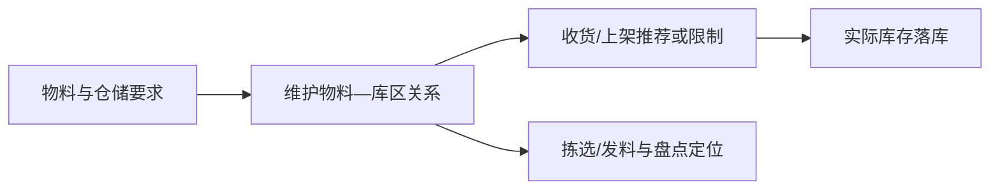

# 物料库区配置管理

> 适用基线：测试环境目标 / `dev` 分支 / 2026-07-15。
> 阅读对象：仓储主数据维护人员、库房主管、上架/拣选配置人员。

## 业务目的与适用范围

物料库区配置用于把物料与适合存放、收发或管理的库区建立关系，为收货上架、发料拣选、盘点和库存查询提供地点层面的业务依据。它不是实际库存记录，而是“某种物料通常应在哪类区域处理”的配置。

## 何时需要维护

新物料启用、仓储布局调整、物料改为冷链/危险品/隔离等特殊管理，或上架与拣选地点频繁不合理时，应检查本配置。

## 配置如何影响仓储业务

配置应表达业务适用性，而不应把一次临时存放地点固化为物料的长期库区规则。实际作业仍需以任务、库存状态和现场条件为准。

## 关键维护与变更

| 维护点 | 业务判断 | 使用建议 |
| --- | --- | --- |
| 物料与库区匹配 | 物料是否适合在该库区存放或处理。 | 先确认物料属性、温湿度/安全要求和作业方式。 |
| 默认或优先关系 | 是否用于引导上架、拣选或查询。 | 不确定实际规则时先验证页面与任务配置。 |
| 多库区适用 | 同一物料是否可在多个库区管理。 | 明确主库区、备用库区和异常去向。 |
| 状态与变更 | 旧关系是否仍被库存或任务使用。 | 仓储布局变更应同步评估未完成作业。 |

## 查询、详情与联查

| 查询目标 | 建议联查 |
| --- | --- |
| 某物料可在哪些区域处理 | 物料基本信息、库区资料、物料库区配置。 |
| 为什么任务推荐到某区域 | 上架/拣选任务、库存状态和配置关系。 |
| 某库区管理哪些物料 | 库区、物料配置与现有库存余额。 |

## 常见问题与处理

| 情况 | 建议处理 |
| --- | --- |
| 物料无法选择目标库区 | 核对物料/库区状态、配置关系和任务限制。 |
| 实际库区与配置不一致 | 确认是否为临时异常；不要直接覆盖长期配置。 |
| 改配置后影响作业 | 先检查在途收货、上架、拣选和库存，再分阶段切换。 |

## 当前限制与待确认事项

- 配置是否直接参与库位推荐、强制校验或仅作为查询资料需继续验证；
- 物料—库区关系的唯一性、导入和权限规则待核验；
- 需补列表、详情、任务推荐和异常提示截图。

## 图示、截图与示例任务

【图示占位：物料属性—库区配置—上架/拣选—实际库存的关系图。】

【截图占位：配置列表、物料/库区选择和任务引用结果。】

【示例数据占位：常温物料、隔离物料和线边物料对应不同库区的样例。】
