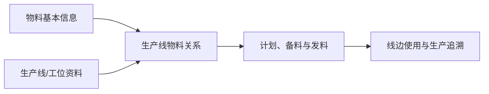

# 生产线物料关系管理

> 适用基线：测试环境目标 / `dev` 分支 / 2026-07-15。
> 阅读对象：生产主数据维护人员、工艺/计划人员、线边物流人员。

## 业务目的与适用范围

生产线物料关系用于说明哪些物料在什么生产线使用或供应，使生产计划、线边备料、发料和异常追溯能够以正确的产线为维度理解物料用途。它是主数据匹配关系，不替代 BOM、工艺路线或实际发料记录。

## 何时需要维护

新产线投产、物料切换、工艺调整、线边补料异常频发或需要限制某物料只能在特定产线使用时，应维护或核对本关系。

## 关系如何服务生产物流

同一物料可能被多个产线使用；同一产线也会使用多种物料。维护时应明确这是长期适用关系、优先关系还是临时替代，避免把一次临时用料固化为通用配置。

## 关键维护与变更

| 维护点 | 业务判断 | 使用建议 |
| --- | --- | --- |
| 物料与产线 | 物料是否确实由该产线生产或消耗。 | 与工艺、BOM和计划责任人共同确认。 |
| 适用状态 | 当前关系是否仍有效。 | 停线或工艺变更时及时评估。 |
| 多产线关系 | 是否存在主用、备用或限制产线。 | 需要明确业务口径，不能仅靠名称判断。 |
| 变更影响 | 是否影响已下达计划、线边库存或发料。 | 先查未完成任务再发布变更。 |

## 查询、详情与联查

| 查询目标 | 建议联查 |
| --- | --- |
| 某产线需要哪些物料 | 生产线、物料关系、BOM和工艺路线。 |
| 某物料可在哪些线使用 | 物料、生产线关系和工艺资料。 |
| 为什么无法给某线发料 | 发料任务、产线关系、库存和工单来源。 |

## 常见问题与处理

| 情况 | 建议处理 |
| --- | --- |
| 物料无法关联产线 | 核对物料、产线状态和维护权限。 |
| 已有关联不再适用 | 评估在途计划和线边库存后停用或替换。 |
| 关系与 BOM/工艺冲突 | 不直接覆盖其中一方；先确认工程和生产口径。 |

## 当前限制与待确认事项

- 本关系是否参与工单创建、发料校验或仅用于查询，需继续验证；
- 默认产线、优先级、导入和删除保护待核验；
- 需补产线、物料选择器和线边发料引用截图。

## 图示、截图与示例任务

【图示占位：物料—产线—工艺/BOM—备料/发料—线边使用的关系图。】

【截图占位：新增关系、查询某产线物料和关联任务入口。】

【示例数据占位：一项物料在两条产线使用、其中一条为备用线的样例。】
