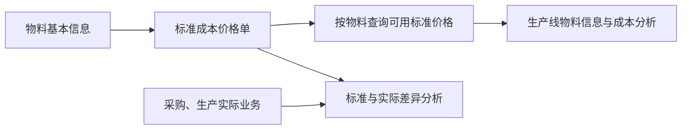

# 标准成本价格单管理

> 适用基线：测试环境 / `dev` 分支 / 2026-07-15。
> 阅读对象：测试、实施、运维（主）；成本/财务协同、主数据维护、采购与生产管理等人员（顺带）。

## 业务目的与适用范围

标准成本价格单为一项物料维护当前可用的标准价格和币种，作为成本分析、按产线查看物料信息等场景的参考口径。读完本页，应能判断：分析出现零价是「未维护」还是「真实为零」；变更时为何优先停用旧记录而不是直接覆盖；为何不能按供应商/多期间自动取价来培训。

它表达管理基准，不是采购收货、销售出库或库存事务的实际成交金额。当前主要按「物料」取一条可用标准价格；多版本/多维自动计价尚未证实。具体操作见[标准成本价格单管理-维护与查询参考](11-标准成本价格单管理-维护与查询参考.md)。

## 如何使用本组文档

| 你的目的 | 建议阅读 |
| --- | --- |
| 理解标准价与实际业务金额的边界 | 本页「业务目的」→「它与其他业务的关系」→「能力边界」 |
| 弄清启停/取价如何影响分析零值，或据此验证/排障 | 本页「维护时最重要的判断」「建议验证点」「查询与联查」 |
| 新增、启停、导入或查字段细节 | [标准成本价格单管理-维护与查询参考](11-标准成本价格单管理-维护与查询参考.md) |

## 什么时候需要维护

| 业务事件 | 应做什么 | 维护前要确认 |
| --- | --- | --- |
| 新物料需要成本参考口径 | 新增该物料的标准价格。 | 物料、计价单位和币种已确认。 |
| 成本基准发生变化 | 在变更前评估历史追溯与下游查询影响。 | 是否应该先停用旧记录、再启用新记录，而非直接覆盖。 |
| 价格暂不适用 | 停用价格，保留历史原因。 | 是否仍被计划、报表或其他业务查询使用。 |
| 需要批量维护成本口径 | 用模板分批导入，并回看错误明细。 | 同一物料的重复与更新方式是否已确认。 |

## 它与其他业务的关系

这张图只表达当前已知的查询与分析关系。价格单不会因为录入而自动改变采购、库存或生产的实际金额；这些自动挂接边界需要后续专项验证。

!!! example "写实示例：给定配置 → 期望行为"
    **给定：** 物料 RM-001、币种 CNY、价格 12.500000、是否可用 = 是。
    **期望：**

    1. 按物料取可用价得到 12.5；分析侧可区分标准与实际差异。
    2. 停用该记录后，再取价可能落到价格 0——须区分「零成本」与「未维护可用价」（`GAP-039`）。
    3. 变更口径时：先停用旧记录并写备注，再新增/启用新价格；不要假定生效/失效时间会自动切换。
    4. 不要把供应商当作新增必填条件（`GAP-038`）；当前 Web/导入未形成完整供应商录入链路。

## 维护时最重要的判断

| 需要判断什么 | 业务含义 | 建议做法 |
| --- | --- | --- |
| 物料是否正确 | 当前价格主要按物料使用。 | 从可用物料中选择，并核对单位。 |
| 币种和价格是否为已批准口径 | 避免把临时询价或单次交易价当作标准。 | 由成本责任岗位确认来源和批准依据。 |
| 是否应覆盖历史价格 | 当前未确认支持按有效期或版本自动挑选。 | 没有明确切换规则时，先停用旧记录并保留变更说明。 |
| 是否需要停用 | 停用会影响按物料取得当前价格的结果。 | 先确认使用场景与报表口径，不把停用当作删除。 |

### 关键字段业务角色

完整操作与选择器见[维护与查询参考](11-标准成本价格单管理-维护与查询参考.md)。

| 字段/配置点 | 在系统中的作用 | 关键行为要点 | 维护时要警惕什么 |
| --- | --- | --- | --- |
| 物料 | 价格归属键 | 必填；创建/导入按物料查重 | 一物料一价口径；勿依赖多维唯一 |
| 币种 / 价格 | 成本参考口径 | 必填；页面限制非负与小数位 | 勿把成交价当标准成本 |
| 供应商 | 资料层保留位置 | Web/导入未形成完整录入；服务唯一校验也不按供应商 | 当前不要把供应商当维护条件（`GAP-038`） |
| 是否可用 | 生命周期 | 必填；取价常要求可用 | 停用后按物料取价可能落到零值 |
| 生效/失效时间 | 适用期间说明 | 可维护；无自动失效/按期取价证实 | 变更时先停用旧记录再启用新记录 |

### 建议验证点

- 同一物料重复新增「当前可用」价是否被查重拦截。
- 停用后按物料取价是否返回 0；分析是否能区分未维护。
- 生效/失效时间到期后是否**不会**自动切换（能力边界确认，`GAP-039`）。
- 导入模式跳过行是否有明确错误回执；正式导入前小样验证（`GAP-039`）。

## 当前可证实行为（相对接口旁路）

| 场景 | 当前可证实行为 | 培训口径 |
| --- | --- | --- |
| 新增 | 按物料查重；供应商存在性校验未接入 | 同一物料不要建多条“当前可用”价 |
| 编辑 | 服务仍可写回物料等字段 | 日常按“物料归属不改、只调价格/币种/状态”执行 |
| 导入 | 校验物料/币种/价格/可用；按物料匹配既有行；模式 2/3 对跳过行未见明确错误回执 | 必须看错误文件与抽查结果（`GAP-039`） |
| 取价 | 按物料取可用价；查无可用价可能返回价格 0 | 分析时区分“零成本”与“未维护” |
| 删除/启停 | 可删可启停；未见下游核算引用拦截 | 已用于分析的价格优先停用 |

## 当前能力边界与风险提示

- 当前维护界面没有形成完整的供应商录入链路；不要把供应商作为价格单新增的必填业务条件（`GAP-038`）。
- 有效期可以维护，但系统尚未确认会校验时间先后、自动让旧价格失效或按有效期选取价格（`GAP-039`）。
- 系统对同一物料的价格关系采用单一口径，未确认具备物料+币种、物料+期间等多维唯一规则。若同一物料需多币种或多期间成本，必须先确认产品规则。
- 当前按物料查询价格时，查无可用价格可能返回零值作为临时结果。业务分析时必须区分“真实标准价格为零”和“尚未维护可用价格”。

## 查询与联查

| 想回答的问题 | 建议先查什么 | 再联查什么 |
| --- | --- | --- |
| 某物料当前标准价格是什么 | 本页按物料和可用状态查询。 | 物料基本信息、单位和变更记录。 |
| 某价格何时开始适用 | 价格的生效/失效时间和维护记录。 | 成本管理确认材料。 |
| 为什么成本分析出现零或异常值 | 该物料是否存在可用价格。 | 调用页面、价格启停状态与导入错误记录。 |
| 产线相关价格从哪里来 | 生产线物料关系中的物料。 | 本页的可用价格与物料单位。 |

## 待确认事项

- `GAP-038`：供应商维度是否参与标准成本，以及业务唯一键如何落地。
- `GAP-039`：有效期校验/自动失效、取价零值语义、导入模式跳过回执。

## 待补充的图示与示例
!!! example "📷 截图占位"
    新增价格时选择物料、填写币种/价格并设置可用状态。

!!! example "📷 截图占位"
    按物料查询、查看启停记录和导入错误回执。

!!! tip "📝 待补充"
    某物料成本口径变更时，如何评估旧记录、维护新价格并验证按物料查询结果。
