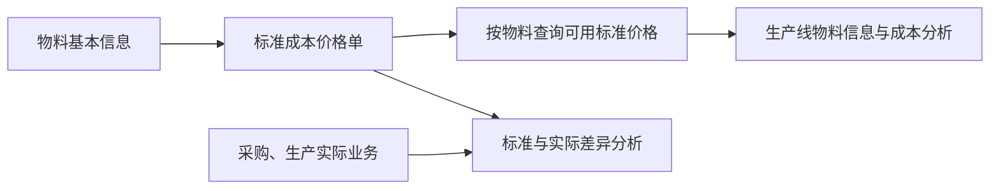

# 标准成本价格单管理

> 适用基线：测试环境 / `dev` 分支 / 2026-07-15。
> 阅读对象：成本/财务协同人员、主数据维护人员、采购与生产管理人员。
> 具体新增、编辑、启停、导入和查询操作见[标准成本价格单管理-维护与查询参考](11-标准成本价格单管理-维护与查询参考.md)。

## 这项价格单解决什么问题

标准成本价格单为一项物料维护当前可用的标准价格和币种，作为成本分析、按产线查看物料信息等场景的参考口径。它表达的是管理基准，不是采购收货、销售出库或库存事务的实际成交金额。

当前资料显示，系统主要按“物料”取得一条可用标准价格。它尚未证明支持按供应商、组织、仓库、成本版本或有效期间自动挑选不同价格。因此，在未补齐规则前，不应把它当作多版本成本体系或自动计价能力使用。

## 什么时候需要维护

| 业务事件 | 应做什么 | 维护前要确认 |
| --- | --- | --- |
| 新物料需要成本参考口径 | 新增该物料的标准价格。 | 物料、计价单位和币种已确认。 |
| 成本基准发生变化 | 在变更前评估历史追溯与下游查询影响。 | 是否应该先停用旧记录、再启用新记录，而非直接覆盖。 |
| 价格暂不适用 | 停用价格，保留历史原因。 | 是否仍被计划、报表或其他业务查询使用。 |
| 需要批量维护成本口径 | 用模板分批导入，并回看错误明细。 | 同一物料的重复与更新方式是否已确认。 |

## 它与其他业务的关系

这张图只表达当前已知的查询与分析关系。价格单不会因为录入而自动改变采购、库存或生产的实际金额；这些自动挂接边界需要后续专项验证。

## 维护时最重要的判断

| 需要判断什么 | 业务含义 | 建议做法 |
| --- | --- | --- |
| 物料是否正确 | 当前价格主要按物料使用。 | 从可用物料中选择，并核对单位。 |
| 币种和价格是否为已批准口径 | 避免把临时询价或单次交易价当作标准。 | 由成本责任岗位确认来源和批准依据。 |
| 是否应覆盖历史价格 | 当前未确认支持按有效期或版本自动挑选。 | 没有明确切换规则时，先停用旧记录并保留变更说明。 |
| 是否需要停用 | 停用会影响按物料取得当前价格的结果。 | 先确认使用场景与报表口径，不把停用当作删除。 |

## 当前能力边界与风险提示

- 当前维护界面没有形成完整的供应商录入链路；不要把供应商作为价格单新增的必填业务条件。
- 有效期可以维护，但系统尚未确认会校验时间先后、自动让旧价格失效或按有效期选取价格。
- 系统对同一物料的价格关系采用单一口径，未确认具备物料+币种、物料+期间等多维唯一规则。若同一物料需多币种或多期间成本，必须先确认产品规则。
- 当前按物料查询价格时，查无可用价格可能返回零值作为临时结果。业务分析时必须区分“真实标准价格为零”和“尚未维护可用价格”。

## 查询与联查

| 想回答的问题 | 建议先查什么 | 再联查什么 |
| --- | --- | --- |
| 某物料当前标准价格是什么 | 本页按物料和可用状态查询。 | 物料基本信息、单位和变更记录。 |
| 某价格何时开始适用 | 价格的生效/失效时间和维护记录。 | 成本管理确认材料。 |
| 为什么成本分析出现零或异常值 | 该物料是否存在可用价格。 | 调用页面、价格启停状态与导入错误记录。 |
| 产线相关价格从哪里来 | 生产线物料关系中的物料。 | 本页的可用价格与物料单位。 |

## 图示、截图与示例任务

【截图占位：新增价格时选择物料、填写币种/价格并设置可用状态。】

【截图占位：按物料查询、查看启停记录和导入错误回执。】

【示例任务占位：某物料成本口径变更时，如何评估旧记录、维护新价格并验证按物料查询结果。】
