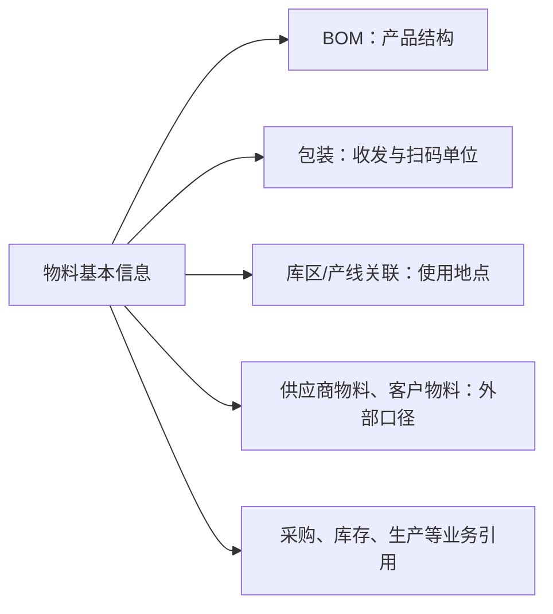

# 物料管理

> 阅读对象：测试、实施、运维（主）；主数据维护、采购/仓储/生产人员（顺带）。

## 这一组业务解决什么问题

物料管理回答一个贯穿全链路的问题：一项物料是什么、按什么单位和包装被处理、又由哪些 BOM、库区、产线关联约束着它能在哪些业务中被选中。读完本组文档，应能判断某物料在采购、库存、生产或交付页面里选不到、单位换算对不上，或包装/产线关联缺失时，应该先回查物料本身的哪一层资料，而不是逐个业务模块排查。

## 如何使用本组文档

| 你的目的 | 建议阅读 |
| --- | --- |
| 想理解物料如何统一采购、库存、生产和交付口径 | 本页「这一组业务解决什么问题」与「关键业务对象与关系」。 |
| 要新建或维护物料、包装、BOM、库区/产线关联 | 按下方「建议学习与操作顺序」逐项进入对应叶页。 |
| 物料在某业务页选不到、单位或包装对不上 | 本页「常见问题与相关分组」，先判断问题出在物料本身还是外部业务口径。 |

## 建议学习与操作顺序

| 顺序 | 页面/业务对象 | 先解决什么 | 与下一步怎样衔接 |
| --- | --- | --- | --- |
| 1 | 物料基本信息 | 统一识别物料及其用途、单位和状态。 | 是包装、BOM、库区和生产关联的共同前提。 |
| 2 | BOM | 说明成品/半成品由哪些物料构成。 | 为生产和成本理解提供产品结构。 |
| 3 | 物料包装信息、包装规格 | 说明物料如何按包装层级和数量被处理。 | 支持收货、库存、扫码和标签使用。 |
| 4 | 物料库区配置、生产线物料关系 | 表达物料通常在哪里存放、在哪些产线使用。 | 支持仓储和生产现场的快速判断。 |
| 5 | 标准成本价格单 | 维护与物料相关的成本参考信息。 | 具体使用范围待按业务场景确认。 |

## 关键业务对象与关系

这张图表达业务引用关系，不表示数据库表结构或所有关系均已完成测试验证。

## 本组页面一览
| 页面 | 说明 | 待完善 |
| --- | --- | --- |
| [物料基本信息](01-物料基本信息.md) | 已说明维护主线、导入、查询和常见问题。 | 测试截图、真实导入样例、停用/删除验证。 |
| [BOM](02-BOM.md) | 已恢复产品结构、变更影响和反查主线。 | 测试截图、实际导入规则、版本切换与跨模块挂接验证。 |
| [物料包装信息](03-物料包装信息.md)、[包装规格](04-包装规格.md) | 待按包装使用场景重构。 | 包装层级、换算、扫码和收发示例。 |
| [物料库区配置](05-物料库区配置管理.md) | 已明确当前实际是物料—仓库默认配置，而非库区/库位策略。 | 真实库区策略边界、包装字段一致性和下游影响测试。 |
| [生产线物料关系](06-生产线物料关系管理.md) | 已说明产线—物料关系、BOM 查询线索和导入边界。 | 原材料/产成品入口、MES/WMS 实际挂接和详情联查测试。 |
| [标准成本价格单](07-标准成本价格单管理.md) | 已明确其为按物料维护的当前标准价格口径，而非多版本自动计价体系。 | 多币种/期间规则、供应商维度、下游取价和零值处理测试。 |

## 常见问题与相关分组

当物料在业务页面中无法选择、单位不一致或包装/库位不匹配时，先回查物料基本信息及本组关联资料；如果问题是实际收发或库存数量，再转到 WMS 对应业务查询。物料是本组的边界终点：供应方口径见[供应商管理](../02-供应商管理/index.md)，客户侧口径见[客户管理](../03-客户管理/index.md)，本组不重复定义这两侧的匹配规则。

## 待补充的图示与示例
!!! example "📐 图示占位"
    物料、包装、BOM、供应商/客户物料、库存和生产之间的业务关系图；用于新人培训。

!!! example "📷 截图占位"
    物料详情的关联页签、包装维护和 BOM 结构页面；使用脱敏测试数据。

!!! example "📝 示例数据占位"
    一项物料从创建、配置包装和 BOM，到采购收货与库存查询的完整样例。

