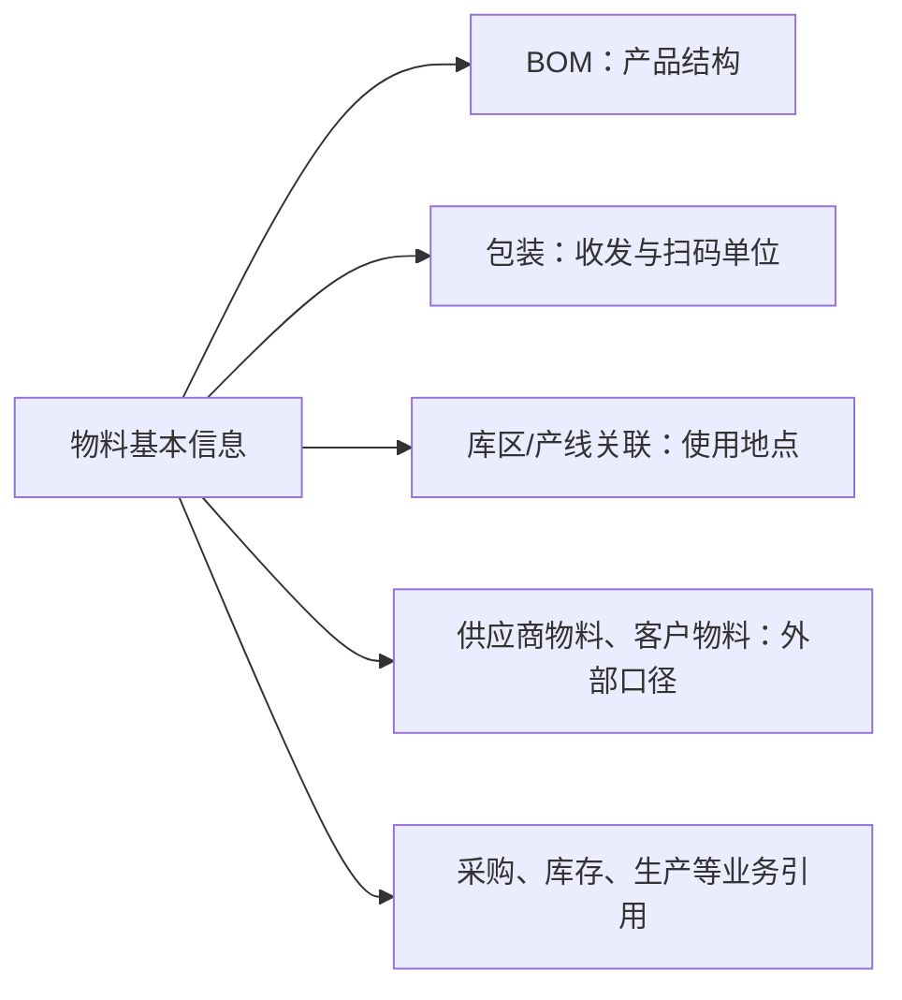

# 物料管理

## 这一组业务解决什么问题

物料管理用于定义企业实际采购、存放、制造、交付或核算的对象及其关联条件。它帮助不同岗位以同一物料口径处理采购、库存、生产和交付，避免“同物不同码”或“同码不同含义”。

## 建议学习与操作顺序

| 顺序 | 页面/业务对象 | 先解决什么 | 与下一步怎样衔接 |
| --- | --- | --- | --- |
| 1 | 物料基本信息 | 统一识别物料及其用途、单位和状态。 | 是包装、BOM、库区和生产关联的共同前提。 |
| 2 | BOM | 说明成品/半成品由哪些物料构成。 | 为生产和成本理解提供产品结构。 |
| 3 | 物料包装信息、包装规格 | 说明物料如何按包装层级和数量被处理。 | 支持收货、库存、扫码和标签使用。 |
| 4 | 物料库区配置、生产线物料关系 | 表达物料通常在哪里存放、在哪些产线使用。 | 支持仓储和生产现场的快速判断。 |
| 5 | 标准成本价格单 | 维护与物料相关的成本参考信息。 | 具体使用范围待按业务场景确认。 |

## 关键业务对象与关系

这张图表达业务引用关系，不表示数据库表结构或所有关系均已完成测试验证。

## 页面清单与写作状态

| 页面 | 文档形态 | 已说明内容 | 后续需补 |
| --- | --- | --- | --- |
| [物料基本信息](01-物料基本信息.md) | 主文档 + 维护与查询参考 | P0 样板，已说明维护主线、导入、查询和常见问题。 | 测试截图、真实导入样例、停用/删除验证。 |
| [BOM](02-BOM.md) | 主文档 + [维护与查询参考](08-BOM-维护与查询参考.md) | 已恢复产品结构、变更影响和反查主线。 | 测试截图、实际导入规则、版本切换与跨模块挂接验证。 |
| [物料包装信息](03-物料包装信息.md)、[包装规格](04-包装规格.md) | 单文档（合并维护与查询） | 待按包装使用场景重构。 | 包装层级、换算、扫码和收发示例。 |
| [物料库区配置](05-物料库区配置管理.md)、[生产线物料关系](06-生产线物料关系管理.md) | 待按判定表复核 | 待按现场使用地点重构。 | 选择规则、联查和现场示例。 |
| [标准成本价格单](07-标准成本价格单管理.md) | 待按判定表复核 | 待按成本参考资料重构。 | 使用边界、维护责任和导入/查询站位。 |

## 常见问题与相关分组

当物料在业务页面中无法选择、单位不一致或包装/库位不匹配时，先回查物料基本信息及本组关联资料；如果问题是实际收发或库存数量，再转到 WMS 对应业务查询。供应来源和客户口径分别见供应商管理、客户管理。

## 图示、截图与示例任务

【图示占位：物料、包装、BOM、供应商/客户物料、库存和生产之间的业务关系图；用于新人培训。】

【截图占位：物料详情的关联页签、包装维护和 BOM 结构页面；使用脱敏测试数据。】

【示例数据占位：一项物料从创建、配置包装和 BOM，到采购收货与库存查询的完整样例。】
