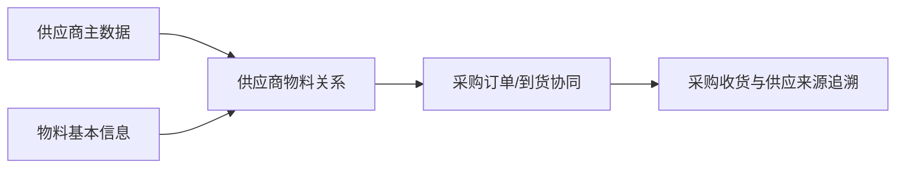

# 供应商物料

> 适用基线：测试环境目标 / `dev` 分支 / 2026-07-15。
> 阅读对象：采购主数据维护人员、采购协同人员、仓库收货人员。

## 业务目的与适用范围

供应商物料用于维护“哪个供应商可以供应哪种物料，以及双方在采购识别和协同上如何对应”的关系。它将供应商主数据与物料主数据连接起来，帮助采购下单、到货核对和供应来源追溯避免只凭名称人工判断。

本页不替代供应商资料或物料基本信息：供应商页面维护主体，物料页面维护物料属性，本页只维护两者之间的供货匹配关系。

## 如何使用本组文档

| 你的目的 | 建议阅读 |
| --- | --- |
| 想理解供应商、物料与采购收货为何需要建立对应关系 | 本页的业务目的、使用链路和变更影响。 |
| 正在新增、修改、导入或查询一条供货关系 | [供应商物料-维护与查询参考](04-供应商物料-维护与查询参考.md)。 |
| 需要核对维护规则、校验表现或导入差异 | 由文档维护人员查内部证据底稿；业务读者不需要阅读。 |

## 何时需要维护

引入新供应商、新物料启用、供应商编码/包装/交付口径变化，或采购、收货页面无法正确匹配供应来源时，应新增、调整或停用供应商物料关系。

## 一条关系如何被使用

同一物料可以由多个供应商供应；同一供应商也可供应多个物料。维护时应明确该关系是可供货、优先供货还是已停止使用，避免把一次临时采购固化为长期关系。

!!! example "📝 示例数据占位"
    物料 M 同时由供应商 A、B 供货，展示采购选择、到货核对和历史追溯。

## 关键维护与变更

| 维护点 | 业务判断 | 使用建议 |
| --- | --- | --- |
| 供应商与物料 | 两者是否已建立、可用且确有供货关系。 | 同一供应商和物料的组合不能重复建立；需要更换任一方时，建立新关系并评估旧关系。 |
| 供应商侧物料识别 | 是否需要维护供应商自身的物料编码或描述。 | 用于来料、单据和协同匹配时应保持稳定。 |
| 采购/交付属性 | 是否存在包装、交期、价格或其它约定。 | 未验证字段不要写成系统已强制规则。 |
| 启停或替换 | 旧供应商是否仍有订单、到货或退货在途。 | 先评估未完成业务再停用。 |

## 查询、详情与联查

| 查询目标 | 建议联查 |
| --- | --- |
| 某物料可由谁供货 | 物料、供应商物料、供应商状态。 |
| 某供应商供应哪些物料 | 供应商、供应商物料、物料可用状态。 |
| 收货为何无法匹配 | 来源订单、供应商、物料、供应商侧物料识别。 |
| 某次采购的供应来源 | 采购订单/收货记录与供应商物料关系。 |

## 常见问题与处理

| 情况 | 建议处理 |
| --- | --- |
| 供应商或物料无法选择 | 核对主数据是否可用、关系是否已维护和权限范围。 |
| 同一物料出现多个供应商 | 确认是否属于正常多来源，并补优先/适用口径。 |
| 已停合作仍可在采购中选择 | 检查供应商、关系状态和采购页面的实际过滤规则。 |

## 当前限制与待确认事项

- 默认供应商、优先级和价格/交期字段是否由本页面维护，仍需继续核验；
- 采购订单、收货、退货对关系的实际强制校验与提示需测试验证；
- 详情分组、快速跳转和动作权限待补充。

## 图示、截图与示例任务

!!! example "📐 图示占位"
    供应商—物料—采购订单—收货的匹配关系。

!!! example "📷 截图占位"
    新增关系、供应商/物料选择和采购页面引用结果。

!!! example "📝 示例数据占位"
    单来源、多来源和停用关系三类样例。

