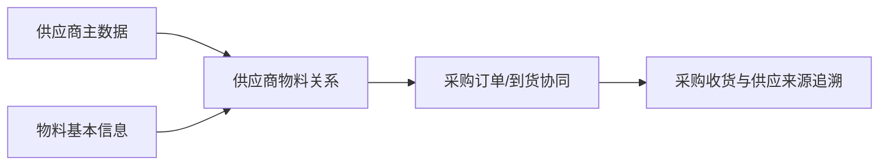

# 供应商物料

> 适用基线：测试环境目标 / `dev` 分支 / 2026-07-15。
> 阅读对象：采购主数据维护人员、采购协同人员、仓库收货人员。

## 业务目的与适用范围

供应商物料用于维护“哪个供应商可以供应哪种物料，以及双方在采购识别和协同上如何对应”的关系。它将供应商主数据与物料主数据连接起来，帮助采购下单、到货核对和供应来源追溯避免只凭名称人工判断。

本页不替代供应商资料或物料基本信息：供应商页面维护主体，物料页面维护物料属性，本页只维护两者之间的供货匹配关系。

## 如何使用本组文档

| 你的目的 | 建议阅读 |
| --- | --- |
| 想理解供应商、物料与采购收货为何需要建立对应关系 | 本页的业务目的、使用链路和变更影响。 |
| 正在新增、修改、导入或查询一条供货关系 | [供应商物料-维护与查询参考](04-供应商物料-维护与查询参考.md)。 |
## 何时需要维护

引入新供应商、新物料启用、供应商编码/包装/交付口径变化，或采购、收货页面无法正确匹配供应来源时，应新增、调整或停用供应商物料关系。

## 一条关系如何被使用

同一物料可以由多个供应商供应；同一供应商也可供应多个物料。维护时应明确该关系是可供货、优先供货还是已停止使用，避免把一次临时采购固化为长期关系。

!!! example "📝 示例数据占位"
    物料 M 同时由供应商 A、B 供货，展示采购选择、到货核对和历史追溯。

## 关键字段业务角色

下表只列影响供货匹配、换算与到货地点的关键项；完整语义与选择器范围见[维护与查询参考](04-供应商物料-维护与查询参考.md)。写法约定见[页面数据字典规范](../../02-业务模型/04-页面数据字典规范.md)。「可用供应商 / 可用物料 / 可用月台」通例见[通用选择器过滤惯例](../../02-业务模型/12-通用选择器过滤惯例.md)；组合唯一与导入差异见本页及 `GAP-045`。

| 字段/配置点 | 在系统中的作用 | 关键行为要点（取值/范围/联动/门禁） | 维护或操作时要警惕什么 |
| --- | --- | --- | --- |
| 供应商 + 物料 | 供货关系业务键 | 从**可用供应商**、**可用物料**选择；组合不可重复；编辑锁定双方 | 更换任一方须新建关系；旁路重复见 `GAP-045` |
| 月台 | 到货交接地点 | 从**可用月台**选择；页面新增要求；导入是否强制 ❓ | 错选导致收货地点带入不符 |
| 供应商物料代码 | 供应方料号 | 可选；最长 50 字符 | 用于来料单据/标签核对，须稳定 |
| 转换率 / 供应方单位 | 交付单位与系统单位换算 | 转换率必填、非负 | 错率导致采购数量与库存数量脱节 |
| 是否允许超发 | 超发边界 | 创建/导入应明确 | 对收货强制程度 ❓ |
| 是否可用 / 有效期 | 关系生命周期 | 停用过滤 ❓；有效期拦截 ❓ | 停用前查在途订单/收货 |
| 默认/优先供应商 | 多来源时优先口径 | 本页是否维护默认优先级 ❓ 待确认 | 未证实前勿培训“系统自动选默认供方” |

## 关键维护与变更

| 维护点 | 业务判断 | 使用建议 |
| --- | --- | --- |
| 供应商与物料 | 两者是否已建立、可用且确有供货关系。 | 同一供应商和物料的组合不能重复建立；需要更换任一方时，建立新关系并评估旧关系。见上表 P2/P6。 |
| 供应商侧物料识别 | 是否需要维护供应商自身的物料编码或描述。 | 用于来料、单据和协同匹配时应保持稳定。 |
| 采购/交付属性 | 是否存在包装、交期、价格或其它约定。 | 包装等字段导入范围与页面不一致时见 `GAP-045`；未验证字段不要写成系统已强制规则。 |
| 启停或替换 | 旧供应商是否仍有订单、到货或退货在途。 | 先评估未完成业务再停用。 |

## 查询、详情与联查

| 查询目标 | 建议联查 |
| --- | --- |
| 某物料可由谁供货 | 物料、供应商物料、供应商状态。 |
| 某供应商供应哪些物料 | 供应商、供应商物料、物料可用状态。 |
| 收货为何无法匹配 | 来源订单、供应商、物料、供应商侧物料识别。 |
| 某次采购的供应来源 | 采购订单/收货记录与供应商物料关系。 |

### 详情分组与快速跳转

| 详情分组 | 应帮助使用者判断什么 | 建议联查 |
| --- | --- | --- |
| 关系身份 | 哪一供应商供应哪一物料，是否可用。 | 供应商、物料基本信息。 |
| 交付与换算 | 供应商料号、单位换算、超发与月台。 | 月台、包装相关资料。 |
| 有效期与状态 | 适用窗口与启停。 | 同物料其它供货关系。 |
| 业务引用 | 是否已用于采购/到货。 | 采购订单、采购收货。 |
| 系统信息 | 创建、更新与审计。 | 变更痕迹（后续补充）。 |

!!! example "📷 截图占位"
    供应商物料详情分组与供应商/物料/采购收货联查；状态：待截图。

## 常见问题与处理

| 情况 | 建议处理 |
| --- | --- |
| 供应商或物料无法选择 | 核对主数据是否可用、关系是否已维护和权限范围。 |
| 同一物料出现多个供应商 | 确认是否属于正常多来源，并补优先/适用口径。 |
| 已停合作仍可在采购中选择 | 检查供应商、关系状态和采购页面的实际过滤规则。 |

## 当前限制与待确认事项

- 默认供应商、优先级和价格/交期字段是否由本页面维护，仍需继续核验（P11 标 ❓）；
- `GAP-045`：关系存在性、业务键与导入范围（包装/结算等）未闭合；页面与导入必填可能不一致；
- 采购订单、收货、退货对关系的实际强制校验与提示需测试验证；
- 详情实际 Tab、跳转过滤条件与动作权限待截图与实测补充。

## 待补充的图示与示例
!!! example "📐 图示占位"
    供应商—物料—采购订单—收货的匹配关系。

!!! example "📷 截图占位"
    新增关系、供应商/物料选择和采购页面引用结果。

!!! example "📝 示例数据占位"
    单来源、多来源和停用关系三类样例。

