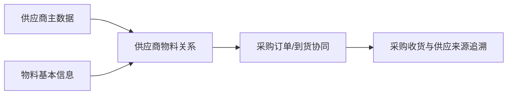

# 供应商物料

> 适用基线：测试环境目标 / `dev` 分支 / 2026-07-15。
> 阅读对象：测试、实施、运维（主）；采购主数据与协同、仓库收货人员（顺带）。

## 业务目的与适用范围

供应商物料维护「哪个供应商可以供应哪种物料，以及双方在采购识别和协同上如何对应」的关系。它把[供应商](01-供应商.md)与物料主数据连起来，帮助采购下单、到货核对和供应来源追溯，避免只凭名称人工判断。

读完本页，应能判断：何时必须建关系、月台/换算配错会怎样，以及**能选供应商却带不出物料、或采购匹配失败**时先查关系还是先查主体/物料可用性。本页不替代供应商资料或物料基本信息。

## 如何使用本组文档

| 你的目的 | 建议阅读 |
| --- | --- |
| 理解供应商、物料与采购/收货为何需要对应关系 | 本页：何时维护 → 一条关系如何被使用 → 关键判断 |
| 弄清关系启停/换算如何影响带入，或据此验证/排障 | 本页「关系如何影响采购与收货」「建议验证点」「常见问题与处理」 |
| 新增、修改、导入或查字段细节 | [供应商物料-维护与查询参考](04-供应商物料-维护与查询参考.md) |

## 何时需要维护

引入新供应商、新物料启用、供应商编码/包装/交付口径变化，或采购、收货页面无法正确匹配供应来源时，应新增、调整或停用供应商物料关系。

## 使用前准备

| 需要确认什么 | 为什么重要 |
| --- | --- |
| 供应商已建档且可用 | 关系主体来自可用供应商，不以手工名称替代。 |
| 物料已建档且可用 | 可供对象来自可用物料；可采购等用途口径以物料页为准。 |
| 到货月台（若页面要求） | 影响采购明细地点带入与现场交接。 |
| 供应方料号与单位换算 | 来料单据/标签核对，以及采购数量与库存数量理解。 |
| 超发与有效期口径 | 决定关系使用边界；下游强制程度 ❓ |

## 一条关系如何被使用

同一物料可以由多个供应商供应；同一供应商也可供应多个物料。维护时应明确该关系是可供货、优先供货还是已停止使用，避免把一次临时采购固化为长期关系。

!!! example "📝 示例数据占位"
    物料 M 同时由供应商 A、B 供货，展示采购选择、到货核对和历史追溯。

!!! example "写实示例：给定配置 → 期望行为"
    **给定：** 供应商 `V-1001` 可用；物料 `M8×20` 可用且可采购；新建关系：供应商 + 物料、月台 `DOCK-01`、转换率 `1`、是否可用 = 是；供应商物料代码 = `SUP-M8`。
    **期望：**

    1. 保存成功；同一「供应商 + 物料」再次新增应被拒绝（旁路重复见 `GAP-045`）。
    2. 按供应商或物料查询，能找到该关系及供应方料号 `SUP-M8`。
    3. 采购/收货按该组合匹配时，应能带入或核对到月台与换算口径（业务页强制程度 ❓）。
    4. 停用该关系后，新单原则上不应再选为供应来源；过滤时点 ❓。历史单据仍应能说明当时供应来源。
    5. 若仅停用供应商主体、未停用关系，排障时两边状态都要看，不要只查一侧。

## 关键字段业务角色

下表只列影响供货匹配、换算与到货地点的关键项；完整语义与选择器范围见[维护与查询参考](04-供应商物料-维护与查询参考.md)。写法约定见[页面数据字典规范](../../02-业务模型/04-页面数据字典规范.md)。「可用供应商 / 可用物料 / 可用月台」通例见[通用选择器过滤惯例](../../02-业务模型/12-通用选择器过滤惯例.md)；组合唯一与导入差异见本页及 `GAP-045`。

| 字段/配置点 | 在系统中的作用 | 关键行为要点（取值/范围/联动/门禁） | 维护或操作时要警惕什么 |
| --- | --- | --- | --- |
| 供应商 + 物料 | 供货关系业务键 | 从**可用供应商**、**可用物料**选择；组合不可重复；编辑锁定双方 | 更换任一方须新建关系；旁路重复见 `GAP-045` |
| 月台 | 到货交接地点 | 从**可用月台**选择；页面新增要求；导入是否强制 ❓ | 错选导致收货地点带入不符 |
| 供应商物料代码 | 供应方料号 | 可选；最长 50 字符 | 用于来料单据/标签核对，须稳定 |
| 转换率 / 供应方单位 | 交付单位与系统单位换算 | 转换率必填、非负 | 错率导致采购数量与库存数量脱节 |
| 是否允许超发 | 超发边界 | 创建/导入应明确 | 对收货强制程度 ❓ |
| 是否可用 / 有效期 | 关系生命周期 | 停用过滤 ❓；有效期拦截 ❓ | 停用前查在途订单/收货 |
| 默认/优先供应商 | 多来源时优先口径 | 本页是否维护默认优先级 ❓ 待确认 | 未证实前勿培训“系统自动选默认供方” |

## 关键维护与变更

| 维护点 | 业务判断 | 使用建议 |
| --- | --- | --- |
| 供应商与物料 | 两者是否已建立、可用且确有供货关系。 | 同一供应商和物料的组合不能重复建立；需要更换任一方时，建立新关系并评估旧关系。 |
| 供应商侧物料识别 | 是否需要维护供应商自身的物料编码或描述。 | 用于来料、单据和协同匹配时应保持稳定。 |
| 采购/交付属性 | 是否存在包装、交期、价格或其它约定。 | 包装等字段导入范围与页面不一致时见 `GAP-045`；未验证字段不要写成系统已强制规则。 |
| 启停或替换 | 旧供应商是否仍有订单、到货或退货在途。 | 先评估未完成业务再停用。 |

### 关系如何影响采购与收货

本页没有独立策略引擎。对下游「能不能匹配/带入」主要靠关系是否存在且可用，以及业务页是否强制读取：

| 维护点 | 起作用的方式 | 排障时先看 |
| --- | --- | --- |
| 供应商 + 物料关系 | 提供可匹配的供应来源；缺失则匹配失败或无法带入 | 关系是否存在、是否可用 |
| 月台 / 转换率 | 影响地点与数量理解；错配不一定拦保存，但现场会偏 | 关系明细与来源单据是否一致 |
| 供应商或物料停用 | 选择器通例下可能选不到主体/物料，关系也无法新建 | 先查[供应商](01-供应商.md)、物料可用性，再查本页 |

现场说「选不到供应商」：先走供应商页排障。说「有供应商但物料对不上 / 带不出」：以本页「供应商 + 物料」查询为入口。

### 建议验证点

- 缺关系时，采购选源/收货带入是否失败或仅提示（强制程度 ❓）。
- 有关系且可用时，月台与转换率是否按预期带入。
- 停用关系后，新单是否立即选不到该来源（过滤时点 ❓）。
- 同一供应商 + 物料重复新增是否被拒绝；导入与页面必填差异（月台等）是否符合 `GAP-045` 说明。

## 查询、详情与联查

| 查询目标 | 建议联查 |
| --- | --- |
| 某物料可由谁供货 | 物料、供应商物料、供应商状态。 |
| 某供应商供应哪些物料 | 供应商、供应商物料、物料可用状态。 |
| 收货为何无法匹配 | 来源订单、供应商、物料、供应商侧物料识别。 |
| 某次采购的供应来源 | 采购订单/收货记录与供应商物料关系。 |

### 详情分组与快速跳转

| 详情分组 | 应帮助使用者判断什么 | 建议联查 |
| --- | --- | --- |
| 关系身份 | 哪一供应商供应哪一物料，是否可用。 | 供应商、物料基本信息。 |
| 交付与换算 | 供应商料号、单位换算、超发与月台。 | 月台、包装相关资料。 |
| 有效期与状态 | 适用窗口与启停。 | 同物料其它供货关系。 |
| 业务引用 | 是否已用于采购/到货。 | 采购订单、采购收货。 |
| 系统信息 | 创建、更新与审计。 | 变更痕迹（后续补充）。 |

!!! example "📷 截图占位"
    供应商物料详情分组与供应商/物料/采购收货联查；状态：待截图。

## 常见问题与处理

| 情况 | 建议处理 |
| --- | --- |
| 供应商或物料无法选择 | 核对主数据是否可用、关系是否已维护和权限范围；不要改用手工录入的替代代码。 |
| 采购或收货选不到供应商 | **排障入口：** 先回[供应商](01-供应商.md)查主体可用与权限；主体正常仍匹配失败时，再以本页查关系。 |
| 能选供应商但物料/关系带不出 | **排障入口：** 按「供应商 + 物料」查本页关系是否存在、是否可用、是否在有效期内；再核月台与转换率。 |
| 同一物料出现多个供应商 | 确认是否属于正常多来源；默认/优先是否由本页维护 ❓，未证实前勿按“系统自动选默认”培训。 |
| 已停合作仍可在采购中选择 | 检查供应商状态、关系状态和采购页面的实际过滤规则（时点 ❓）。 |

## 当前限制与待确认事项

- 默认供应商、优先级和价格/交期字段是否由本页面维护，仍需继续核验（标 ❓）；
- `GAP-045`：关系存在性、业务键与导入范围（包装/结算等）未闭合；页面与导入必填可能不一致；
- 采购订单、收货、退货对关系的实际强制校验与提示需测试验证；
- 详情实际 Tab、跳转过滤条件与动作权限待截图与实测补充。

## 待补充的图示与示例
!!! example "📐 图示占位"
    供应商—物料—采购订单—收货的匹配关系。

!!! example "📷 截图占位"
    新增关系、供应商/物料选择和采购页面引用结果。

!!! example "📝 示例数据占位"
    单来源、多来源和停用关系三类样例。
