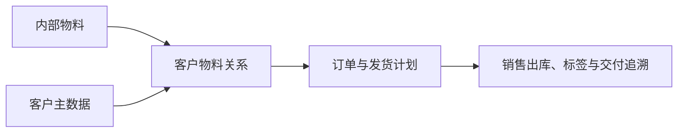

# 客户物料

> 适用基线：测试环境目标 / `dev` 分支 / 2026-07-15。
> 阅读对象：销售/交付主数据维护人员、订单协同人员、仓库发运人员。

## 业务目的与适用范围

客户物料用于维护企业物料与客户侧物料编码、名称、包装或交付口径的对应关系。它解决“内部物料如何被某个客户识别”的问题，支持订单匹配、标签/单据展示、发运核对和客户追溯。

客户物料不是物料替代关系，也不改变企业内部物料主数据；它只在特定客户交付场景下提供映射。

## 如何使用本组文档

| 你的目的 | 建议阅读 |
| --- | --- |
| 想理解客户专用物料号、包装与内部物料如何配合交付 | 本页的业务目的、交付链路和变更影响。 |
| 正在新增、修改、导入或查询客户物料关系 | [客户物料-维护与查询参考](04-客户物料-维护与查询参考.md)。 |
## 何时需要维护

新客户导入物料、客户变更物料号或包装要求、订单无法匹配客户物料，或发运标签/单据显示不一致时，应维护本关系。

## 关系如何服务交付

同一内部物料可能对应不同客户物料号；维护时必须限定客户，不能把客户专用编码写回物料基本信息。

!!! example "📝 示例数据占位"
    内部物料 M 对客户 A、客户 B 分别使用不同客户物料号的映射样例。

## 关键字段业务角色

下表只列影响客户侧识别与交付包装的关键项；完整语义与选择器范围见[维护与查询参考](04-客户物料-维护与查询参考.md)。写法约定见[页面数据字典规范](../../02-业务模型/04-页面数据字典规范.md)。「可用客户 / 可用物料 / 包装规格」通例见[通用选择器过滤惯例](../../02-业务模型/12-通用选择器过滤惯例.md)；组合与导入差异见本页及 `GAP-059`。

| 字段/配置点 | 在系统中的作用 | 关键行为要点（取值/范围/联动/门禁） | 维护或操作时要警惕什么 |
| --- | --- | --- | --- |
| 客户 + 内部物料 | 交付映射业务键 | 从**可用客户**、**可用物料**选择；组合不重复 | 勿把客户专用码写回物料主数据；重复保护见 `GAP-059` |
| 客户物料代码 | 客户侧料号 | 可选；≤50 字符 | 跨客户勿复用未确认编码 |
| 客户包装规格 | 交付包装标准 | 页面必填；选自包装规格；导入校验口径可能不同（`GAP-059`） | 包装错 → 标签/发运核对失败 |
| 标准包装数量 | 客户包装件数口径 | 必填；≥1 | 与客户确认版本不一致会导致发运争议 |
| 客户计量单位 | 客户侧单位 | 按客户确认录入 | 勿用改内部单位临时规避 |
| 默认映射 / 唯一默认 | 同客户多映射时优先 | 是否支持默认映射 ❓ 待确认 | 未证实前勿培训“自动取默认客户包装” |
| 是否可用 / 有效期 | 关系生命周期 | 新建/导入常置为可用；停用动作 ❓ | 切换前评估在途订单与标签 |

## 关键维护与变更

| 维护点 | 业务判断 | 使用建议 |
| --- | --- | --- |
| 客户与内部物料 | 是否为真实交付关系。 | 先核对客户和物料均已建立且可用。见上表 P2/P6。 |
| 客户侧识别信息 | 编码/名称/包装口径是否与客户确认一致。 | 变更前评估未完成订单和标签。 |
| 多客户映射 | 同一内部物料是否对应不同客户要求。 | 每条关系必须清楚标明客户范围。 |
| 启停/替换 | 旧客户编码是否仍有在途交付。 | 优先新增新映射并在切换后停用旧映射。 |

## 查询、详情与联查

| 查询目标 | 建议联查 |
| --- | --- |
| 某客户如何识别某物料 | 客户、客户物料、内部物料。 |
| 某内部物料对应哪些客户口径 | 物料、客户物料和客户状态。 |
| 订单或发运为何匹配失败 | 客户、内部物料、客户物料关系和交付要求。 |

### 详情分组与快速跳转

| 详情分组 | 应帮助使用者判断什么 | 建议联查 |
| --- | --- | --- |
| 关系身份 | 哪一客户对应哪一内部物料。 | 客户、物料基本信息。 |
| 客户识别与包装 | 客户料号、包装规格与标准包装数量。 | 包装规格。 |
| 有效期与状态 | 是否可用、适用时间窗。 | 同客户其它映射。 |
| 交付引用 | 订单/发运是否引用该映射。 | 销售出库、标签相关入口。 |
| 系统信息 | 创建、更新与审计。 | 变更痕迹（后续补充）。 |

!!! example "📷 截图占位"
    客户物料详情分组与客户/物料/销售出库联查；状态：待截图。

## 常见问题与处理

| 情况 | 建议处理 |
| --- | --- |
| 客户物料号重复或选错 | 核对客户范围，不要跨客户复用未确认的编码。 |
| 标签显示与客户要求不一致 | 回查客户物料关系、标签模板和订单来源。 |
| 变更后在途订单异常 | 评估订单、备货、发运和客户沟通后再切换。 |

## 当前限制与待确认事项

- 客户物料的唯一性、默认映射、包装和标签字段待继续核验（P11 标 ❓）；
- `GAP-059`：包装校验、导入字段与权限标识不一致；普通保存与导入约束可能不同；
- 订单、发货、标签和接口对映射关系的实际强制校验需测试；
- 详情跳转和权限边界待补充。

## 待补充的图示与示例
!!! example "📐 图示占位"
    内部物料—客户物料—订单—销售出库的映射关系。

!!! example "📷 截图占位"
    客户/物料选择、客户物料编码维护和订单引用入口。

!!! example "📝 示例数据占位"
    一物多客户、客户编码切换和订单匹配错误样例。

