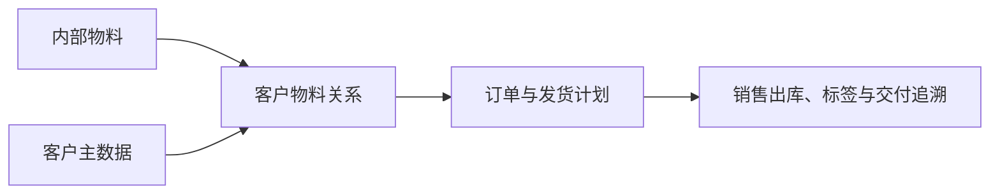

# 客户物料

> 适用基线：测试环境目标 / `dev` 分支 / 2026-07-15。
> 阅读对象：销售/交付主数据维护人员、订单协同人员、仓库发运人员。

## 业务目的与适用范围

客户物料用于维护企业物料与客户侧物料编码、名称、包装或交付口径的对应关系。它解决“内部物料如何被某个客户识别”的问题，支持订单匹配、标签/单据展示、发运核对和客户追溯。

客户物料不是物料替代关系，也不改变企业内部物料主数据；它只在特定客户交付场景下提供映射。

## 如何使用本组文档

| 你的目的 | 建议阅读 |
| --- | --- |
| 想理解客户专用物料号、包装与内部物料如何配合交付 | 本页的业务目的、交付链路和变更影响。 |
| 正在新增、修改、导入或查询客户物料关系 | [客户物料-维护与查询参考](04-客户物料-维护与查询参考.md)。 |
| 需要核对维护规则、导入校验或下游表现 | 由文档维护人员查内部证据底稿；业务读者不需要阅读。 |

## 何时需要维护

新客户导入物料、客户变更物料号或包装要求、订单无法匹配客户物料，或发运标签/单据显示不一致时，应维护本关系。

## 关系如何服务交付

同一内部物料可能对应不同客户物料号；维护时必须限定客户，不能把客户专用编码写回物料基本信息。

!!! example "📝 示例数据占位"
    内部物料 M 对客户 A、客户 B 分别使用不同客户物料号的映射样例。

## 关键维护与变更

| 维护点 | 业务判断 | 使用建议 |
| --- | --- | --- |
| 客户与内部物料 | 是否为真实交付关系。 | 先核对客户和物料均已建立且可用。 |
| 客户侧识别信息 | 编码/名称/包装口径是否与客户确认一致。 | 变更前评估未完成订单和标签。 |
| 多客户映射 | 同一内部物料是否对应不同客户要求。 | 每条关系必须清楚标明客户范围。 |
| 启停/替换 | 旧客户编码是否仍有在途交付。 | 优先新增新映射并在切换后停用旧映射。 |

## 查询、详情与联查

| 查询目标 | 建议联查 |
| --- | --- |
| 某客户如何识别某物料 | 客户、客户物料、内部物料。 |
| 某内部物料对应哪些客户口径 | 物料、客户物料和客户状态。 |
| 订单或发运为何匹配失败 | 客户、内部物料、客户物料关系和交付要求。 |

## 常见问题与处理

| 情况 | 建议处理 |
| --- | --- |
| 客户物料号重复或选错 | 核对客户范围，不要跨客户复用未确认的编码。 |
| 标签显示与客户要求不一致 | 回查客户物料关系、标签模板和订单来源。 |
| 变更后在途订单异常 | 评估订单、备货、发运和客户沟通后再切换。 |

## 当前限制与待确认事项

- 客户物料的唯一性、默认映射、包装和标签字段待继续核验；
- 订单、发货、标签和接口对映射关系的实际强制校验需测试；
- 详情跳转和权限边界待补充。

## 图示、截图与示例任务

!!! example "📐 图示占位"
    内部物料—客户物料—订单—销售出库的映射关系。

!!! example "📷 截图占位"
    客户/物料选择、客户物料编码维护和订单引用入口。

!!! example "📝 示例数据占位"
    一物多客户、客户编码切换和订单匹配错误样例。

