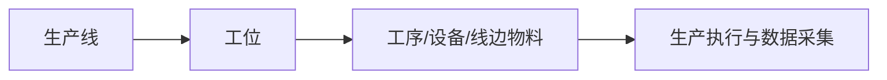

# 工位管理

> 适用基线：测试环境目标 / `dev` 分支 / 2026-07-15。

## 业务目的与适用范围

工位是生产线中可执行具体工序、领取线边物料或采集现场数据的最小作业地点。它将工艺步骤、人员/设备、物料供给和生产执行定位到现场可识别的位置。

## 何时需要维护

新工位启用、工艺调整、设备迁移、线边物料地点变化或工位无法匹配生产任务时，应维护本资料。

## 工位如何服务执行

工位不是人员账号或设备台账的替代品；它是现场作业位置，相关人员、设备和工艺需通过各自业务对象关联。

## 关键维护与变更

| 维护点 | 业务判断 |
| --- | --- |
| 所属产线 | 是否位于正确线体。 |
| 工位身份与现场标签 | 是否可被任务、扫码和人员识别。 |
| 工序/设备/物料关系 | 是否符合实际作业方式。 |
| 停用/调整 | 是否仍有在途任务、设备或数据采集引用。 |

## 查询、详情与联查

可从工位联查生产线、工艺路线、线边物料、设备与生产任务；无法报工或无法发料时，应按来源关系逐项核对。

## 当前限制与待确认事项

- 工位与工序、人员、设备、数采点的强制关系和权限待验证；
- 导入、状态、详情页签及终端扫码规则待补测试素材。

## 图示、截图与示例任务

【截图占位：工位新增、关联产线/工序和线边任务引用。】
