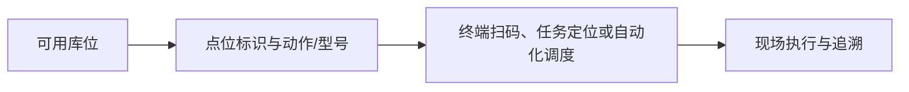

# 点位管理

> 适用基线：测试环境目标 / `dev` 分支 / 2026-07-15。
> 具体新增、编辑、导入和查询操作见[点位管理-维护与查询参考](22-点位管理-维护与查询参考.md)。

## 业务目的与适用范围

点位用于为工厂现场的物理位置、设备位置、物料交接点或自动化站点建立统一标识。当前模型以**库位—AGV 点位映射**为主，不替代仓库库位或生产工位；也不应按历史坐标模型培训（`GAP-057`）。

## 何时需要维护

新增现场点位、设备/产线布局调整、扫码定位失败或自动化任务无法指向正确位置时，应维护点位资料。

## 点位如何被业务使用

## 关键字段业务角色

完整语义见[维护与查询参考](22-点位管理-维护与查询参考.md)。本页模式：**P2 / P4 / P6 / P1**。

| 字段/配置点 | 行为模式 | 在系统中的作用 | 关键行为要点 | 维护时要警惕什么 |
| --- | --- | --- | --- | --- |
| 点位编码 | P6 | 点位业务键 | 服务/导入要求代码；**当前 Web 可能未展示代码字段**（`GAP-057`） | Web 新增可能缺关键键 |
| 关联库位 | P2 / P4 | 仓储地点锚点 | **从可用库位中选择**；创建同时检查代码+库位 ❓ | 改库位影响标签与调度 |
| 动作 / AGV 型号 / 类型 / 楼层 | P1 | 自动化用途分类 | 多为必填 | 与车辆可达性不符 |
| 设备/参数 | P2 | 可选关联 | 不能理解为已自动控制设备 | 过度承诺自动控制 |
| 是否可用 | P1 | 可否被调度使用 | 导入状态列与服务必填可能不一致 | 导入成功但状态未更新 |

### 关键维护与变更摘要

| 维护点 | 业务判断 |
| --- | --- |
| 点位身份与库位 | 是否能唯一表达现场实际位置。 |
| 自动化用途 | 动作、型号、类型是否匹配车辆与任务。 |
| 变更影响 | 是否影响扫码标签、AGV 或在途任务。 |

## 查询、详情与联查

点位应能联查关联库位、AGV 配置和任务；发生扫码或调度异常时，应同时检查点位状态、现场标签、终端配置和关联地点。

## 维护与查询边界

先维护库位，再维护点位。历史坐标模型已移除。点位编码 Web/导入/服务规则未闭合（`GAP-057`）。变更后是否自动影响终端或调度，需按自动化场景测试确认。

## 当前限制与待确认事项

- 业务键口径（全局代码 vs 代码+库位）不一致（`GAP-057`）；
- 与设备、AGV、地图同步和引用保护待测试。

## 图示、截图与示例任务

!!! example "📷 截图占位"
    点位新增、可用库位选择和 AGV 配置联查。
