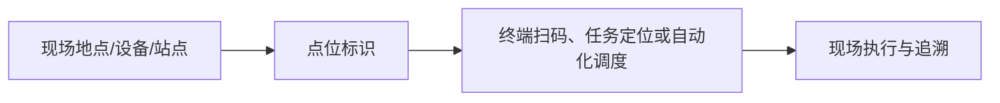

# 点位管理

> 适用基线：测试环境目标 / `dev` 分支 / 2026-07-15。
> 具体新增、编辑、导入和查询操作见[点位管理-维护与查询参考](22-点位管理-维护与查询参考.md)。

## 业务目的与适用范围

点位用于为工厂现场的物理位置、设备位置、物料交接点或自动化站点建立统一标识。它支持终端扫码、任务定位、自动化调度和现场追溯，但不替代仓库库位或生产工位；具体使用边界取决于所在业务场景。

## 何时需要维护

新增现场点位、设备/产线布局调整、扫码定位失败或自动化任务无法指向正确位置时，应维护点位资料。

## 点位如何被业务使用

## 关键维护与变更

| 维护点 | 业务判断 |
| --- | --- |
| 点位身份与位置 | 是否能唯一表达现场实际位置。 |
| 关联对象 | 是否关联正确的仓储、生产或设备场景。 |
| 状态 | 是否可被当前任务和终端使用。 |
| 变更影响 | 是否影响扫码标签、AGV/设备或在途任务。 |

## 查询、详情与联查

点位应能联查关联的现场对象和任务；发生扫码或调度异常时，应同时检查点位状态、现场标签、终端配置和关联地点。

## 维护与查询边界

点位以可用库位为基础，维护其动作类型、适用 AGV 型号、点位类型、楼层、方向以及可选的设备/参数关联。它不是库存库位本身，也不应代替 AGV 地图或设备台账。点位变更后是否自动影响终端、调度或设备控制，需要按自动化场景测试确认。

页面支持批量导入。先维护库位，再维护点位；导入时只填写当前模板覆盖的定位与分类资料，不导入任务状态、实时坐标、库存或设备运行数据。

## 当前限制与待确认事项

- 点位与库位、工位、设备、AGV 的强制关系待确认；
- 点位坐标、地图、导入和权限规则需按数采/自动化资料继续核验；
- 需补点位列表、现场标签和任务引用截图。

## 图示、截图与示例任务

【截图占位：点位新增、关联现场对象和终端/任务定位结果。】
