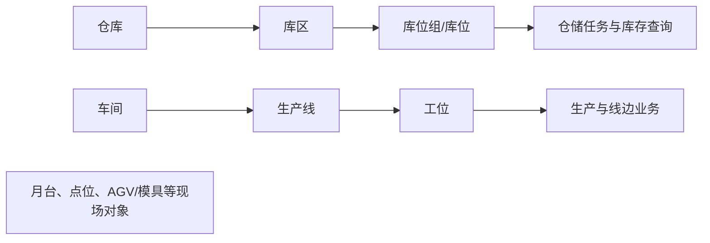

# 工厂建模

## 这一组业务解决什么问题

工厂建模用于描述企业现场“物料在哪里存放、生产在哪里发生、设备或自动化点位在哪里工作”。它把仓储空间和生产空间转化为可被 WMS、MES 及现场终端引用的业务地点。

## 建议学习与操作顺序

| 顺序 | 页面/业务对象 | 先解决什么 | 与下一步怎样衔接 |
| --- | --- | --- |
| 1 | 仓库、库区、库位组、库位 | 建立仓储空间的层级和可执行地点。 | 支持收货、上架、库存和盘点。 |
| 2 | 月台 | 建立收发货的现场交接地点。 | 支持到货、发运和交付协同。 |
| 3 | 车间、生产线、工位 | 建立生产现场的组织与作业地点。 | 支持工艺、生产执行和线边物流。 |
| 4 | 模具信息、点位、AGV 点位配置 | 补充设备/自动化相关的现场资料。 | 使用边界需与 EAM、终端和自动化业务确认。 |

## 关键业务对象与关系

## 页面清单与写作状态

本组叶页将在本目标中统一补齐“业务目的、维护前准备、典型使用、变更影响、查询联查、常见问题、素材站位”的完整大纲。具体页面见站点导航；避免将工厂层级或点位关系直接写成未经确认的数据库约束。

## 常见问题与相关分组

库存或任务无法选择地点时，先确认仓库/库区/库位层级与状态；生产现场无法匹配时，先确认车间、产线、工位和工艺关系。设备、工装和自动化对象的最终职责边界需与设备管理、工艺建模及 EAM 页面共同核对。

## 图示、截图与示例任务

【图示占位：仓储空间与生产空间的层级关系图；需区分“地点层级”和“业务使用关系”。】

【截图占位：仓库、库位、生产线、工位和点位的列表/详情页面，标出关联入口。】

【示例数据占位：一个仓库、一条产线、一组库位和一个收货/发料任务的脱敏示例。】
