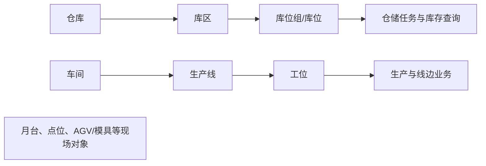

# 工厂建模

> 阅读对象：测试、实施、运维（主）；仓储与生产管理人员（顺带）。

## 这一组业务解决什么问题

工厂建模把企业现场“物料存放在哪里、生产发生在哪里、设备或自动化点位在哪里工作”固化为可被 WMS、MES 及现场终端引用的业务地点层级。读完本组文档，应能判断某个仓储或生产任务因找不到库位、产线或工位而卡住时，应该先核对哪一层地点主数据。

## 如何使用本组文档

| 你的目的 | 建议阅读 |
| --- | --- |
| 想理解仓储空间与生产空间的层级关系 | 本页「这一组业务解决什么问题」与「关键业务对象与关系」。 |
| 要新建或维护仓库/库位、车间/产线/工位等地点资料 | 按下方「建议学习与操作顺序」逐项进入对应叶页。 |
| 库存或生产任务里地点选不到 | 本页「常见问题与相关分组」。 |

## 建议学习与操作顺序

| 顺序 | 页面/业务对象 | 先解决什么 | 与下一步怎样衔接 |
| --- | --- | --- |
| 1 | 仓库、库区、库位组、库位 | 建立仓储空间的层级和可执行地点。 | 支持收货、上架、库存和盘点。 |
| 2 | 月台 | 建立收发货的现场交接地点。 | 支持到货、发运和交付协同。 |
| 3 | 车间、生产线、工位 | 建立生产现场的组织与作业地点。 | 支持工艺、生产执行和线边物流。 |
| 4 | 模具信息、点位、AGV 点位配置 | 补充设备/自动化相关的现场资料。 | 使用边界需与 EAM、终端和自动化业务确认。 |

## 关键业务对象与关系

## 本组页面一览
| 页面 | 说明 | 待完善 |
| --- | --- | --- |
| [仓库](01-仓库管理.md)、[库区](02-库区管理.md)、[库位](03-库位管理.md)、[库位组](04-库位组管理.md)、[月台](05-月台管理.md) | 已补字段行为语义（含仓→区→位级联）；通例见[库位与仓储级联惯例](../../02-业务模型/13-库位与仓储级联惯例.md)。 | 启停/删除保护实测、任务/库存挂接截图。 |
| [车间](06-车间管理.md)、[生产线](07-生产线管理.md)、[工位](08-工位管理.md) | 已补语义；已校正历史字段边界（`GAP-053`～`055`）。 | MES/WMS 自动挂接和终端截图。 |
| [模具信息](11-模具信息管理.md) | 已明确不把历史字段或 EAM 能力误写为 DBC 当前功能。 | 确认菜单可用性、DBC/EAM 归属和实际入口。 |
| [点位](12-点位管理.md)、[AGV 点位配置](13-潜伏式AGV点位配置表.md) | 点位已补语义（`GAP-057`）；AGV 配置待本批后按需加强。 | 地图/任务/车辆挂接、变更保护和现场截图。 |

## 常见问题与相关分组

库存或任务无法选择地点时，先确认仓库/库区/库位层级与状态；生产现场无法匹配时，先确认车间、产线、工位和工艺关系。本组只负责地点本身；设备、工装和自动化对象的执行职责边界见[设备管理](../07-设备管理/index.md)、[工艺建模](../08-工艺建模/index.md)及 EAM 页面，不在本组重复展开。

## 待补充的图示与示例
!!! example "📐 图示占位"
    仓储空间与生产空间的层级关系图；需区分“地点层级”和“业务使用关系”。

!!! example "📷 截图占位"
    仓库、库位、生产线、工位和点位的列表/详情页面，标出关联入口。

!!! example "📝 示例数据占位"
    一个仓库、一条产线、一组库位和一个收货/发料任务的脱敏示例。

