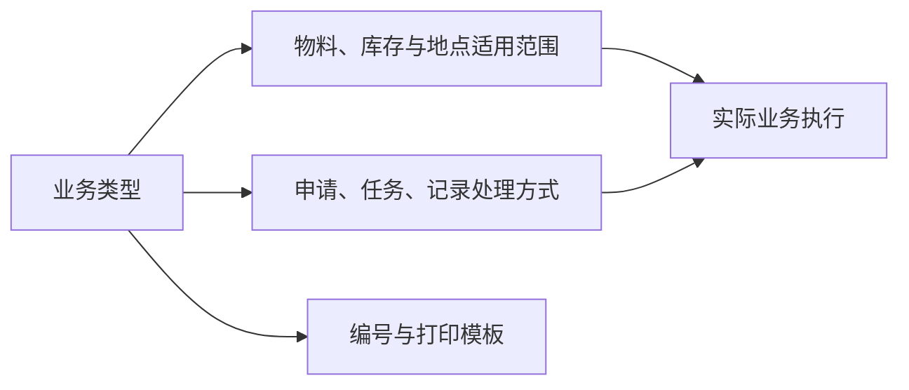

# 业务类型

> 适用基线：测试环境 / `dev` 分支 / 2026-07-15。
> 具体配置、变更和查询操作见[业务类型-维护与查询参考](09-业务类型-维护与查询参考.md)。

## 这项配置解决什么问题

业务类型是申请、任务和记录等业务对象的共同分类口径。它决定某类业务可使用的物料/库存范围、入出库处理、在途处理、自动提交或自动执行等行为边界，并可关联编号和打印模板。

它属于高风险配置：一次变更可能同时影响单据创建、终端操作、库存事务和打印。因此应把它作为受控变更处理，而不是普通分类字典。

## 维护与查询重点

维护前须先明确适用业务场景、入出库方向、可修改范围、自动处理规则、在途地点以及打印/编号需求。变更前应在测试环境用完整业务链路验证：创建、审批/执行、库存结果、撤销、打印和异常处理。

| 查询目标 | 建议联查 |
| --- | --- |
| 某业务为什么可/不可选择物料或库位 | 业务类型的适用范围、物料/库存/库区状态。 |
| 某单据为何自动提交或直接执行 | 业务类型的自动处理设置和实际业务记录。 |
| 某单据编号或打印模板从哪里来 | 业务类型、单据设置和打印模板。 |

## 当前边界

- 当前未确认所有字段都已在每个业务页面实际生效；不同 WMS/MES 场景必须逐项验证。
- 业务类型改动不能替代单据设置、单据开关和规则管理的专项调整。
- 详情分组和业务影响预览需要后续页面改造。

【截图占位：业务类型配置、适用范围、自动处理和模板关联；使用脱敏测试数据。】
