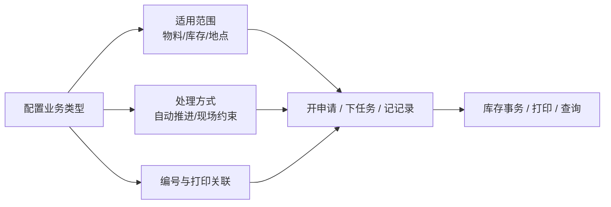

# 业务类型

> 适用基线：测试环境 / `dev` 分支 / 2026-07-15。
> 共享分流语义见[单据类型、业务类型与单据配置](../../02-业务模型/05-单据类型、业务类型与单据配置.md)。

本页回答：业务类型管哪些行为边界；改哪一类配置会改变下游单据、现场操作、库存事务或打印。读完应能在测试环境按「改配置 → 开一笔业务 → 对照结果」做验证，而不是只记住字段清单。

## 如何使用本组文档

| 你要做什么 | 读哪里 |
| --- | --- |
| 理解业务类型解决什么问题、改配置影响什么、怎么验 | **本页（主文档）** |
| 查完整字段语义、配置分组、取值影响矩阵、变更前检查清单 | [业务类型-维护与查询参考](09-业务类型-维护与查询参考.md) |
| 对照「业务类型 / 单据设置 / 开关 / 规则」谁管什么 | [单据类型、业务类型与单据配置](../../02-业务模型/05-单据类型、业务类型与单据配置.md) |
| 看现场业务如何消费本策略（示例） | [采购收货](../../../05-WMS-库房管理/03-采购收货/index.md) |

业务类型是**高风险策略**：一次变更可能同时影响单据创建、终端操作、库存事务和打印。应按受控变更处理，不要当成普通分类字典。

## 这项配置解决什么问题

申请、任务、记录等业务对象需要一套**共同的场景分类口径**。业务类型把「这类业务能选什么、怎么走流程、库存怎么动、单号和标签从哪来」收敛成一条可维护的策略，避免每个业务页各自硬编码。

它**不**替代：

- [单据设置](04-单据设置.md)：只管编号组成规则；
- 单据开关、规则管理：各有独立作用面（见共享通例页）。

## 一笔典型配置业务

**场景：** 为「采购收货」准备一条可用的业务类型，使现场能选对库位范围、按约定自动推进，并挂上正确的编号/打印关联。

1. **触发**：实施确认目标场景（如采购收货）、入出库方向、是否允许改量/改库位、是否自动提交/同意/执行、编号与打印需求。
2. **处理**：在业务类型中维护基本识别、适用范围、库存与在途、自动化、现场约束、编号与打印关联，并置为可用。
3. **结果**：目标业务开单时可引用该类型；现场可选范围与自动推进路径按配置收紧或放宽；新单号/标签按关联规则走。
4. **关键分支**：
   - 范围配得过窄 → 现场选不到仓库/库区/库位或物料；
   - 自动处理误开 → 申请可能跳过人工审核节点直接进入任务/记录（真实状态迁移细节 ❓，见文末）；
   - 入出方向或在途配错 → 库存增减或在途地点与实务相反；
   - 模板/号段错挂 → 错号或错打。

!!! example "写实示例（给定配置 → 期望行为）"
    **给定：** 采购收货业务类型允许改数量、禁止改库位；未开自动提交；入出用途与收货入库事务口径一致；已关联申请/任务号段。
    **期望：** 建收货申请可选该类型；提交后仍需人工审核节点；任务执行时数量可改、库位不可改；新单号按关联号段生成。
    **对照：** 若任务上库位仍可改，或未提交即生成任务，先查本类型现场约束与自动处理，再查单据开关/规则，勿只改业务页。

## 使用前准备

1. 目标业务场景与单据对象（申请 / 任务 / 记录）已明确。
2. 入出库方向、事务口径、是否使用在途及在途地点已由业务负责人批准。
3. 可用物料/质量状态、仓库/库区范围与现场 SOP（能否改量、改位、超收/欠收、重复扫描等）已对齐。
4. 若需编号或打印：相关[单据设置](04-单据设置.md)与打印模板来源已准备（打印模板入口当前可能仍走 WMS 标签，产品目标归属 INFRA）。
5. 变更在**测试环境**用完整链路验证后再进生产。

## 业务逻辑要点

| 要点 | 说明 |
| --- | --- |
| 主对象 | 业务类型是策略档案，被单据设置、开关、规则及各类业务页引用。 |
| 影响方向 | 配置 → 开单可选类型与范围 → 申请/任务/记录推进方式 → 库存与打印结果。 |
| 与现场任务 | 任务控制类开关（改量、改库位、连续扫描、部分完成等）会被收货等现场任务读取；先查类型，再查具体业务页。 |
| 与编号 | 类型上可关联号段/打印；实际单号组成仍以[单据设置](04-单据设置.md)为准。 |
| 生效边界 | **未证实**每个字段都被每个 WMS/MES 页面完整消费；必须按目标业务逐项验证（`FSEM-005`）。 |

## 配置如何起作用

改配置时按「改什么 → 下游哪里变」理解。下表只写已有文档/链路可支撑的结论；未闭合项标 ❓。

| 你改了什么 | 下游通常会发生什么 | 证实程度 |
| --- | --- | --- |
| 收紧/放宽仓库、库区、地点或物料/质量适用范围 | 新开任务或现场选择器可选范围变小或变大 | 配置项存在；各消费方是否完整读取 ❓ |
| 入出库用途、事务方向、在途库/在途库位 | 库存事务与在途路径按新口径走 | 与事务类型协同的配置存在；互斥/强校验 ❓ |
| 自动提交 / 自动同意 / 自动执行 / 直接生成记录 | 申请→任务→记录人工节点减少或跳过 | 开关存在于配置；真实审批主体与状态码 ❓（`GAP-002`） |
| 禁止或允许改库位、数量、批次、包装；超收/欠收、重复扫描、目标库位扫描 | PDA/Web 执行时对应字段可否改、扫描细则松紧变化 | 收货等任务已读取任务控制类配置；细则组合 ❓ |
| 申请/任务/记录号段启用及打印模板绑定 | 新单据取号与标签模板来源变化；旧单通常仍保留原号 | 关联能力存在；模板失效保护 ❓（`GAP-060`） |
| 停用（是否可用 = 否） | 新业务不应再选用该类型 | 停用后在途旧单能否继续引用 ❓ |

**实施口诀：** 先定场景与库存口径，再定自动与现场约束，最后挂号段/模板；任何一项变更都用目标业务开一单验证，不要假设「配了就全站生效」。

## 建议验证点

1. **范围**：收紧库区后，目标业务新建任务时是否选不到被排除库区；放宽后是否可选回来（含是否即时生效 ❓）。
2. **自动处理**：仅开「自动提交」与同时开「自动提交+自动同意」各走一笔，对照是否少了人工节点（不承诺固定状态码）。
3. **现场约束**：禁止改库位后，收货任务执行页库位是否不可改；允许改数量后数量是否可改。
4. **库存方向**：入出用途与实务一致的一笔完成后，库存增减方向是否正确；在途开启时在途地点是否符合预期。
5. **编号/打印**：关联号段与模板后，新申请/任务号及打印是否来自预期规则；故意错挂模板时是否失败或打错。
6. **停用**：停用后新单选择器是否仍出现该类型；已有在途单行为单独记录（勿默认与新建相同）。
7. **回归**：变更后至少覆盖创建 → 审批/执行 → 库存结果 → 撤销（若业务支持）→ 打印/异常各一次。

完整检查项见[维护与查询参考](09-业务类型-维护与查询参考.md)。

## 关键字段业务角色

| 字段/配置点 | 在系统中的作用 | 配错或改错时要警惕什么 |
| --- | --- | --- |
| 业务类型代码/名称 | 策略身份；被单据与配置引用 | 被引用后改码/删除保护 ❓（`GAP-060`） |
| 适用范围（物料/库存/地点等） | 限制可选对象 | 过窄选不到；过宽选到不该选的 |
| 入出库 / 在途处理 | 库存事务方向与在途地点 | 方向反了会导致库存增减错误 |
| 自动提交 / 自动同意 / 自动处理等 | 改变申请→任务→记录推进路径 | 误开可能导致未审即执行 |
| 任务控制类开关 | 现场能否改量、改库位、连续扫描等 | 与 SOP 不一致会造成扫码失败或违规完成 |
| 编号 / 打印模板关联 | 单号规则与标签模板来源 | 错挂导致错号/错打 |
| 是否可用 | 新业务能否引用 | 停用后旧单行为 ❓ |

完整语义、配置分组与取值影响矩阵见[维护与查询参考](09-业务类型-维护与查询参考.md)。

## 做完影响什么

- **下游业务页**：开单可选类型、自动推进路径、现场可改范围可能变化。
- **库存**：入出方向与在途口径变化会改变事务与预期库存表现。
- **编号与打印**：新单按新关联取号/打标；已生成单据通常保留原号。
- **其它策略**：[单据设置](04-单据设置.md)、单据开关、规则管理仍可能叠加约束；业务类型改动不能替代它们的专项调整。

## 异常与查询入口

| 现象 | 先查什么 | 再联查什么 |
| --- | --- | --- |
| 现场选不到物料或库位 | 本类型适用范围 | 物料/库存/库区状态；具体业务页选择器 |
| 单据自动提交或直接执行 | 自动处理开关 | 实际申请/任务/记录；单据开关与规则 |
| 编号或打印不对 | 本类型编号/打印关联 | [单据设置](04-单据设置.md)、打印模板 |
| 改完配置业务页无变化 | 是否可用、是否选对类型 | 该业务是否真正读取该字段（逐业务验证） |

操作步骤、导入与详情分组建议见[维护与查询参考](09-业务类型-维护与查询参考.md)。

## 当前边界（不打断主线）

- 各模块对业务类型字段的完整消费矩阵未闭合（`FSEM-005` / `DOC-CFG-02`）。
- 唯一性分层、导入引用校验、打印模板入口归属见 `GAP-060`。
- 自动处理的真实状态迁移与审批主体见 `GAP-002`。
- 详情分组与「变更影响预览」能力若产品侧尚未提供，实施侧用本页验证点人工对照。

!!! example "📷 截图占位"
    业务类型：适用范围、自动处理、现场约束、模板关联；使用脱敏测试数据，并标注变更前后各验证一笔业务。
