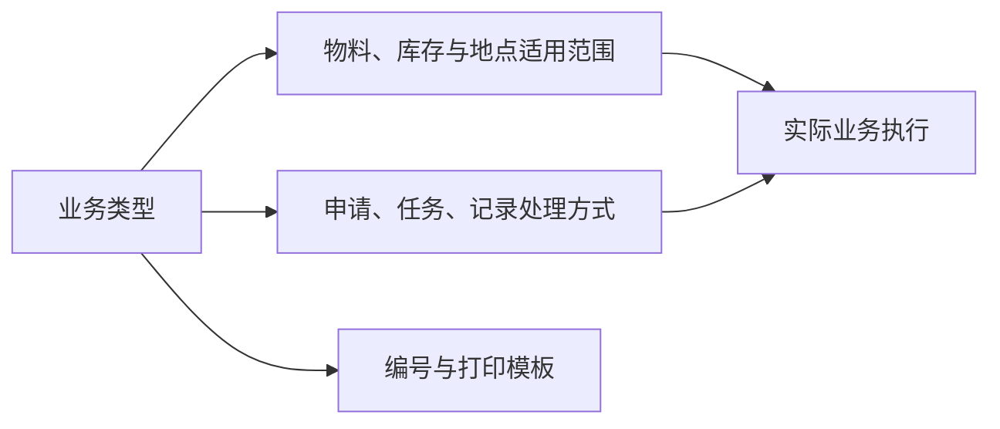

# 业务类型

> 适用基线：测试环境 / `dev` 分支 / 2026-07-15。
> 具体配置、变更和查询操作见[业务类型-维护与查询参考](09-业务类型-维护与查询参考.md)。

## 这项配置解决什么问题

业务类型是申请、任务和记录等业务对象的共同分类口径。它决定某类业务可使用的物料/库存范围、入出库处理、在途处理、自动提交或自动执行等行为边界，并可关联编号和打印模板。

它属于高风险配置：一次变更可能同时影响单据创建、终端操作、库存事务和打印。因此应把它作为受控变更处理，而不是普通分类字典。

读完本页，测试能据此设计跨业务类型的验证场景，实施能说清改哪个开关会让现场发生什么变化，运维能据此判断问题出在业务类型还是单据设置。

## 如何使用本组文档

| 你的目的 | 建议阅读 |
| --- | --- |
| 想理解业务类型如何影响流程、库存方向与编号打印 | 本页「这项配置解决什么问题」「配置如何起作用」。 |
| 正在新增/修改业务类型，需要选择器范围与字段级约束 | [业务类型-维护与查询参考](09-业务类型-维护与查询参考.md)。 |
| 需要核对某类单据的编号/打印从哪套规则来 | 本页「配置如何起作用」并联查[单据设置](04-单据设置.md)。 |
| 需要核对实现证据或未证实项 | 由文档维护人员按 `GAP-060`/`GAP-002` 查内部底稿。 |

## 一笔典型配置业务

**场景：** 为「采购收货」准备一条可用的业务类型，使现场能选对库位范围、按约定自动推进，并挂上正确的编号/打印关联（对应上文流程图）。

1. **触发**：实施与业务负责人确认目标场景（如采购收货）、入出库方向、是否允许改量/改库位、是否自动提交/同意/执行、编号与打印需求。
2. **处理**：在业务类型中维护基本识别、适用范围、库存与在途、自动化、现场约束、编号与打印关联，并置为可用。
3. **结果**：目标业务开单时可引用该类型；现场可选范围与自动推进路径按配置收紧或放宽；新单号/标签按关联规则生成。
4. **关键分支**：
   - 范围配得过窄 → 现场选不到仓库/库区/库位或物料；
   - 自动处理误开 → 申请可能跳过人工审核节点直接进入任务/记录（真实状态迁移细节 ❓，见「当前边界」）；
   - 入出方向或在途配错 → 库存增减或在途地点与实务相反；
   - 模板/号段错挂 → 错号或错打。

!!! example "写实示例（给定配置 → 期望行为）"
    **给定：** 采购收货用业务类型允许改数量、禁止改库位；未开自动提交；入出用途与收货入库事务口径一致；已关联申请/任务号段。
    **期望：** 建收货申请可选该类型；提交后仍需人工审核节点；任务执行时数量可改、库位不可改；新单号按关联号段生成。
    **对照：** 若任务上库位仍可改，或未提交即生成任务，应先查本类型现场约束与自动处理，再查单据开关/规则，勿只改业务页。

## 使用前准备

1. 目标业务场景与单据对象（申请 / 任务 / 记录）已明确。
2. 入出库方向、事务口径、是否使用在途及在途地点已由业务负责人批准。
3. 可用物料/质量状态、仓库/库区范围与现场 SOP（能否改量、改位、超收/欠收、重复扫描等）已对齐。
4. 若需编号或打印：相关[单据设置](04-单据设置.md)与打印模板来源已准备（打印模板入口当前可能仍走 WMS 标签，产品目标归属 INFRA）。
5. 变更在**测试环境**用完整链路验证后再进生产。

## 业务逻辑要点

| 要点 | 说明 |
| --- | --- |
| 主对象 | 业务类型是策略档案，被单据设置、开关、规则及各类业务页引用；本身不是可执行的业务单据。 |
| 影响方向 | 配置 → 开单可选类型与范围 → 申请/任务/记录推进方式 → 库存与打印结果。 |
| 与现场任务 | 任务控制类开关（改量、改库位、连续扫描、部分完成等）会被收货等现场任务读取；排查现场问题时先查类型，再查具体业务页。 |
| 与编号 | 类型上可关联号段/打印；实际单号组成仍以[单据设置](04-单据设置.md)为准，两者须成对验证。 |
| 生效边界 | **未证实**每个字段都被每个 WMS/MES 页面完整消费；必须按目标业务逐项验证（`FSEM-005`）。 |

## 关键字段业务角色

| 字段/配置点 | 在系统中的作用 | 关键行为要点（取值/范围/联动/门禁） | 维护或操作时要警惕什么 |
| --- | --- | --- | --- |
| 业务类型代码/名称 | 策略配置的身份识别 | 代码唯一（服务层查重；库约束 ❓）；编辑改码高风险 | 被单据引用后改码/删除保护 ❓（`GAP-060`） |
| 适用范围（物料/库存/地点等） | 限制该类业务可选的物料、库存状态、库区等 | ❓ 各消费方是否完整读取待逐业务验证 | 配错范围 → 现场选不到或选到不该选的对象 |
| 入出库 / 在途处理 | 决定库存事务方向与在途地点行为 | 与事务类型、仓库地点配置联动 | 方向错误导致库存增减反了 |
| 自动提交 / 自动同意 / 自动处理等 | 改变申请→任务→记录的推进路径 | 开关存在于配置；真实审批主体与状态码 ❓（`GAP-002`） | 误开自动可能导致未审即执行 |
| 任务控制类开关 | 现场能否改量、改库位、连续扫描等 | 被收货等任务读取（见采购收货） | 与现场 SOP 不一致会造成扫码失败 |
| 编号 / 打印模板关联 | 单据号规则与标签模板来源 | 打印模板入口归属 INFRA 目标（当前可能仍走 WMS 标签） | 模板错挂导致错打/错号 |
| 是否可用 | 配置是否可被新业务引用 | 停用后旧单 ❓ | 停用仍被在途单引用 |

完整语义与选择器见[业务类型-维护与查询参考](09-业务类型-维护与查询参考.md)。共享策略概念见[单据类型、业务类型与单据配置](../../02-业务模型/05-单据类型、业务类型与单据配置.md)。

## 配置如何起作用

业务类型不是孤立字典，它的每一次变更都会顺着申请→任务→记录链路和库存/编号体系连锁生效：

- **对申请/任务/记录：** 自动提交、自动同意、自动执行等开关直接决定某类业务是否需要人工审批节点；任务控制类开关（能否改数量、改库位、连续扫描、部分完成）会被现场任务（如收货）直接读取，改配置即改现场可操作范围。
- **对库存方向：** 入出库/在途处理设置与事务类型协同，决定该类业务产生的库存事务是增还是减、是否经过在途库位；配错方向会导致库存结果与实际操作相反。
- **对编号与打印：** 业务类型本身不直接生成单据号——它通过关联到具体的[单据设置](04-单据设置.md)决定该类业务使用哪套编号规则与打印模板；停用或改挂业务类型会连带影响新单能否正确取号、打印能否找到模板。

因此改业务类型前，应同时核对其关联的[单据设置](04-单据设置.md)是否仍然匹配，两者须成对验证。

## 建议验证点

变更业务类型前，建议在测试环境走通一次完整链路，而不是只看配置页保存成功：

- **创建：** 用目标业务类型发起一笔申请/任务，确认可选的物料、库存状态、库区/库位范围与预期一致。
- **执行：** 核对自动提交/自动执行等开关是否按预期跳过或保留人工节点；现场能否按任务控制类开关改数量/改库位/连续扫描。
- **库存/编号：** 核对生成的库存事务方向（入/出/在途）是否正确；核对生成的单据号是否来自预期的[单据设置](04-单据设置.md)规则，打印模板是否正确挂接。
- **撤销/异常：** 尝试撤回或作废该笔业务，确认库存能否正确冲正、编号不会被错误复用；核对停用业务类型后，在途单据是否仍可正常收尾（`GAP-060`）。

## 维护与查询重点

维护前须先明确适用业务场景、入出库方向、可修改范围、自动处理规则、在途地点以及打印/编号需求。变更前应在测试环境用完整业务链路验证：创建、审批/执行、库存结果、撤销、打印和异常处理。

| 查询目标 | 建议联查 |
| --- | --- |
| 某业务为什么可/不可选择物料或库位 | 业务类型的适用范围、物料/库存/库区状态。 |
| 某单据为何自动提交或直接执行 | 业务类型的自动处理设置和实际业务记录。 |
| 某单据编号或打印模板从哪里来 | 业务类型、单据设置和打印模板。 |

## 做完影响什么

- **下游业务页**：开单可选类型、自动推进路径、现场可改范围可能变化。
- **库存**：入出方向与在途口径变化会改变事务与预期库存表现。
- **编号与打印**：新单按新关联取号/打标；已生成单据通常保留原号。
- **其它策略**：[单据设置](04-单据设置.md)、单据开关、规则管理仍可能叠加约束；业务类型改动不能替代它们的专项调整。

## 异常与查询入口

| 现象 | 先查什么 | 再联查什么 |
| --- | --- | --- |
| 现场选不到物料或库位 | 本类型适用范围 | 物料/库存/库区状态；具体业务页选择器 |
| 单据自动提交或直接执行 | 自动处理开关 | 实际申请/任务/记录；单据开关与规则 |
| 编号或打印不对 | 本类型编号/打印关联 | [单据设置](04-单据设置.md)、打印模板 |
| 改完配置业务页无变化 | 是否可用、是否选对类型 | 该业务是否真正读取该字段（逐业务验证） |

日常联查场景另见上文「维护与查询重点」；操作步骤、导入与详情分组建议见[维护与查询参考](09-业务类型-维护与查询参考.md)。

## 当前边界

- 当前未确认所有字段都已在每个业务页面实际生效；不同 WMS/MES 场景必须逐项验证。
- 业务类型改动不能替代单据设置、单据开关和规则管理的专项调整。
- 详情分组和业务影响预览需要后续页面改造。

!!! example "📷 截图占位"
    业务类型配置、适用范围、自动处理和模板关联；使用脱敏测试数据。

