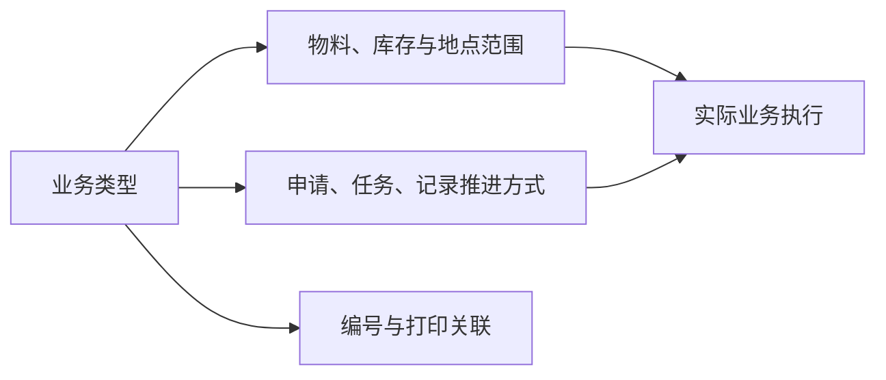

# 业务类型

> 适用基线：测试环境 / `dev` 分支 / 2026-07-15。
> 具体配置、变更和查询操作见[业务类型-维护与查询参考](09-业务类型-维护与查询参考.md)。

## 这项配置解决什么问题

业务类型是申请、任务、记录的共同策略口径：决定可选物料/库存/地点范围、入出库与在途、自动推进、现场能否改量改位，并可关联编号与打印。一次改错可能同时影响开单、终端、库存和打印，应按受控变更处理。

读完本页，应能说清「改哪个开关 → 现场/库存/编号发生什么」，并判断问题出在业务类型还是[单据设置](04-单据设置.md)。

## 如何使用本组文档

| 你的目的 | 建议阅读 |
| --- | --- |
| 理解业务类型如何改变行为 | 本页：典型配置 → 关键字段 → 改完影响什么 |
| 落地或核对某条配置 | 本页「使用前准备」+ 维护参考字段细节 |
| 排障：选不到料/位、自动跳过审核、错号错打 | 本页「改完影响什么与排障」并联查[单据设置](04-单据设置.md) |
| 字段级选择器与导入 | [业务类型-维护与查询参考](09-业务类型-维护与查询参考.md) |

## 一笔典型配置（含准备）

**场景：** 为采购收货准备一条可用业务类型。

**准备：** 场景与单据对象已明确；入出方向/在途已批准；库区范围与现场 SOP（改量、改位、超欠收等）已对齐；若需编号/打印，[单据设置](04-单据设置.md)与模板来源已就绪；先在测试环境验证再进生产。

1. **触发**：确认范围、自动推进、现场约束、号段/打印需求。
2. **处理**：维护识别信息、适用范围、库存与在途、自动化、现场约束、编号/打印关联，并置为可用。
3. **结果**：目标业务可引用该类型；可选范围与自动路径按配置收紧或放宽；新单号/标签按关联规则生成。
4. **关键分支**：范围过窄 → 选不到对象；自动误开 → 可能跳过人工节点（状态细节 ❓）；入出/在途配错 → 库存方向反了；模板/号段错挂 → 错号或错打。

!!! example "写实示例（给定配置 → 期望行为）"
    **给定：** 允许改数量、禁止改库位；未开自动提交；入出与收货入库一致；已关联申请/任务号段。  
    **期望：** 建收货申请可选该类型；提交后仍需人工审核；任务上数量可改、库位不可改；新单号按关联号段生成。  
    **对照：** 若库位仍可改或未提交即出任务，先查本类型现场约束与自动处理，再查单据开关/规则，勿只改业务页。

业务类型是策略档案，不是可执行单据；编号组成以[单据设置](04-单据设置.md)为准，须成对验证。未证实每个字段都被每个业务页完整消费（`FSEM-005`），须按目标业务实测。

## 关键字段业务角色

| 字段/配置点 | 在系统中的作用 | 关键行为要点（取值/范围/联动/门禁） | 维护或操作时要警惕什么 |
| --- | --- | --- | --- |
| 业务类型代码/名称 | 策略配置的身份识别 | 代码唯一（服务层查重；库约束 ❓）；编辑改码高风险 | 被单据引用后改码/删除保护 ❓（`GAP-060`） |
| 适用范围（物料/库存/地点等） | 限制该类业务可选对象 | ❓ 各消费方是否完整读取待逐业务验证 | 配错 → 选不到或不该选的对象 |
| 入出库 / 在途处理 | 库存事务方向与在途地点 | 与事务类型、仓库地点联动 | 方向错误导致增减反了 |
| 自动提交 / 自动同意 / 自动处理等 | 改变申请→任务→记录推进 | 真实审批主体与状态码 ❓（`GAP-002`） | 误开可能导致未审即执行 |
| 任务控制类开关 | 现场改量、改库位、连续扫描等 | 被收货等任务读取 | 与 SOP 不一致会造成扫码失败 |
| 编号 / 打印模板关联 | 号段与标签来源 | 打印入口目标归属 INFRA（当前可能仍走 WMS 标签） | 错挂导致错打/错号 |
| 是否可用 | 新业务能否引用 | 停用后旧单 ❓ | 在途单仍可能引用 |

完整语义见[维护与查询参考](09-业务类型-维护与查询参考.md)。共享概念见[单据类型、业务类型与单据配置](../../02-业务模型/05-单据类型、业务类型与单据配置.md)。

## 建议验证点

变更后不要只看保存成功，在测试环境走通目标业务：

- **创建：** 可选物料/库存/库区是否符合预期。
- **执行：** 自动推进与现场改量/改位是否符合开关。
- **库存/编号：** 事务方向是否正确；单号与打印是否来自预期[单据设置](04-单据设置.md)。
- **异常：** 撤回/作废后库存冲正；停用后在途单能否收尾（`GAP-060`）。

## 改完影响什么与排障

| 影响面 | 说明 |
| --- | --- |
| 下游业务页 | 开单可选类型、自动路径、现场可改范围可能变化 |
| 库存 | 入出/在途口径变化会改变事务与预期 |
| 编号与打印 | 新单按新关联取号/打标；已生成单据通常保留原号 |
| 其它策略 | [单据设置](04-单据设置.md)、单据开关、规则仍可能叠加；本页改动不能替代它们 |

| 现象 | 先查 | 再联查 |
| --- | --- | --- |
| 选不到物料或库位 | 本类型适用范围 | 物料/库存/库区状态；业务页选择器 |
| 自动提交或直接执行 | 自动处理开关 | 实际单据；单据开关与规则 |
| 编号或打印不对 | 本类型编号/打印关联 | [单据设置](04-单据设置.md)、打印模板 |
| 改完业务页无变化 | 是否可用、是否选对类型 | 该业务是否真正读取该字段 |

操作步骤与导入见[维护与查询参考](09-业务类型-维护与查询参考.md)。

## 当前边界

- 未确认所有字段都已在每个业务页生效；须按场景逐项验证。
- 不能替代单据设置、单据开关和规则管理的专项调整。
- 详情分组和业务影响预览需后续页面改造。

!!! example "📷 截图占位"
    业务类型配置、适用范围、自动处理和模板关联；使用脱敏测试数据。
