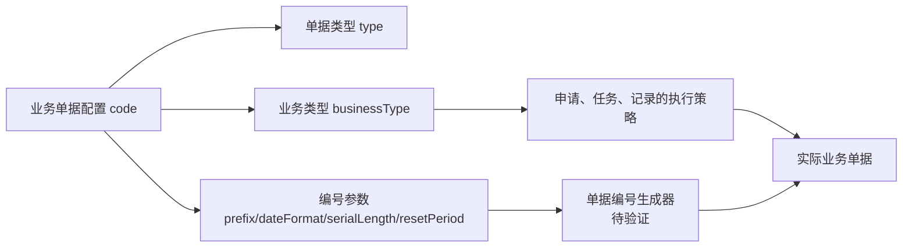

# 单据设置

> 第一阶段状态：本页已补齐业务大纲；原有技术性材料仅作后续内部整理线索，不应直接作为培训或操作结论。

## 业务目的与适用范围

用于维护业务单据运行相关的受控设置，使业务按统一规则被创建、识别或处理。

本页属于策略设置，用于维护受控的基础资料或配置；实际业务执行结果应在对应业务模块查询。

## 何时需要维护

【待补充：说明由哪个岗位、在何种业务变更、组织调整或新场景启用时维护本对象；明确需要审批或影响评估的场景。】

## 使用前准备

【待补充：说明关联资料、适用范围、维护责任、命名/分类口径和变更影响确认。】

【截图占位：新增/编辑页面，标出关联选择、状态/启停、受控字段和确认入口。】

## 典型维护与使用方式

【待补充：以一笔典型配置或资料维护说明新增、关联、启用、验证和被下游业务引用的顺序。】

【图示占位：单据设置与关联主数据、配置或下游业务之间的业务影响图。】

【示例数据占位：一条正确维护样例及其对下游选择、业务执行或查询结果的影响。】

## 关键维护与变更

| 需要判断什么 | 应说明的业务规则 |
| --- | --- |
| 新增 | 【待补充：必填信息、适用范围、关联选择和重复检查。】 |
| 修改 | 【待补充：哪些信息可改、修改前应检查哪些已运行的业务。】 |
| 启停、发布或删除 | 【待补充：何时可启停/发布、是否存在删除保护及回退方式。】 |
| 批量处理 | 【待补充：是否支持导入；模板、系统填充、校验和错误处理。】 |

## 查询、详情与联查

【待补充：说明列表优先显示的识别信息、常用筛选、详情分组及可联查的关联对象和业务影响。】

【截图占位：列表筛选、详情分组、启停/发布或关联跳转入口。】

## 常见问题与处理

【待补充：至少说明关联资料不可选、配置不生效、对象已被引用或状态不允许变更等情况。】

## 当前限制与待确认事项

【待补充：列出会改变用户操作结论的未确认项及验证方式；不要记录源码取证过程。】

## 图示、截图与示例任务

【图示占位：补充配置/资料与下游业务关系图。】

【截图占位：补充维护、查询和异常提示页面。】

【示例数据占位：补充一笔正常配置和一笔常见异常的脱敏样例。】
> 取证状态：已完成 DDL、DO/VO、服务、导入 VO 与 Web 页面首轮校正；编号生成器对本表字段的实际消费、已使用单据的引用保护和接口权限仍待测试环境验证。基线：`dev` 分支、测试环境目标版本，2026-07-16。

## 业务定位

单据设置是申请、任务、记录等单据的**类型与编号参数档案**。它以 `code` 标识一个单据配置，保存名称、描述、单据类型、关联业务类型以及号码前缀、日期格式、流水长度、分隔符和重置周期。

它与[申请、任务与记录模型](../../02-业务模型/01-申请任务记录模型.md)的关系如下：业务类型定义“此类业务怎样执行”；单据设置定义“申请、任务、记录等单据以何种类型和编号参数出现”。本表不保存申请/任务/记录的实际状态、明细或库存影响。

| 项目 | 当前实现 |
| --- | --- |
| 持久化对象 | `document_documentsetting` |
| 业务标识 | `code`，`varchar(64)`、非空；服务层按代码查重，DDL 当前仅有普通索引。 |
| 核心关联 | `type` 为单据类型字典；`businessType` 为业务类型代码文本，当前 Web 与服务均未见强制选择/存在性校验。 |
| 使用规则 | 按代码查询时，服务只返回 `available=true` 的配置。 |
| 当前页面 | DBC 单据设置列表，支持新增、编辑、通用详情和筛选；导入、导出、删除按钮在当前 Web 页面被注释。 |
| 审计 | 服务新增、修改、删除会写趋势记录；删除是否受引用保护尚未取证。 |

## 数据模型与字段真实性

| 分组 | 实际字段 | 类型/长度 | 当前含义 |
| --- | --- | --- | --- |
| 标识 | `code`、`name` | `varchar(64)`、非空 | 单据设置代码和名称。 |
| 类型归属 | `description`、`type`、`businessType` | `varchar(64)`、非空 | 描述、单据类型、业务类型。历史 `docTypeCode`、`bizTypeCode` 均非当前字段名。 |
| 编号参数 | `numberPrefix`、`dateFormat`、`serialLength`、`separatorStr`、`resetPeriod` | 前三者及重置周期 `varchar(64)`/非空；`serialLength` 为 `integer`/非空；分隔符 `varchar(64)`/可空 | 单据编号组成与重置规则。 |
| 生命周期 | `available`、`activeTime`、`expireTime` | `boolean` 非空，默认 `true`；两个时间为 timestamp、可空 | 可用状态和生/失效时间。 |
| 补充与审计 | `remark`、`extraProperties`、`concurrencyStamp`、创建/更新/删除审计字段 | 备注、扩展属性为文本；乐观锁为整数 | 扩展字段及系统审计。 |

## 新增约束与选择器

### 当前保存校验

服务新增和修改共同检查以下字段非空：代码、名称、描述、单据类型、业务类型、号码前缀、号码时间格式、号码流水长度、流水重置周期、是否可用；代码另外进行服务层唯一性检查。

Web 表单的长度限制大多为 50 字符，低于 DDL 的 64 字符上限；号码流水长度使用整数输入，当前前端允许 `0` 至 `50`，服务仅检查非空，未见大于零、日期格式合法性或编号组合唯一性的显式校验。

| 字段 | 页面输入方式 | 数据源/限制 |
| --- | --- | --- |
| `code`、`name`、`description`、`businessType`、`numberPrefix`、`dateFormat` | 文本输入。 | 代码、名称、描述、业务类型、前缀、日期格式页面均限制 50 字符；`businessType` 当前不是业务类型选择器。 |
| `type` | 字典选择。 | `document_type` 字典，必填。 |
| `serialLength` | 数字输入。 | 整数，页面最小值 0、最大值 50；应在后续产品确认中明确是否允许 0。 |
| `resetPeriod` | 字典选择。 | `reset_period` 字典，必填。 |
| `separatorStr` | 文本输入。 | 可空，页面最大 50 字符。 |
| `activeTime`、`expireTime` | 日期时间选择。 | 页面仅校验失效时间应晚于生效时间；未见服务端同等比较。 |
| `available` | 布尔开关。 | 新建默认 `true`，必填。 |

## 编辑、删除与日志边界

Web 对新增和编辑使用同一通用表单，当前未见代码、单据类型、业务类型或编号参数在编辑时锁定。后端更新也接收同一组字段，未见“已有申请/任务/记录引用后禁止变更”的显式检查。因此，培训材料只能说明当前页面允许编辑，不能将其表述为“已安全支持在用配置改码或改编号规则”。

服务实现了删除前趋势记录，但 Web 删除按钮当前被注释；同样，前端 `dbc:*` 按钮权限标识不构成接口侧授权结论。

## 导入规则

### 当前模板事实

当前导入 VO 包含代码、名称、描述、单据类型、业务类型、号码参数、是否可用、生/失效时间和备注；代码至重置周期均列为必填（分隔符、时间、备注除外）。单据类型、是否可用使用字典转换。导出 VO 另外包含审计字段和软删除状态，但这些字段不应由人工在导入模板中维护。

导入校验复用代码唯一性和字段非空校验；当前可见服务未见业务类型存在性、日期格式解析、流水长度取值范围、编号冲突或已有单据影响的完整校验。页面的导入按钮被注释，且已保留的 `ImportForm` URL 使用 `/wms/documentsetting/import`，与当前 Controller 的 `/dbc/documentsetting` 根路径不一致，不能视为可用入口。

### 建议模板

| 类别 | 建议人工提供 | 不应进入人工模板 | 必要校验 |
| --- | --- | --- | --- |
| 单据基础档案 | 代码、名称、描述、单据类型、业务类型、可用状态、备注 | 主键、创建/更新/删除审计、乐观锁、软删除、扩展属性 | 代码唯一；单据类型字典有效；业务类型存在且可用。 |
| 编号参数 | 号码前缀、日期格式、流水长度、分隔符、重置周期 | 已生成编号、运行计数器、审计字段 | 日期格式可解析；长度大于零（若产品确认）；与其它有效配置的编号空间不冲突。 |
| 生效控制 | 生效、失效时间 | 系统生成时间 | 生效时间早于失效时间；已被运行中单据使用时走受控变更。 |

## 列表、详情与跳转规划

| 区域 | 当前实现 | 建议标准 |
| --- | --- | --- |
| 列表 | Schema 具备大量字段，容易显示为宽表；代码可打开通用详情。 | 默认顺序：代码、名称、单据类型、业务类型、号码前缀、流水重置周期、可用状态、最后更新时间、操作；其余编号与审计信息放入字段设置/高级查询。 |
| 查询 | 已接入通用筛选；当前明确搜索字段为代码、名称。 | 默认支持代码、名称、单据类型、业务类型、可用状态；高级条件补生效区间、重置周期与更新时间。 |
| 详情 | 使用通用详情组件，无业务分组。 | 分为“基本信息”“类型与业务关联”“编号参数”“生效与审计”“变更记录”五组。 |
| 快速跳转 | 当前无明确业务跳转。 | 增加到关联[业务类型](03-业务类型.md)、流水号配置、使用该配置的申请/任务/记录查询；跳转权限和实际菜单待实测。 |

## 关系示例与图示占位

> 后续应补一张实际单据编号样例及对应申请、任务、记录截图；在未验证编号生成器前，不以示例推断最终编号格式。

## 待核验与差距标记

| 待核验项 | 后续动作 |
| --- | --- |
| 编号消费关系 | 从流水号/编号服务和实际单据创建流程确认 `numberPrefix` 等字段是否、何时被消费。 |
| 业务类型关联 | 补业务类型选择器或服务端存在性/可用性校验，并测试无效代码的保存与导入结果。 |
| 在用修改与删除 | 查询申请、任务、记录的引用关系，确定改码、禁用、删除的受控策略。 |
| 导入入口与权限 | 校正前端 URL/按钮权限，确认通用 Controller 的接口授权、错误文件和覆盖模式。 |

详见《产品差距总账》GAP-061：单据设置代码唯一性、业务类型自由输入、编号参数校验、在用配置保护以及导入入口未闭合；按“登记问题、继续推进”处理。
