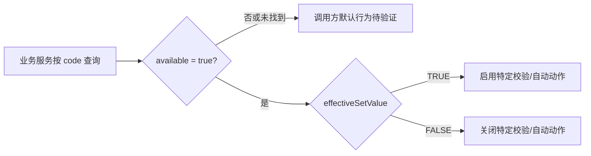

# 单据开关

> 取证状态：已完成 DDL、VO、服务与 Web 页面首轮校正；每个开关代码的具体消费点和开关生效时点仍需按业务逐项验证。基线：`dev` 分支、测试环境目标版本，2026-07-16。

## 业务定位

单据开关是由代码驱动的**全局布尔策略表**。业务服务以开关 `code` 查询可用记录，再按 `effectiveSetValue`（`TRUE`/`FALSE`）决定是否启用某项校验、自动创建或接口动作。它不同于业务类型中的单据级策略：业务类型描述某类单据的通用执行规则；单据开关用于跨业务或特定业务代码的功能总开关。

| 项目 | 当前实现 |
| --- | --- |
| 持久化对象 | `document_switch` |
| 核心字段 | `code`、`description`、`effectiveSetValue`、`available`。 |
| 生效查询 | `selectSwitchExist(code)` 按代码和 `available=true` 查询；代码不存在或不可用时返回空对象，调用方如何处理需逐项确认。 |
| 当前页面 | 仅提供刷新、筛选、字段设置和部分记录编辑；新增、导入、导出、删除按钮均被注释。 |
| 编辑特例 | 四个代码在 Web 中隐藏编辑：`CreatePutawayRequestAfterInspectRecordCreated`、`CreatePurchasePlanAfterDiscretePurchaseOrderPublished`、`ExemptItemCreatePutawayRequestAfterPurchaseReceiptRecordCreated`、`CreatePurchaseReceiptRequestAfterSupplierDeliverRecordCreated`。 |

## 字段与新增约束

| 字段 | 类型/长度 | 当前页面与服务规则 |
| --- | --- | --- |
| `code` | `varchar(255)`、非空 | 表单显示为只读；VO 标为必填。但服务新增未见非空、唯一性或格式校验，DDL 仅有普通索引。 |
| `description` | `varchar(255)`、非空 | 页面允许编辑、VO 标为必填；服务未见同等内容校验。 |
| `effectiveSetValue` | `varchar(64)`、非空 | 页面使用 `TRUE`/`FALSE` 开关，默认 `TRUE`；VO 标为必填。 |
| `available` | `boolean`、非空、默认 `true` | 当前列表不显示，表单也标为非表单字段；实际可用状态主要由接口/数据维护决定。 |
| 审计与补充 | 创建/更新人时间、`activeTime`、`expireTime`、`remark` | DDL 存在，但当前主表单未维护生失效/备注；VO/导出模型也未完整覆盖。 |

> 当前前端没有开放新增入口，代码只读，故本页更接近“受控参数维护”而非日常主数据建档。若未来开放新增，至少应补代码唯一性、用途登记、默认值和消费方评审。

## 编辑、导入与权限边界

当前行级编辑没有显式前端权限标识；`success` 回调无论表单类型都调用更新 API。服务更新仅检查主键存在，未校验代码、描述、值域、可用状态或已有消费关系；服务仍会为新增、修改、删除写趋势记录。

`SwitchExcelVO` 包含 `id`、代码、描述、有效设置值、是否可用，但当前页面导入按钮被注释，模板下载也未初始化。因此，不应将 Excel VO 视为当前可用导入流程，更不应把 `id` 作为人工导入字段。

| 场景 | 当前结论 | 建议规则 |
| --- | --- | --- |
| 修改开关值 | Web 对未隐藏代码可编辑描述和值。 | 必须记录消费业务、变更人、变更时间及回滚方案；关键自动动作应增加双人复核。 |
| 停用 | 服务按 `available=true` 查询。 | 明确停用后的调用方行为（默认关闭、默认开启或报错），并在测试环境验证。 |
| 新增 | 页面未开放；服务创建无专用校验。 | 不允许通过普通导入/接口随意新增；须先完成代码登记和消费方实现。 |
| 导入 | 当前无可见入口。 | 若恢复，仅导入代码、描述、值；排除 `id` 和审计字段，并校验代码唯一、值域和用途。 |

## 列表、详情与快速跳转规划

| 区域 | 当前实现 | 建议标准 |
| --- | --- | --- |
| 列表 | 代码、描述、有效设置值、审计字段与操作；可用状态不显示。 | 默认：代码、描述、当前值、可用状态、最后更新时间、更新者、操作；避免将所有审计列前置。 |
| 查询 | 当前明确支持代码搜索及通用筛选。 | 代码、描述、当前值、可用状态、更新时间。 |
| 详情 | 通用详情，无业务分组。 | “基本信息”“当前状态与生效范围”“消费业务与风险”“变更记录”四组。 |
| 跳转 | 当前无消费方跳转。 | 每个代码应链接到实际调用它的业务页面、对应申请/任务/记录或接口配置；待源码全量检索后回填。 |

## 待核验与差距标记

1. 全量建立“开关代码—消费服务/页面—生效时点—关闭后的默认行为”矩阵。
2. 验证四个隐藏编辑代码是否有后端等效保护，避免仅靠前端隐藏。
3. 确认不可用或缺失开关在各调用方的异常处理、默认值和日志。
4. 核验更新、删除接口的后端授权和在用开关的变更审计。

详见《产品差距总账》GAP-062：单据开关的服务端约束、受控变更、导入入口和消费方闭环未完成；按“登记问题、继续推进”处理。
