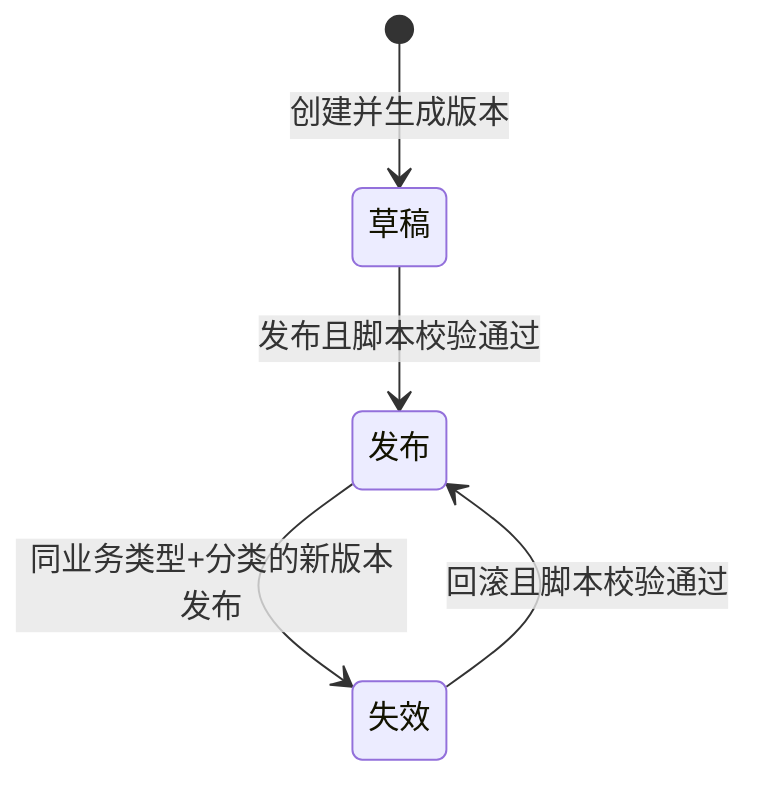

# 规则管理

> 基线状态：已完成后端首轮取证。页面字段、前端交互、各规则分类和脚本语法仍待后续核验。

## BATCH-01 标准占位

> 状态：首轮占位增强。本页已有后端首轮事实，新增内容只作为后续取证任务，不覆盖已核验事实。

规则管理属于 DBC 策略配置页面，用于向业务模块提供可版本化的规则结果。它不直接适用[申请、任务与记录模型](../../02-业务模型/01-申请任务记录模型.md)，但可能影响申请、任务、记录、库存挂接、选择器范围、自动策略和终端执行。

| 主题 | 当前占位 | 后续取证 |
| --- | --- | --- |
| 字段真实性 | 已有后端首轮取证；页面字段和导入字段仍需继续核验。 | 从 DBC DDL、DO、DTO、VO、前端配置校正真实字段名。 |
| 新增约束 | 待补规则编码、业务类型、规则分类、版本、脚本/表达式、状态等规则。 | 前端表单、后端校验、规则执行服务。 |
| 编辑限制 | 待补规则已启用、被业务调用、存在历史版本后的可编辑范围。 | 后端更新服务、版本管理、测试环境。 |
| 导入规则 | 待补是否支持导入、模板字段、脚本语法校验和错误处理。 | Excel VO、导入服务、导入模板。 |
| 列表与详情 | 待补默认列、查询条件、详情分组、规则版本和执行日志跳转。 | 前端列表配置、详情组件。 |
| 关联影响 | 待补与业务类型、单据设置、库存策略、选择器、自动化规则的关系。 | 源码调用、菜单、业务确认。 |
| 权限与日志 | 按 RBAC 与动作权限取证模板 逐项补。 | 菜单权限、按钮权限、接口权限、操作日志。 |

## 功能定位

规则管理用于维护受控的业务规则版本，并按业务类型和规则分类向业务模块提供规则结果。它不是简单的“按优先级排序的参数表”。

## 已核验事实

| 主题 | 当前实现事实 |
| --- | --- |
| 生命周期 | 新建规则默认进入“草稿”状态，并生成规则版本号。 |
| 发布 | 仅草稿规则可发布；发布时会校验规则脚本。 |
| 单一发布版本 | 以“业务类型 + 规则分类”查询既有发布规则；发布新版本时，原发布版本被置为失效。 |
| 回滚 | 失效规则可回滚为发布状态，回滚时同样校验脚本。 |
| 管理精度查询 | 提供按物料号集合，以及按物料号和库位号查询库存管理精度的接口。 |
| 幂等 | 创建接口使用 60 秒幂等保护，避免重复提交。 |

## 当前模型、页面与字段分层

后端当前主模型为 `strategy_rule`，核心为 `businessType`、`category`、`version`、`status`、`condition`、`nodeData`、`remark`。其中业务类型、分类为 `varchar(64)` 非空；版本最大 128；条件、节点数据为文本；状态 DDL 口径为 `1=发布、2=草稿、3=失效`。新建时服务强制置为草稿并由流水号服务生成版本号。

| 层级 | 已证实字段/行为 | 不可混写的差异 |
| --- | --- | --- |
| DDL / VO | `businessType`、`category`、`version`、`status`、`condition`、`nodeData`、`remark`。VO 还声明 `configuration`。 | DDL 未见 `configuration` 列。 |
| 后端服务 | 按“业务类型＋分类”维护单一发布版本；发布和回滚时校验规则脚本。 | 部分服务残留 `strategy_code`、`priority` 等旧字段查询，与当前 DDL 不一致。 |
| 当前 Web | 显示“策略代码、优先级、名称、条件、配置”。 | `strategyCode`、`priority`、`name`、`configuration` 与当前 DDL/VO 不能直接对应，且页面未呈现业务类型、分类、版本、状态、节点数据。 |
| 导入/导出模型 | Excel VO 以业务类型、分类、版本、状态、条件、节点数据、备注为主。 | 当前 Controller 未见导入/导出端点，Web 却展示导入/导出按钮；需实测通用路由与模板是否实际可用。 |

因此，本页及培训材料应把后端 `strategy_rule` 作为当前业务事实；现有 Web 列表只能作为“待迁移/待核验的旧字段界面”，不能据此生成字段字典或导入模板。

## 生命周期与编辑限制

服务发布仅允许草稿；回滚仅允许失效版本。更新已发布规则的禁止逻辑、非草稿规则的删除禁止逻辑目前均为注释代码，实际服务仍可更新或删除。因此，当前不能把“发布后不可编辑、非草稿不可删除”写成已实现约束。

## 列表、详情与导入规划

| 区域 | 当前建议 |
| --- | --- |
| 默认列表 | 业务类型、分类、版本、状态、条件摘要、更新时间、更新者、操作。不要以前端旧字段的策略代码/优先级替代。 |
| 查询 | 业务类型、分类、状态、版本、更新时间；条件脚本仅支持全文/摘要查询。 |
| 详情分组 | “规则标识与版本”“条件与节点数据”“状态流转与脚本校验”“调用方与管理精度”“变更记录”。 |
| 快速跳转 | 关联业务类型、库存管理精度、调用该规则的 WMS 业务页和规则执行/失败日志；具体调用方待全量检索。 |
| 人工导入 | 暂不建议开放。若恢复，只提供业务类型、分类、条件、节点数据、备注；版本、状态由服务生成/控制，排除审计字段。 |

## 当前可确认的接口能力

| 接口用途 | 说明 |
| --- | --- |
| 创建、更新、删除、查询、分页与高级查询 | 管理规则记录与版本。 |
| 发布、回滚 | 控制规则生命周期。 |
| 按规则编码获取列表 | 支持业务按编码获取规则集合。 |
| 查询库存管理精度 | 支持物料/库位维度的精度查询。 |

## 待核验内容

| 编号 | 待确认内容 | 证据 |
| --- | --- | --- |
| DBC-RULE-01 | 规则分类、业务类型、`condition` 脚本和返回结构的实际语义 | 前端页面、VO、数据库数据、调用方。 |
| DBC-RULE-02 | 已发布规则是否允许修改及其实际限制 | 服务实现、测试环境。 |
| DBC-RULE-03 | 规则命中日志、人工覆盖、失败提示和权限控制 | 前端、日志、权限配置。 |
| DBC-RULE-04 | 管理精度规则如何被 WMS 事务、余额和现场扫描调用 | WMS 调用方、测试环境。 |
| DBC-RULE-05 | Web 旧字段、VO `configuration`、服务残留 `strategy_code/priority` 与 `strategy_rule` 当前表结构的迁移关系 | 前后端版本基线、数据库迁移、测试环境。 |

## 关联页面

- [策略与规则引擎模型](../../02-业务模型/06-策略与规则引擎模型.md)
- [库存管理精度与唯一粒度](../../02-业务模型/08-库存管理精度与唯一粒度.md)
- [库存管理](../../05-WMS-库房管理/09-库存管理/index.md)

## 差距标记

详见《产品差距总账》GAP-063：规则管理后端模型、Web 字段、导入/导出入口和部分遗留服务查询不一致；本页已按后端事实和页面现状分层说明，后续继续取证而不阻塞其它页面。
