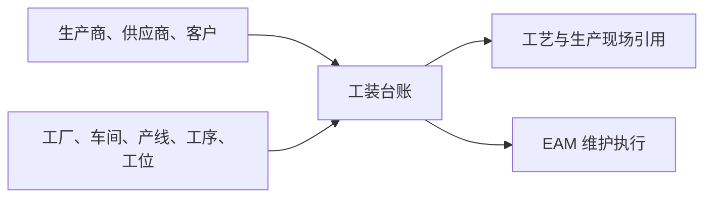

# 工装台账管理

> 适用基线：测试环境 / `dev` 分支 / 2026-07-15。
> 具体新增、编辑、导入和查询操作见[工装台账管理-维护与查询参考](04-工装台账管理-维护与查询参考.md)。

## 这项台账解决什么问题

工装台账维护工装的身份、类型、归属、客户资质、存放与使用信息，以及采购、生产商和运行参考信息。它为工艺、生产和现场业务提供“这套工装是什么、能否使用、由谁负责、位于哪里”的共同口径。

本页不是工装维修、保养、故障、寿命预警或维修工单的操作入口；这些执行类业务应以 EAM 为准。若两个模块存在同一工装，应先确认主数据来源和同步规则，不能双向随意修改。

## 何时需要维护

| 业务事件 | 应做什么 | 维护前要确认 |
| --- | --- | --- |
| 新工装投入使用 | 建立台账并确认类型、状态、组织/现场归属和责任人。 | 代码、名称、工装类型、客户资质及启用条件。 |
| 工装转移、报废或状态变化 | 更新状态、存放/使用信息与变更原因。 | 是否已有工艺、生产或 EAM 业务引用。 |
| 客供工装或合作关系变化 | 维护客户资质、客户和归属信息。 | 客户口径、产权与责任边界。 |
| 大批量建账 | 使用模板导入后抽查关联信息。 | 供应商、生产商和组织信息已准备且可用。 |

## 它与其他业务的关系

当前资料证实工装台账可保存这些关联信息；尚未逐一验证工艺、生产和 EAM 的实际读取范围与同步方式。

## 维护时最重要的判断

| 需要判断什么 | 业务含义 | 建议做法 |
| --- | --- | --- |
| 工装是否可唯一识别 | 工装编号是跨现场追溯的基础。 | 使用稳定编码，避免用名称替代标识。 |
| 类型、状态与客户资质是否正确 | 决定工装的适用边界。 | 与工艺和现场负责人共同确认。 |
| 组织与现场归属是否正确 | 影响查找、责任和现场引用。 | 与工厂/车间/产线/工序/工位口径一致。 |
| 是否可修改运行或采购信息 | 可能影响维护分析与资产追溯。 | 对已使用台账保留变更原因和历史依据。 |

## 查询与联查

| 想回答的问题 | 建议先查什么 | 再联查什么 |
| --- | --- | --- |
| 现场应该使用哪套工装 | 工装编号、类型、状态、可用状态、组织与现场归属。 | 工艺路线、生产业务和 EAM 台账。 |
| 工装归谁负责、放在哪里 | 责任人、联系方式、使用部门、存放位置。 | 现场管理或 EAM 执行记录。 |
| 工装为何不可选 | 状态、可用状态、客户资质和关联资料。 | 目标业务的选择条件与权限。 |

## 当前边界与待确认事项

- 工装编码唯一性、客户选择条件、状态流转和已引用后的编辑/停用保护尚未完成测试验证。
- 导入中供应商、生产商、组织及现场关联的匹配规则存在待核实差异，应先用少量样例试导。
- 工装与 EAM 台账的主从关系、同步方式及工艺路线实际引用范围需要专项确认。

## 图示、截图与示例任务

【截图占位：工装基本信息、归属与现场、采购与运行信息的分组页面。】

【示例任务占位：建立一套客户工装，关联现场位置，并验证在工艺/生产或 EAM 场景中的查询结果。】
