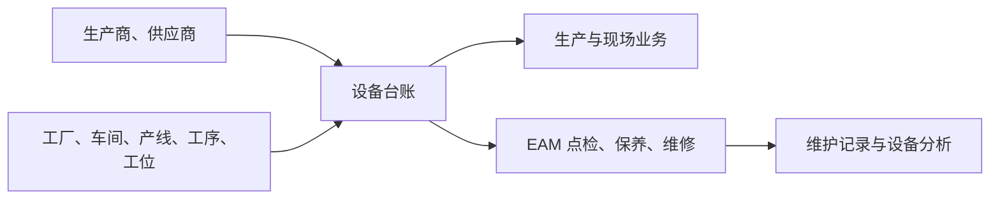

# 设备台账管理

> 适用基线：测试环境 / `dev` 分支 / 2026-07-15。
> 具体新增、编辑、导入和查询操作见[设备台账管理-维护与查询参考](05-设备台账管理-维护与查询参考.md)。

## 这项台账解决什么问题

设备台账维护设备身份、型号、状态、产权、现场归属、责任人、采购/生产商信息和运行参考指标。它使生产与现场业务可以用统一设备口径进行识别和查询。

本页不替代 EAM 中的点检、保养、维修、故障、备件和维修工单。DBC 侧应说明“设备是什么、归属哪里、当前是否可用”；EAM 侧应说明“设备如何被维护和执行”。同一设备的主数据归属和同步规则尚待确认。

## 何时需要维护

| 业务事件 | 应做什么 | 维护前要确认 |
| --- | --- | --- |
| 新设备验收并投用 | 建立设备台账，补齐身份、类型、组织/现场、责任和启用信息。 | 设备编号、名称、类型、车间及责任口径。 |
| 设备转移、改造或状态变化 | 受控更新状态、位置、归属与变更原因。 | 生产、质量、EAM 和报表是否已引用。 |
| 采购或生产商信息补全 | 维护采购、生产商、寿命、价格和验收信息。 | 信息来源可靠且符合资产管理口径。 |
| 批量建账 | 使用导入模板并回看每行结果。 | 车间、产线、工序、供应商、生产商等关联资料已准备。 |

## 它与现场和维护的关系

图中表达应建立的业务联系；实际跨模块挂接、字段同步和状态优先级需要测试环境验证。

## 维护时最重要的判断

| 需要判断什么 | 业务含义 | 建议做法 |
| --- | --- | --- |
| 设备身份是否可靠 | 编号、名称、型号和出厂信息是追溯基础。 | 按资产/设备编码规范维护，避免临时改号。 |
| 现场归属是否一致 | 影响现场查询、生产关联和责任分工。 | 与工厂、车间、产线、工序、工位资料逐项核对。 |
| 状态与可用性是否相符 | 影响设备能否被后续业务使用。 | 状态变化应记录原因，并验证目标业务的表现。 |
| 运行指标是否可直接修改 | 运行时长、故障相关指标可能来自执行过程。 | 未确认来源前，避免把统计结果当作普通主数据覆盖。 |

## 查询与联查

| 想回答的问题 | 建议先查什么 | 再联查什么 |
| --- | --- | --- |
| 一条产线有哪些设备 | 车间、产线、工序、工位与设备状态。 | 生产现场与 EAM 设备视图。 |
| 设备为何不可使用 | 状态、可用状态、有效归属和责任信息。 | 生产页面选择条件、EAM 维护状态。 |
| 设备来自哪里、何时验收 | 供应商、生产商、采购/出厂/验收日期。 | 采购资料、资产资料与 EAM 记录。 |

## 当前边界与待确认事项

- 设备编号、类型、状态、组织/现场关系的必填与校验规则尚需前端和测试环境复核。
- 导入模板中设备编号、现场关联、供应商/生产商匹配和运行指标的校验逻辑待验证。
- 运行指标是否由 EAM 或设备采集自动更新、DBC 侧是否允许人工修改，当前未确认。

## 图示、截图与示例任务

【截图占位：设备基本识别、现场归属、采购与运行指标的详情分组。】

【示例任务占位：新增一台设备并关联车间/产线/生产商，在生产和 EAM 相关页面验证查询边界。】
