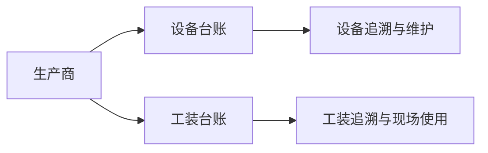

# 生产商管理

> 适用基线：测试环境 / `dev` 分支 / 2026-07-15。

## 这项主数据解决什么问题

生产商管理维护设备或工装制造方的识别和联系资料，供设备台账、工装台账及采购/追溯场景引用。它用于说明“谁制造了这项设备或工装”，不等同于采购供应商或承运商。

## 关键字段业务角色

| 字段/配置点 | 行为模式 | 在系统中的作用 | 关键行为要点 | 维护时要警惕什么 |
| --- | --- | --- | --- | --- |
| 制造商编号 | P6 | 制造方识别号 | 新增必填非空；服务层未见与导入同等的显式重码拦截 | 编号应稳定，已被台账引用后勿改 |
| 名称 | P6 | 正式名称 | 导入显式校验非空；页面亦要求名称 | 与铭牌/合同口径一致 |
| 联系与部门 | P14 | 协同信息 | 可维护 | 变更不影响设备台账主键 |
| 是否可用 | P1 / P9 | 生命周期 | 可维护 | 停用后选择器过滤时点 ❓ |

## 维护与查询说明

| 维护事项 | 当前可确认做法 | 操作提示 |
| --- | --- | --- |
| 新增 | 制造商编号必填非空；名称在导入路径强制校验。可维护简称、地址、国家/城市、联系方式、部门、备注和可用状态。 | 编号应稳定；名称应与设备资料、合同或铭牌口径一致。不要假设系统一定拦截重复编号。 |
| 编辑 | 联系资料、简称、部门和备注可按实际变化维护；更新路径未见锁定编号。 | 已被设备/工装引用后，编号和名称变更前先评估追溯影响；日常按“编号不改”执行。 |
| 停用 | 通过可用状态停止后续选择。 | 保留历史记录，先确认在用设备/工装与导入任务。 |
| 导入 | 模板覆盖识别、联系、部门、备注和可用状态；按既有条目匹配键更新/追加。 | 实际必填、重复处理和错误回执需用模板试导确认。 |
| 删除 | 未见设备/工装引用拦截。 | 已被台账引用时优先停用。 |
| 查询 | 列表优先显示制造商编号、名称、简称、联系人、电话、部门和可用状态。 | 常用筛选为编号/名称、部门和可用状态。 |

### 详情分组与快速跳转

| 分组 | 应展示什么 | 可联查什么 |
| --- | --- | --- |
| 基本识别 | 制造商编号、名称、简称。 | — |
| 联系信息 | 地址、国家/城市、电话、传真、邮编、联系人。 | — |
| 组织信息 | 部门、备注。 | — |
| 使用状态 | 可用状态。 | 设备台账、工装台账选择器。 |
| 变更记录 | 创建/更新审计。 | — |

!!! example "📷 截图占位"
    生产商详情及设备/工装引用入口；状态：待截图。

## 它与设备、工装的关系

当前可确认生产商信息可由台账维护/导入引用；台账选择器的过滤条件、停用保护和跨模块追溯范围仍待验证。

## 当前边界与待确认事项

- `DBC-MFR-001`：编号唯一性、可用默认值与导入必填（名称等）对齐未环境闭合；日常勿假设系统必拦重复编号。
- `DBC-MFR-002`：停用后设备/工装选择器是否即时过滤未证实。
- `DBC-MFR-003`：更新旁路改编号与台账引用一致性未联调；培训按「编号不改」执行。
- 生产商与供应商不是已证实的系统绑定关系，应按「制造方」与「供货方」分别维护。

## 待补充的图示与示例
!!! example "📷 截图占位"
    生产商新增、列表筛选、详情分组及设备/工装引用入口。

!!! tip "📝 待补充"
    新增一个制造商，并在一台设备和一套工装中验证选择与停用影响。
