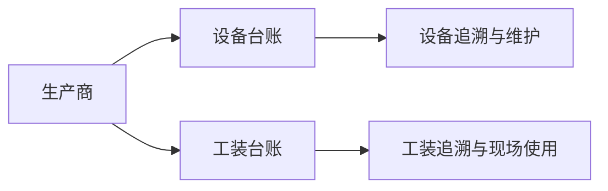

# 生产商管理

> 适用基线：测试环境 / `dev` 分支 / 2026-07-15。

## 这项主数据解决什么问题

生产商管理维护设备或工装制造方的识别和联系资料，供设备台账、工装台账及采购/追溯场景引用。它用于说明“谁制造了这项设备或工装”，不等同于采购供应商或承运商。

## 维护与查询说明

| 维护事项 | 当前可确认做法 | 操作提示 |
| --- | --- | --- |
| 新增 | 制造商编号和名称为必填；可维护简称、地址、国家/城市、联系方式、部门、备注和可用状态。 | 编号应稳定；名称应与设备资料、合同或铭牌口径一致。 |
| 编辑 | 联系资料、简称、部门和备注可按实际变化维护。 | 已被设备/工装引用后，编号和名称变更前先评估追溯影响。 |
| 停用 | 通过可用状态停止后续选择。 | 保留历史记录，先确认在用设备/工装与导入任务。 |
| 导入 | 当前存在模板对象，包含识别、联系、部门、备注和可用状态。 | 实际必填、重复处理和错误回执需用模板试导确认。 |
| 查询 | 列表优先显示制造商编号、名称、简称、联系人、电话、部门和可用状态。 | 常用筛选为编号/名称、部门和可用状态。 |

建议详情页按“基本识别、联系信息、组织信息、使用状态与变更记录”分组；从制造商跳转至设备/工装台账的实际入口需要补充截图验证。

## 它与设备、工装的关系

当前可确认生产商信息可由台账维护/导入引用；台账选择器的过滤条件、停用保护和跨模块追溯范围仍待验证。

## 当前边界与待确认事项

- 生产商编号唯一性、部门/地点关联以及可用状态默认行为尚未完成测试验证。
- 生产商与供应商的关系不是当前已证实的系统绑定关系，应按“制造方”和“供货方”分别维护。

## 图示、截图与示例任务

!!! example "📷 截图占位"
    生产商新增、列表筛选、详情分组及设备/工装引用入口。

!!! tip "📝 待补充"
    新增一个制造商，并在一台设备和一套工装中验证选择与停用影响。
