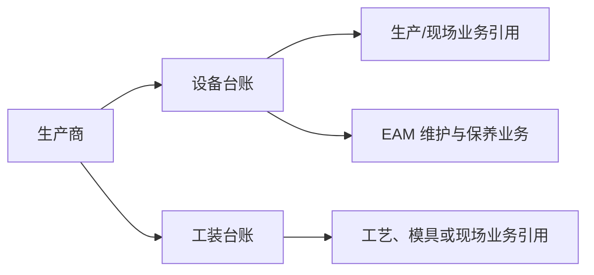

# 设备管理

## 这一组业务解决什么问题

DBC 中的设备管理用于维护设备、工装和生产商等可被其它业务引用的基础台账。它关注“这是什么资产或工装、由谁生产、可在哪些业务中识别”；设备维护、保养、故障和备件等执行业务以 EAM 为主要归属。

## 建议学习与操作顺序

| 顺序 | 页面/业务对象 | 先解决什么 | 与下一步怎样衔接 |
| --- | --- | --- |
| 1 | 生产商管理 | 维护设备或工装的生产方基础信息。 | 可供设备/工装台账引用。 |
| 2 | 设备台账管理 | 维护可被现场业务识别的设备基础资料。 | 与 EAM 设备执行业务建立边界。 |
| 3 | 工装台账管理 | 维护工装或模具相关基础资料。 | 可与工艺建模、生产和 EAM 关联。 |

## 关键业务对象与关系

## 页面清单与写作状态

| 页面 | 文档形态 | 已说明内容 | 后续需补 |
| --- | --- | --- | --- |
| [工装台账管理](01-工装台账管理.md) | 一页完成 | 待重构为工装基础资料说明。 | 维护责任、状态、关联工艺/设备和查询。 |
| [设备台账管理](02-设备台账管理.md) | 一页完成 | 待重构为设备基础资料说明。 | 维护责任、与 EAM 边界、联查和变更影响。 |
| [生产商管理](03-生产商管理.md) | 一页完成 | 待重构为生产方资料说明。 | 新增/停用、设备/工装关联和查询。 |

## 常见问题与相关分组

需要处理设备保养、故障、备件或维修工单时，应转到 EAM；需要维护工艺路线中的模具类型或制造条件时，应同时查看工艺建模，不在本组推断实际维护执行规则。

## 图示、截图与示例任务

【截图占位：设备、工装、生产商的关联维护与详情联查页面。】

【示例数据占位：一台设备、一套工装、一个生产商及其在生产/维护业务中被引用的样例。】
