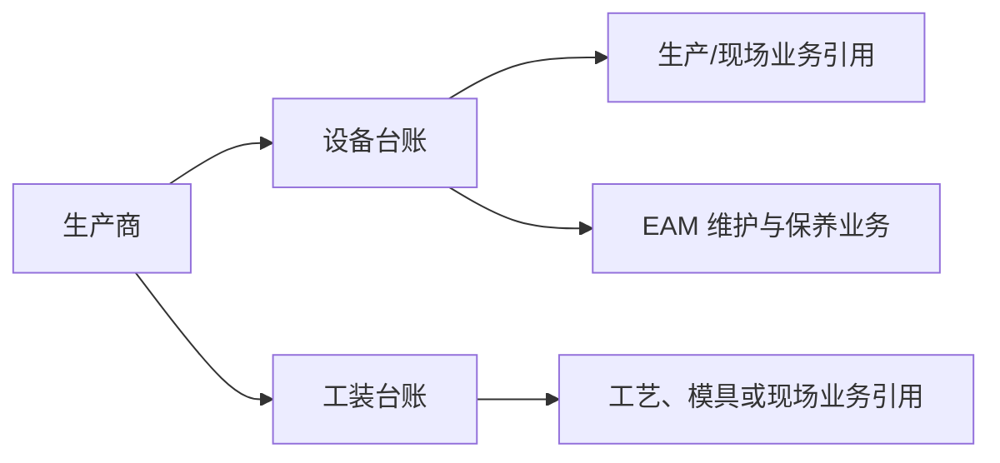

# 设备管理

> 阅读对象：测试、实施、运维（主）；设备/工装台账维护人员（顺带）。

## 这一组业务解决什么问题

DBC 设备管理（侧栏名「设备台账（DBC）」）维护设备、工装和生产商这类可被其它业务引用的基础台账，只回答“这是什么资产或工装、由谁生产、可在哪些业务中识别”。读完本组文档，应能判断一项设备/工装资料的问题该在本组排查，还是该转到负责维护、保养、故障和备件等执行业务的 [EAM（运维执行）](../../08-EAM-设备管理/index.md)。

## 如何使用本组文档

| 你的目的 | 建议阅读 |
| --- | --- |
| 想理解台账与 EAM 执行业务的边界 | 本页「这一组业务解决什么问题」。 |
| 要新建或维护设备台账、工装台账、生产商 | 按下方「建议学习与操作顺序」逐项进入对应叶页。 |
| 需要处理保养/故障/备件/维修工单 | 转到 [EAM](../../08-EAM-设备管理/index.md)，不在本组处理。 |

## 建议学习与操作顺序

| 顺序 | 页面/业务对象 | 先解决什么 | 与下一步怎样衔接 |
| --- | --- | --- | --- |
| 1 | 生产商管理 | 维护设备或工装的生产方基础信息。 | 可供设备/工装台账引用。 |
| 2 | 设备台账管理 | 维护可被现场业务识别的设备基础资料。 | 与 EAM 设备执行业务建立边界。 |
| 3 | 工装台账管理 | 维护工装或模具相关基础资料。 | 可与工艺建模、生产和 EAM 关联。 |

## 关键业务对象与关系

## 本组页面一览
| 页面 | 说明 | 待完善 |
| --- | --- | --- |
| [工装台账管理](01-工装台账管理.md) | 已说明工装身份、客户/现场、采购制造与 EAM 边界。 | 选择器、状态和 EAM 同步的实际验证。 |
| [设备台账管理](02-设备台账管理.md) | 已说明设备身份、现场归属、导入和 EAM 边界。 | 运行数据来源、状态和跨模块同步验证。 |
| [生产商管理](03-生产商管理.md) | 已说明制造方、导入、停用和台账引用边界。 | 选择器、唯一性和实际引用范围。 |

## 常见问题与相关分组

需要处理设备保养、故障、备件或维修工单时，应转到 [EAM](../../08-EAM-设备管理/index.md)；需要维护工艺路线中的模具类型或制造条件时，应同时查看[工艺建模](../08-工艺建模/index.md)，不在本组推断实际维护执行规则。

## 待补充的图示与示例
!!! example "📷 截图占位"
    设备、工装、生产商的关联维护与详情联查页面。

!!! example "📝 示例数据占位"
    一台设备、一套工装、一个生产商及其在生产/维护业务中被引用的样例。

