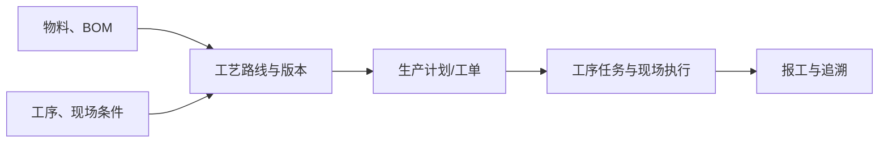

# 工艺路线

> 适用基线：测试环境 / `dev` 分支 / 2026-07-15。
> 具体维护、版本、图形配置和查询操作见[工艺路线-维护与查询参考](04-工艺路线-维护与查询参考.md)。

## 这项业务对象解决什么问题

工艺路线把多个工序组织为一条可执行的制造路径，并维护路线编码、名称、类别、版本、状态、物料/BOM关联、前置校验以及路线图形和配置内容。它是生产计划和现场执行理解“该产品要经过哪些步骤、以什么顺序和约束完成”的基础。

虽然本页位于 DBC 的工艺建模目录，当前可查的实际维护页面和服务主要归属 MES。因此，DBC 侧负责引用工序等基础口径，MES 侧负责路线的维护和运行；目录位置不能被理解为路线全部由 DBC 实现。

## 什么时候需要维护

| 业务事件 | 应做什么 | 维护前要确认 |
| --- | --- | --- |
| 新产品/新版本投产 | 新建路线和版本，配置工序节点、顺序及相关约束。 | 物料、BOM、工序、现场条件和验收样例已准备。 |
| 工艺步骤或节拍变化 | 建立受控新版本或受控变更。 | 已下达工单、在制品和历史追溯的处理方式。 |
| 路线暂不适用 | 调整状态并保留原因。 | 是否仍有计划、工单或返工业务使用。 |
| 需要改变节点关系 | 修改路线配置并完成图形/顺序校验。 | 前后步骤、并行/放行约束和异常回退方式。 |

## 路线如何进入生产

路线配置中已可见版本、状态、节点顺序、前后关系和部分并行/放行控制能力。不同版本如何被工单选择、已有工单是否保留快照及状态切换影响，仍需以 MES 端到端样例确认。

## 维护时最重要的判断

| 需要判断什么 | 业务含义 | 建议做法 |
| --- | --- | --- |
| 路线与版本是否明确 | 防止同一产品在不同场景中使用错误路径。 | 将适用产品、版本和生效原因写入变更说明。 |
| 工序顺序和前后关系是否完整 | 决定工序流转方向。 | 用至少一条正常路径和一条异常路径评审。 |
| 是否允许并行或分批放行 | 影响现场资源与下道工序启动条件。 | 由工艺、生产和质量共同确认，再做小样验证。 |
| 状态是否应切换 | 决定路线能否被新业务选择。 | 先确认在途工单、返工和历史追溯。 |

## 当前边界与待确认事项

- 路线维护已确认主要归属 MES；DBC 与 MES 菜单、权限、接口和主数据同步边界需补充统一说明。
- 路线与物料/BOM的实际选择条件、版本唯一性、状态码语义、发布/回退和历史快照策略尚未完成全流程验证。
- 路线导入能力尚未在当前资料中确认；不可将普通主数据导入规则直接套用。

## 图示、截图与示例任务

【截图占位：路线主信息、版本状态、节点图形配置与工序顺序编辑。】

【示例任务占位：为一个产品建立两道工序路线，验证版本切换前后新旧工单的路线选择。】
