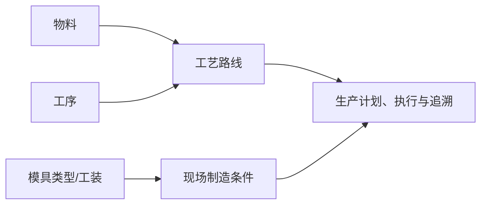

# 工艺建模

## 这一组业务解决什么问题

工艺建模用于描述物料如何经过工序、按什么路线在现场完成制造，并维护与工艺相关的模具分类。它为生产计划、现场执行、追溯和工装使用提供统一的过程口径。

## 建议学习与操作顺序

| 顺序 | 页面/业务对象 | 先解决什么 | 与下一步怎样衔接 |
| --- | --- | --- |
| 1 | 工序管理 | 定义制造过程中的基本作业步骤。 | 是工艺路线的组成基础。 |
| 2 | 工艺路线 | 将工序按适用物料和顺序组织为制造路径。 | 支持生产计划、执行和追溯。 |
| 3 | 模具类型管理 | 定义与制造、工装相关的分类口径。 | 可供工装或工艺相关资料引用。 |

## 关键业务对象与关系

## 页面清单与写作状态

| 页面 | 文档形态 | 已说明内容 | 后续需补 |
| --- | --- | --- | --- |
| [工序管理](01-工序管理.md) | 单文档（合并维护与查询） | 待重构为工序维护说明。 | 新增/停用、排序/引用影响和查询。 |
| [工艺路线](02-工艺路线.md) | 主文档 + 维护与查询参考（待建） | 待重构为制造路径维护说明。 | 版本/启停、物料/工序选择、变更影响和示例。 |
| [模具类型管理](03-模具类型管理.md) | 单文档（合并维护与查询） | 待重构为分类维护说明。 | 与工装、工艺和生产页面的关联边界。 |

## 常见问题与相关分组

生产业务无法获得正确工艺或现场步骤时，先确认物料、工序、工艺路线和生产现场资料是否完整；实际生产任务和追溯结果应在 MES 或相关生产业务页面查询。

## 图示、截图与示例任务

【图示占位：物料—工艺路线—工序—生产现场的关系图；需要明确哪些关系由测试环境验证。】

【截图占位：工序、工艺路线、模具类型的维护和关联选择界面。】

【示例数据占位：一项产品由两道工序组成的路线及其被生产业务引用的脱敏样例。】
