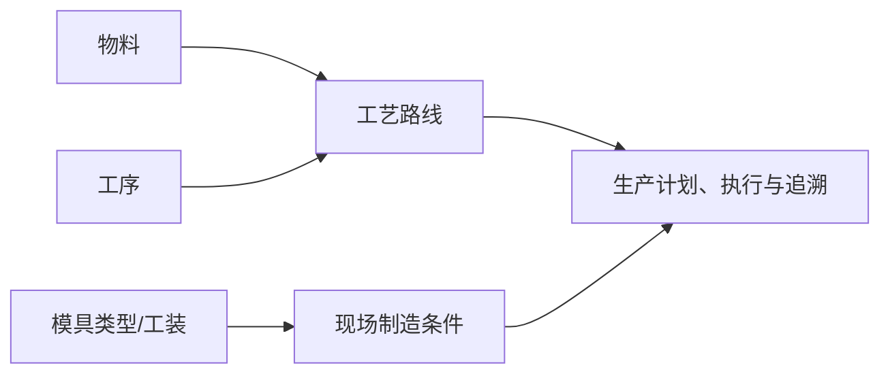

# 工艺建模

## 这一组业务解决什么问题

工艺建模用于描述物料如何经过工序、按什么路线在现场完成制造，并维护与工艺相关的模具分类。它为生产计划、现场执行、追溯和工装使用提供统一的过程口径。

## 建议学习与操作顺序

| 顺序 | 页面/业务对象 | 先解决什么 | 与下一步怎样衔接 |
| --- | --- | --- |
| 1 | 工序管理 | 定义制造过程中的基本作业步骤。 | 是工艺路线的组成基础。 |
| 2 | 工艺路线 | 将工序按适用物料和顺序组织为制造路径。 | 支持生产计划、执行和追溯。 |
| 3 | 模具类型管理 | 定义与制造、工装相关的分类口径。 | 可供工装或工艺相关资料引用。 |

## 关键业务对象与关系

## 页面清单与写作状态

| 页面 | 文档形态 | 已说明内容 | 后续需补 |
| --- | --- | --- | --- |
| [工序管理](01-工序管理.md) | 主文档内含维护与查询说明 | 已说明现场归属、导入、停用与路线引用边界。 | 选择器、顺序影响和实际执行挂接。 |
| [工艺路线](02-工艺路线.md) | 主文档 + [维护与查询参考](04-工艺路线-维护与查询参考.md) | 已说明路线/版本/节点及 MES 归属边界。 | 路线选择、版本切换和端到端生产样例。 |
| [模具类型管理](03-模具类型管理.md) | 业务字典与建设占位 | 已明确应有用途和当前资料缺口。 | 实际模块归属、维护入口与引用关系。 |

## 常见问题与相关分组

生产业务无法获得正确工艺或现场步骤时，先确认物料、工序、工艺路线和生产现场资料是否完整；实际生产任务和追溯结果应在 MES 或相关生产业务页面查询。

## 图示、截图与示例任务

!!! example "📐 图示占位"
    物料—工艺路线—工序—生产现场的关系图；需要明确哪些关系由测试环境验证。

!!! example "📷 截图占位"
    工序、工艺路线、模具类型的维护和关联选择界面。

!!! example "📝 示例数据占位"
    一项产品由两道工序组成的路线及其被生产业务引用的脱敏样例。

