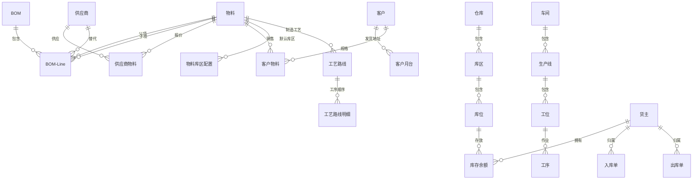

# DBC 主数据管理

## 模块概述

主数据管理（Data Base Core，DBC）是 MOM 系统的数据基石，统一管理和维护各业务模块共享的核心基础数据，确保数据的一致性和准确性。

## 业务分组

| 分组 | 说明 |
|------|------|
| 01-物料管理 | 物料基本信息、BOM |
| 02-供应商管理 | 供应商、供应商物料 |
| 03-客户管理 | 客户、客户月台 |
| 04-工厂建模 | 仓库、库区、库位、车间、生产线、工位、工序、工艺路线、模具 |
| 05-策略设置 | 货主、班次班组、业务类型、单据设置 |

## 核心流程

（待补充）

## 接口规范

（待补充）

## 主数据关系图

