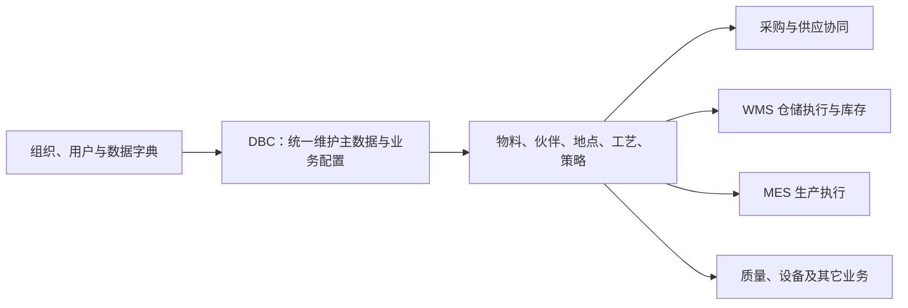
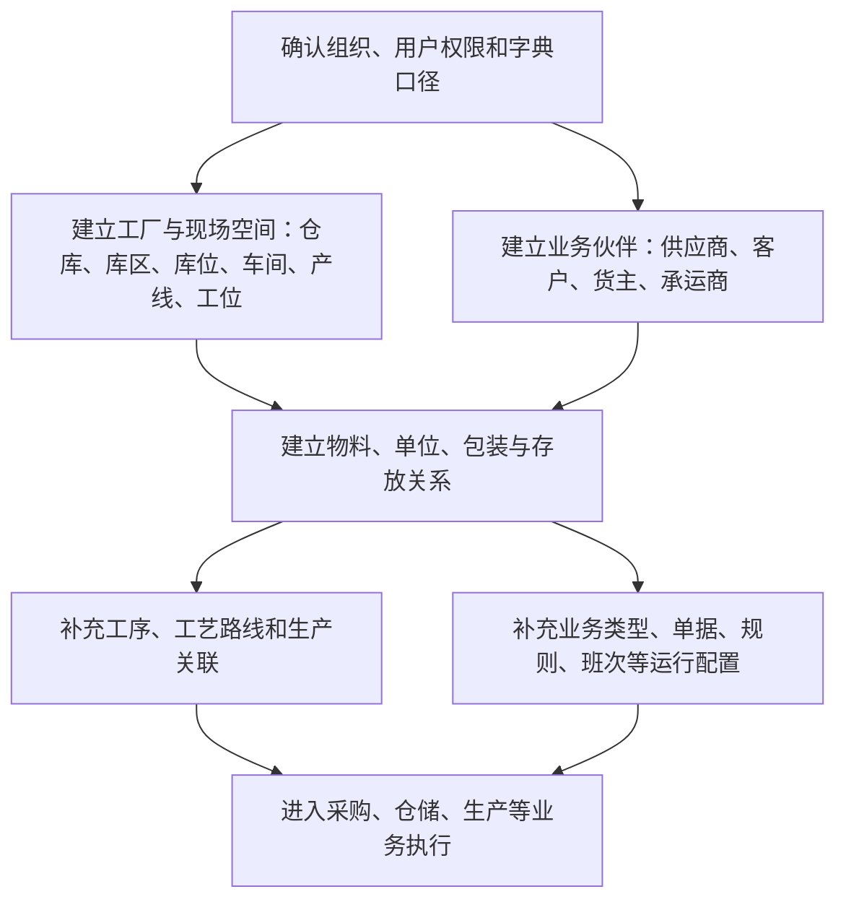

# DBC 主数据管理

> 适用基线：测试环境 / `dev` 分支 / 2026-07-15。
> 阅读对象：主数据维护人员、采购/销售协同人员、仓储与生产管理人员、实施人员和需要理解数据来源的业务人员。

## 模块解决什么问题

DBC（Data Base Core，主数据管理）负责维护各业务共同使用的基础资料和业务配置。它让系统中的“物料是什么、由谁供应或使用、放在哪里、在哪个车间生产、采用什么工艺、单据按什么规则运行”有统一口径。

采购、仓储、生产、质量、设备等业务都会引用 DBC 中的数据。若主数据不完整或口径不一致，常见结果是单据无法选择正确对象、数量或单位无法统一、库存无法准确定位，或同一业务在不同人员眼中含义不同。

DBC 不负责替代各业务模块执行收货、发料、盘点、检验或生产等现场作业；这些业务的任务、记录和结果由相应模块负责。标签、条码和打印可在 DBC 业务页面中被触发，但其模板、设备和审计属于[平台能力与基础设施](../03-基础设施/01-标签、条码与打印.md)的长期职责。

## 谁会使用本模块

| 角色 | 常见目标 | 建议从哪里开始 |
| --- | --- | --- |
| 主数据维护人员 | 新增、维护、停用物料、客户、供应商、工厂模型和基础配置。 | 先了解“主数据维护顺序”，再进入对应业务分组。 |
| 仓库与生产管理人员 | 确认仓库、库位、车间、产线、物料、包装和工艺资料是否可用于现场业务。 | 先看工厂建模、物料管理和工艺建模。 |
| 采购与销售协同人员 | 维护或查询供应商、客户及其与物料的对应关系。 | 先看物料管理，再看供应商管理或客户管理。 |
| 实施与业务配置人员 | 建立业务类型、单据设置、规则、班次和班组等运行基础。 | 先完成基本资料，再看策略设置。 |
| 业务查询人员 | 判断一笔业务中引用的物料、伙伴、地点、工艺或配置从哪里来。 | 先从相关业务页面跳回对应主数据，再按关联关系查询。 |

## DBC 在业务中的位置

这是一张业务使用关系图，不是数据库关系图。它说明 DBC 为下游业务提供可选择、可识别、可追溯的共同语言；具体业务是否要求某一项资料，以对应业务页面的前置条件为准。

【示例数据占位：以“螺栓 M8×20”为例，展示物料、供应商物料、包装、默认库区和采购收货如何共同支撑一笔到货业务。】

## 建议学习与维护顺序

以下顺序用于降低实施和日常维护的返工风险，并非所有企业都必须一次性维护完全部资料。应先完成当前业务场景实际需要的最小集合，再逐步补齐关联资料。

| 建议顺序 | 先维护什么 | 解决什么问题 | 典型后续使用 |
| --- | --- | --- | --- |
| 1 | 组织、权限、字典口径 | 明确资料归属、维护人和可选值。 | 所有 DBC 维护页面。 |
| 2 | 工厂建模与物流伙伴 | 建立“在哪里作业、与谁协作”的基本事实。 | 仓储、收发货、生产、运输协同。 |
| 3 | 物料、包装与关联关系 | 建立“处理什么”的共同识别基础。 | 采购收货、库存、BOM、客户/供应商匹配。 |
| 4 | 工艺与生产关联 | 建立“如何制造、在哪里制造”的业务基础。 | 生产计划、工序执行、追溯。 |
| 5 | 策略、单据和运行配置 | 让业务按统一类型、编号和规则运行。 | 各类业务单据、任务和规则判断。 |
| 6 | 持续治理与变更 | 在已有引用的前提下维护、停用、替代或归档资料。 | 日常运营、问题排查和数据质量治理。 |

## 业务分组与学习入口

| 建议顺序 | 业务分组 | 先理解什么 | 学完能做什么 |
| --- | --- | --- | --- |
| 1 | 物料管理 | 物料、BOM、包装、库区和生产线关联如何表达产品及其使用条件。 | 建立并维护供采购、库存和生产引用的物料资料。 |
| 2 | 供应商管理 | 供应商及其物料对应关系如何支持采购匹配。 | 维护供应来源和供应商物料口径。 |
| 3 | 客户管理 | 客户、客户月台、客户物料如何支持交付匹配。 | 维护客户侧识别、交付地点和物料口径。 |
| 4 | 工厂建模 | 仓库、库区、库位与车间、产线、工位如何描述现场。 | 建立仓储和生产现场的空间/组织模型。 |
| 5 | 工艺建模 | 工序、工艺路线与模具类型如何支持制造过程描述。 | 为生产执行提供可引用的工艺基础。 |
| 6 | 策略设置 | 业务类型、单据、规则、班次和班组如何影响业务运行。 | 建立可控、可复用的业务运行规则。 |
| 7 | 物流配置 | 货主、承运商如何表达库存归属和运输协同对象。 | 维护物流协同所需的伙伴与归属资料。 |
| 8 | 设备管理 | DBC 中的设备、工装与生产商资料如何作为业务基础。 | 维护基础台账，并理解与 EAM 的职责边界。 |

当前可先从[物料基本信息](01-物料管理/01-物料基本信息.md)开始理解 DBC 的典型维护方式。各分组已完成第一阶段的业务说明、维护/查询覆盖和素材占位；实际状态、权限、截图及端到端样例按后续取证任务回填。

## 使用本模块前需要准备什么

| 需要准备什么 | 为什么需要 | 由谁确认 |
| --- | --- | --- |
| 组织、用户权限和基础字典 | 决定谁能维护、资料归属及下拉选项口径。 | 系统管理员、实施人员和业务负责人。 |
| 企业编码与命名规则 | 避免物料、伙伴、地点等基础资料重复或难以辨识。 | 主数据负责人。 |
| 当前业务场景 | 判断应先建哪些资料，以及哪些属性、包装、工艺或配置必须同步维护。 | 采购、仓储、生产或销售业务负责人。 |
| 现场空间与合作伙伴清单 | 为仓库/库位、车间/产线、供应商/客户等资料提供可信来源。 | 现场管理人员和业务协同人员。 |
| 变更与停用原则 | 避免直接修改已被采购、库存、BOM 或生产引用的关键资料。 | 主数据负责人及受影响业务负责人。 |

【截图占位：DBC 菜单全景。标出物料管理、工厂建模、策略设置和物流配置的入口，使用脱敏测试环境截图。】

## 与其它模块怎样协作

| 协作模块 | DBC 提供什么 | 该模块产生什么结果 | 使用者应如何追溯 |
| --- | --- | --- | --- |
| WMS 库房管理 | 物料、包装、仓库/库位、货主、业务类型等基础信息。 | 收货、上架、发料、盘点等任务、记录和库存结果。 | 从业务单据中的物料或地点跳回 DBC 查询口径；库存结果在 WMS 查询。 |
| MES 生产管理 | 物料、工序、工艺路线、车间、产线、工位等基础信息。 | 生产计划、执行和追溯结果。 | 先确认 DBC 工艺/现场资料，再到 MES 查询生产结果。 |
| SCP 供应链平台 | 物料、供应商、客户及其关联信息。 | 采购、协同、计划和交付相关业务结果。 | 先确认伙伴/物料匹配口径，再到供应链业务页面追溯。 |
| QMS、EAM 等模块 | 物料、现场地点、设备/工装等可引用资料。 | 检验、设备维护或异常处理结果。 | 主数据问题回到 DBC，业务执行结果回到所属模块。 |

## 常见问题与处理

| 情况 | 建议先做什么 | 不建议怎么做 |
| --- | --- | --- |
| 下游页面找不到物料、供应商或库位 | 先确认资料状态、归属、字典口径和业务场景是否满足选择条件。 | 不要为了临时可选而重复新建相同资料。 |
| 已使用的物料或地点需要变更 | 先查采购、库存、BOM、生产等既有引用，并评估影响。 | 不要直接改码、删除或用临时名称覆盖原资料。 |
| 不确定某项资料应由哪个模块维护 | 先按“主数据定义事实，业务模块产生结果”判断；再查本页的协作边界。 | 不要在多个模块重复维护同一主数据。 |
| 标签、打印或导入出现问题 | 从当前业务入口定位，再按平台能力或相关业务页面确认模板、权限和处理方式。 | 不要把标签/打印错误误认为物料或库存数据本身错误。 |

## 术语与相关文档

| 主题 | 建议阅读 |
| --- | --- |
| 主数据治理的通用原则 | [主数据治理模型](../02-业务模型/07-主数据治理模型.md) |
| 业务类型、单据和规则如何影响业务 | [单据类型、业务类型与单据配置](../02-业务模型/05-单据类型、业务类型与单据配置.md) |
| 申请、任务、记录的通用概念 | [申请、任务与记录模型](../02-业务模型/01-申请任务记录模型.md) |
| 库存预计、事务和余额的关系 | [库存数据挂接模型](../02-业务模型/02-库存数据挂接模型.md) |
| WMS 如何使用主数据并产生仓储结果 | [WMS 库房管理概述](../05-WMS-库房管理/index.md) |

## 图示、截图与示例任务

| 类型 | 后续需要补充的内容 | 目的 | 资料来源 |
| --- | --- | --- | --- |
| 模块全景图 | DBC 与 WMS、MES、SCP、QMS、EAM 的业务协作关系。 | 支持新员工理解“主数据从哪里来、到哪里去”。 | 菜单、业务负责人确认、已验证业务模型。 |
| 维护顺序示例 | 以一个新工厂/新物料上线场景展示资料准备顺序。 | 支持实施和主数据初始化培训。 | 脱敏测试数据或实施样例。 |
| DBC 菜单截图 | 物料、工厂建模、策略、物流、设备、工艺入口。 | 帮助读者快速定位功能。 | 测试环境脱敏截图。 |
| 关联查询示例 | 从采购收货或库存记录回查物料、供应商、库位的路径。 | 解释“主数据与业务结果如何互相定位”。 | 脱敏业务单据与页面截图。 |
