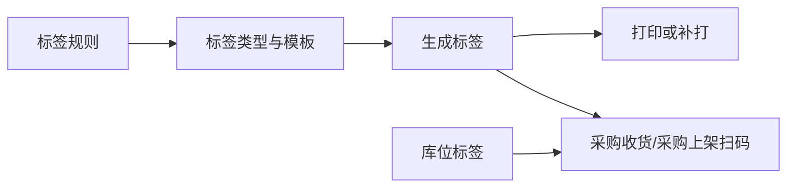

# 标签与条码

> 适用基线：测试环境 / `dev` 分支 / 2026-07-15。具体操作见[标签与条码-维护与查询参考](09-标签与条码-维护与查询参考.md)。

## 这项能力解决什么问题

标签与条码让物料、包装、器具、库位和叫料等现场对象获得可识别、可打印、可追溯的标识。采购收货和采购上架尤其依赖其完成现场扫码与库位确认。

## 当前入口与未来边界

当前 WMS 基础数据包含标签规则、标签类型、标签模板、标签信息，以及采购件、制造件、器具、库位、叫料等标签入口。它们现在服务 WMS 现场业务；由于规则、模板与打印会被多个业务复用，未来应整体纳入基础设施/平台能力治理（`WMS-LABEL-004`、`GAP-015`）。

## 业务关系

## 各入口的使用定位

| 入口 | 应完成的事 | 维护原则 |
| --- | --- | --- |
| 标签规则设置 | 定义标签内容片段、顺序、长度和解析规则。 | 先用样例条码验证，避免直接影响在用模板。 |
| 标签类型 | 定义数据协议、解析、校验和标签代码。 | 与模板及扫码识别联测。 |
| 标签模板 | 维护可打印的模板及其校验/启用规则。 | 先测试打印与扫描，再发布使用。 |
| 标签信息 | 查询标签状态、关联对象和打印记录，可执行补打。 | 补打必须可追溯原因与次数。 |
| 采购件/制造件/器具/库位/叫料标签 | 面向不同对象的生成和打印入口。 | 统一遵循上述规则、类型和模板，不各自复制规则。 |

## 当前可证实行为

| 能力 | 当前可证实结论 | 培训口径 |
| --- | --- | --- |
| 规则/类型/模板维护 | 可维护代码、顺序、长度、协议、模板文件、启用状态等受控属性 | 在用规则变更前先做样例打印与扫码验证 |
| 标签生成 | 支持单条/批量生成；可按库位等对象取打印数据 | 生成不等于已完成现场张贴与扫码确认 |
| 补打 | 标签信息侧可补打，并保留打印次数与最后打印信息 | 补打须有业务原因；次数用于追溯 |
| 多入口映射 | 五类对象入口并存 | 入口与规则/模板映射关系仍待矩阵化（`WMS-LABEL-001`） |
| 版本与在用保护 | 未见完整的“在用模板不可改/不可删”闭环 | 变更在用模板前先评估现场扫码（`WMS-LABEL-002`） |
| 打印服务边界 | 打印/补打能力当前挂在 WMS | 平台迁移方案见 `WMS-LABEL-004` |

## 待确认事项

- `WMS-LABEL-001`：五类标签入口与规则/类型/模板映射。
- `WMS-LABEL-002`：模板/规则版本与在用保护。
- `WMS-LABEL-003`：补打和打印服务边界。
- `WMS-LABEL-004`：平台能力迁移方案。

!!! example "📷 截图占位"
    规则、模板、标签信息列表及一次采购收货标签生成/补打。

!!! example "📝 示例数据占位"
    一张采购件标签和一张库位标签，展示生成、打印、扫码、联查路径。
